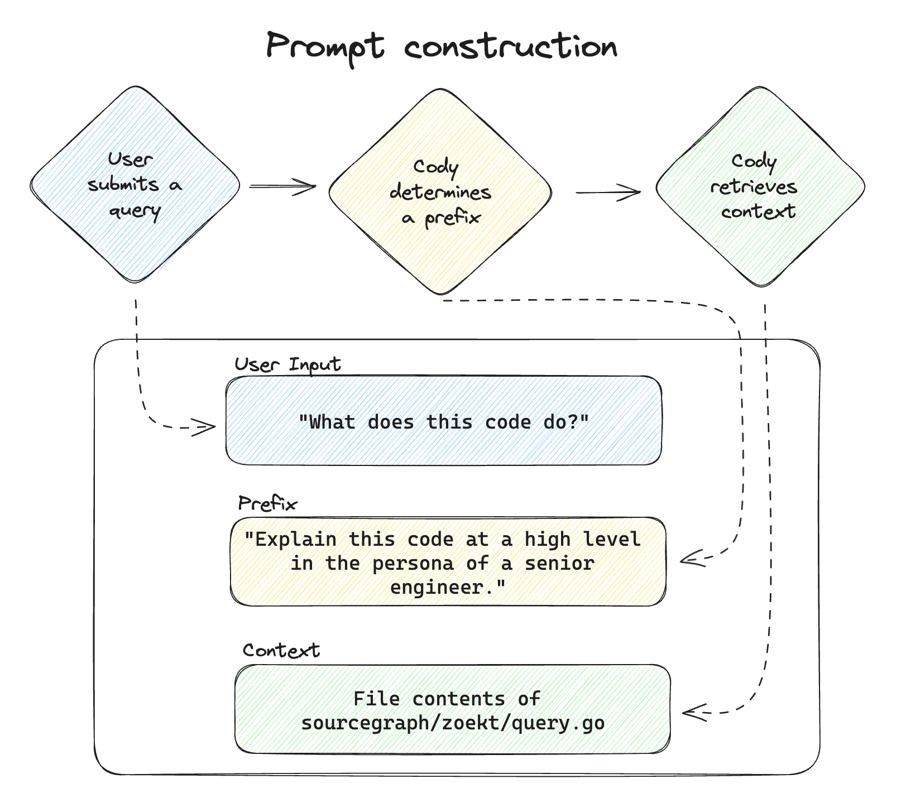
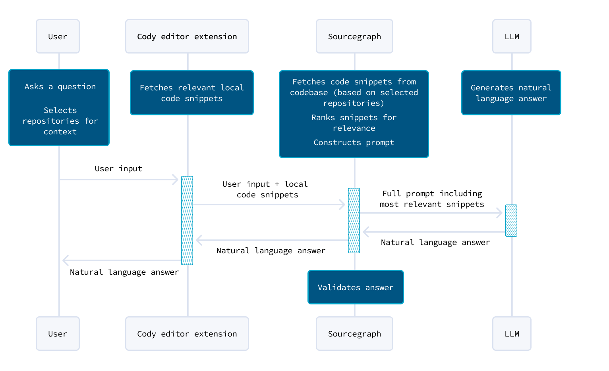

# 代码问答 Agent 示例

## 问答策略

### 全局 vs. 局部上下文

### 远程 vs. 本地相关上下文

### 业务导向还是技术逻辑导向

## 示例

### Sweep：issue-to-pull-request 功能

相关文章：[Sweep's Core Algorithm - Using Retrieval Augmented Generation (RAG) to clear your GitHub Backlog](https://docs.sweep.dev/blogs/sweeps-core-algo)


Sweep 的核心算法可以总结为以下四个主要阶段：

1. **搜索**：
    - **目的**：检索相关的代码片段和上下文。
    - **过程**
      ：根据问题描述查询代码库，获取顶级代码片段。使用 [MPNet](https://huggingface.co/sentence-transformers/all-mpnet-base-v2)
      向量化和 DeepLake 向量存储。
    - **步骤**：
        - 根据问题上下文搜索代码片段。
        - 重排。基于提交计数和最新提交时间的启发式方法对片段进行重新排序
        - 去重和合并代码片段。
        - 使用 [ctag 总结生成仓库摘要](https://docs.sweep.dev/blogs/understanding-codebase-with-ctags)。

2. **规划**：
    - **目的**：确定修改和新创建的文件。
    - **过程**：分析问题的根本原因并规划变更。
    - **步骤**：
        - 使用自然语言规划实现方案。
        - 指定要修改或创建的文件。
        - 根据需要验证和调整修改方案。

3. **执行**：
    - **目的**：在代码库中实施规划的变更。
    - **过程**：
        - 创建新文件或修改现有文件。
        - 辨识并描述具体变更及其涉及的行号。
        - 使用搜索和替换对进行修改。
        - 对于大文件使用流式方法处理。

4. **验证**：
    - **目的**：确保实施变更的正确性。
    - **过程**：
        - 使用基于LLM和程序的验证检查代码错误和功能。
        - 进行自我审查，必要时进行迭代。
        - 利用GitHub Actions进行额外的验证。

从搜索代码片段到验证变更的每个阶段都确保了一种系统化的方法，通过自动化流程和GPT-4驱动的类人推理来进行代码修改和创建。

Sweep 开始搜索相关代码片段的步骤如下：

1. 使用 MPNet 嵌入和 DeepLake 向量存储，通过标题和描述在代码片段上下文中查询，并检索前 100 个片段。我们提前使用基于 CST 的自定义分块器对文件进行分块。更多关于我们的搜索基础设施的详细介绍请参见 [https://docs.sweep.dev/blogs/search-infra](https://docs.sweep.dev/blogs/search-infra) 和 [https://docs.sweep.dev/blogs/building-code-search](https://docs.sweep.dev/blogs/building-code-search)。
2. 使用基于提交次数和最新提交时间的启发式方法重新排序片段，并选取前 4 个。假设最新提交且提交次数最多的文件更有可能再次被编辑。在这一点上，我们还会添加任何直接提到的文件。
3. 对片段进行去重和融合。例如，如果获取到的片段是 main.py:0-50 和 main.py:51-100，则它们会被融合为 main.py:0-100。然后我们在每个方向上扩展每个片段 25 行，因此 main.py:25-75 变为 main.py:0-100。
4. 使用 ctag 摘要生成仓库的摘要。摘要包含重新排序后前 10 个文件的变量名和函数声明。这以目录树的形式呈现：从根目录开始一直到文件以及文件中的类、方法和变量。只有前 10 个文件的同级文件会被包含在内。

此时的最终上下文大致如下：

```bash
<relevant_snippets>
<snippet file_path="main.py" start_line="1" end_line="56">
import numpy as np
...
</snippet>
<snippet file_path="test.py" start_line="1" end_line="32">
import pytest
...
</snippet>
...
</relevant_snippets>
 
<repo_tree>
.gitignore
jp-app/
|- App.xaml
|- App.xaml.cs
|   |- namespace jp_app
|   |- class App
|   |- method App (ISystemLanguageService systemLanguageService)
|   |- method OnStart ()
</repo_tree>
 
Repo name: sweepai/sweep: an AI junior dev
Username: kevinlu1248
Query: Sweep: Use os agnostic temp directory for windows
```

### Cody

[How Cody understands your codebase](https://sourcegraph.com/blog/how-cody-understands-your-codebase)

#### 如何在提示中使用上下文

当用户通过聊天消息或命令向 Cody 查询时，Cody 首先会编译一个 prompt。Cody 将用户的输入整理成一个提示词，以便从大型语言模型（LLM）中获取最佳响应。
提示分为三部分：

1. **前缀（Prefix）**。描述所需输出的可选说明。Cody经常使用前缀，例如，当开发人员触发一个命令时，这个命令是预定义的任务，旨在返回特定的输出格式。例如，对于“Test"命令，Cody会使用前缀来定义输出格式为单元测试。
2. **用户输入（User input）**。用户提供的查询。
3. **上下文（Context）**。Cody查找并检索的附加信息，以帮助LLM提供相关答案。



#### 示例说明

例如，当用户触发 Cody 的 “Explain" 命令时，Cody生成的提示可能如下所示：

- **前缀**：
  ```
  Explain the following Go code at a high level. Only include details that are essential to an overall understanding of what's happening in the code.
  ```

- **用户输入**：
  ```
  zoekt.QueryToZoektQuery(b.query, b.resultTypes, b.features, typ)
  ```

- **上下文**：
  ```
  [Contents of sourcegraph/sourcegraph/internal/search/zoekt/query.go]
  ```

这个完整的提示，包括所有三部分内容，然后被发送到 LLM。LLM 根据提示中包含的信息以及其基线模型中的信息进行工作。任何有关用户代码库的问题，
只有在上下文（作为提示的一部分发送）提供了足够的信息时，LLM 才能回答。

#### 问答示例

1. **广泛的上下文检索**：对于聊天和命令，Cody 需要覆盖用户可能询问的整个代码库的广泛上下文。
2. **Sourcegraph 代码智能平台**：Cody 利用 Sourcegraph 的平台，该平台可以索引并理解来自多个存储库（从几个到超过10万个）的代码。
3. **搜索和上下文选择**：
    - **用户查询处理**：当用户调用 Cody 时，可以选择最多10个存储库。Cody会预处理用户查询，将其标记化并去除多余的信息。
    - **搜索引擎**：然后，这些标记由 Sourcegraph 的搜索引擎处理，扫描选定的存储库。
    - **相关性排名**：Cody 使用改进的 BM25 排名函数和其他调整过的信号，根据搜索查询的相关性对文件片段进行排名。最相关的片段会被发送回Cody。
4. **本地上下文整合**：Cody 还会整合用户 IDE 中打开文件的本地上下文，将这些与从 Sourcegraph 搜索中检索到的片段结合起来。
5. **全局排名和提示构建**：Cody 对所有片段进行全局排名，并根据长度选择最相关的片段来构建提示的上下文。这个上下文连同用户输入一起被发送到LLM（大语言模型）以生成响应。

例如，用户可能会询问：`How it auto generate test for Java?`

Retrieval-based QA：

```bash

Searched entire codebase for relevant files

java/src/test/kotlin/cc/unitmesh/idea/java/JavaAutoProcessorTest.kt
java/src/test/kotlin/cc/unitmesh/idea/java/JavaCodeProcessorTest.kt
java/src/test/kotlin/cc/unitmesh/idea/java/JavaSpringCodeCreatorTest.kt
java/src/test/kotlin/cc/unitmesh/idea/java/JavaParseUtilTest.kt
java/src/test/kotlin/cc/unitmesh/idea/provider/JvmAutoDevFlowTest.kt
src/main/resources/intentionDescriptions/DefaultDocumentationIntention/description.html
java/src/test/kotlin/cc/unitmesh/idea/provider/JvmPromptStrategyTest.kt
java/src/test/kotlin/cc/unitmesh/idea/java/SpringLayerCharacteristicTest.kt
java/src/main/kotlin/cc/unitmesh/idea/provider/JavaTestDataBuilder.kt
java/src/main/kotlin/cc/unitmesh/idea/context/JavaCodeModifier.kt
webstorm/src/main/kotlin/cc/unitmesh/ide/webstorm/provider/testing/JavaScriptTestCodeModifier.kt
java/src/test/kotlin/cc/unitmesh/idea/context/JavaContextCollectionUtilsKtTest.kt
docs/features/auto-dev.md
README.md
docs/index.md
```

Here are some ways AutoDev can auto generate tests for Java code:

- When you create a new Java class or method, AutoDev provides an intention action to generate a test stub. This creates
  a skeleton test class and methods in the test folder.
- When you make changes to existing code, AutoDev analyzes the changes and suggests relevant tests to add or update via
  intention actions. For example, adding a new method would suggest creating a test method.
- AutoDev can generate test data models based on method parameters and return types. It analyzes the code structures and
  provides sample test data.
- For common architectures like Spring MVC, AutoDev has predefined templates to generate component tests for layers like
  Controllers, Services etc.
- AutoDev integrates with test runners like JUnit. It can auto-run tests and if there are failures, provide quick fixes
  and suggestions to update tests.
- The test generation works both for unit tests and integration tests. AutoDev looks at package names, configs and
  contexts to determine which type of tests to create.

In summary, AutoDev aims to reduce manual test writing by auto generating skeletons and suggestions, analyzing contexts
and architectures, and integrating with testing workflows. Let me know if you have any other questions!

中文：`AutoDev 是如何实现自动生成 Java 测试代码的？`

```bash
Searched entire codebase for relevant files

java/src/test/kotlin/cc/unitmesh/idea/provider/JvmAutoDevFlowTest.kt
src/main/resources/prompts/openai/update_service_method.vm
src/main/resources/intentionDescriptions/AutoDevIntentionHelper/description.html
src/main/resources/intentionDescriptions/AutoDevIntention/description.html
src/main/resources/prompts/openai/create_service_and_repository.vm
plugin/description.html
src/main/resources/intentionDescriptions/DefaultDocumentationIntention/description.html
java/src/test/kotlin/cc/unitmesh/idea/java/JavaCodeProcessorTest.kt
java/src/test/kotlin/cc/unitmesh/idea/java/JavaParseUtilTest.kt
java/src/test/kotlin/cc/unitmesh/idea/java/JavaAutoProcessorTest.kt
java/src/main/kotlin/cc/unitmesh/idea/flow/JvmAutoDevFlow.kt
src/main/resources/prompts/openai/create_controller.vm
README.md
docs/features/auto-dev.md
docs/index.md
```

根据 AutoDev 的代码,它实现自动生成 Java 测试代码的主要方式是:

1. 提供一个创建测试的 Intention 动作。当在 Java 代码中调用这个 Intention 时,会触发自动生成测试代码的逻辑。
2. 在后台使用 OpenAI Codex 模型自动生成测试代码。主要流程是:
   - 收集当前需要测试的 Java 代码作为 Prompt。
   - 向 OpenAI 提交生成测试代码的请求。
   - 获取 OpenAI 返回的测试代码。
   - 处理测试代码,插入到项目中合适的测试类或测试方法中。
3. 生成的测试代码会包含基本的单元测试框架代码,以及针对主代码的一些典型测试用例。
4. 生成后的测试代码还会尝试自动运行,如果测试失败,会再次请求 OpenAI 生成修复测试代码的建议。

所以整体上,AutoDev 主要通过 UI 操作触发,配合 OpenAI 自动生成代码的能力,来实现自动化测试代码的生成。

#### 问答数据流



Cody在两种场景下的上下文构建方式不同，分别是聊天/命令和自动完成。

##### 聊天和命令

1. **广泛的上下文检索**：对于聊天和命令，Cody 需要覆盖用户可能询问的整个代码库的广泛上下文。
2. **Sourcegraph 代码智能平台**：Cody 利用 Sourcegraph 的平台，该平台可以索引并理解来自多个存储库（从几个到超过10万个）的代码。
3. **搜索和上下文选择**：
    - **用户查询处理**：当用户调用 Cody 时，可以选择最多10个存储库。Cody会预处理用户查询，将其标记化并去除多余的信息。
    - **搜索引擎**：然后，这些标记由 Sourcegraph 的搜索引擎处理，扫描选定的存储库。
    - **相关性排名**：Cody 使用改进的 BM25 排名函数和其他调整过的信号，根据搜索查询的相关性对文件片段进行排名。最相关的片段会被发送回Cody。
4. **本地上下文整合**：Cody 还会整合用户 IDE 中打开文件的本地上下文，将这些与从 Sourcegraph 搜索中检索到的片段结合起来。
5. **全局排名和提示构建**：Cody 对所有片段进行全局排名，并根据长度选择最相关的片段来构建提示的上下文。这个上下文连同用户输入一起被发送到LLM（大语言模型）以生成响应。

##### 自动补全

自动补全：

1. **速度和本地上下文优先**：自动补全需要非常快，优先考虑本地上下文而不是远程搜索。
2. **意图解析**：使用Tree-Sitter，Cody 解析用户的输入以确定最相关的完成体验，无论是填充函数体、编写文档字符串还是实现方法调用。
3. **本地上下文检索**：Cody 从各种本地来源（如活动文件、其他打开的标签页和最近关闭的标签页）检索上下文。
4. **上下文打包和补全**：它识别相关的代码段，将最相关的片段打包成一个提示。这提示被发送到一个针对完成任务优化的
   LLM，生成的建议会作为虚拟文本显示在用户光标前。

##### Embeddings 转变

Cody最初使用 Embeddings（高维数据的密集向量表示）来检索上下文，但由于几个缺点而放弃了：

- **数据隐私**：将代码发送到 OpenAI 进行处理存在隐私问题。
- **维护复杂性**：创建和更新嵌入增加了 Sourcegraph 管理员的复杂性。
- **可扩展性**：处理大型代码库（超过10万个存储库）的嵌入非常耗费资源，限制了多存储库上下文功能的构建。

新系统利用 Sourcegraph 的本地平台，避免了这些问题，因为不需要外部处理，也不需要额外配置，并且可以更有效地扩展。然而，Embeddings
可能在未来改进中继续探索。

### Aider - 仓库映射提供上下文

aider 的最新版本会随每个修改请求向 GPT 发送一个仓库映射。这个映射包含仓库中所有文件的列表，以及每个文件中定义的符号。像函数和方法这样的可调用对象还包括它们的签名。

- GPT 可以看到仓库中所有地方的变量、类、方法和函数签名。仅此一项可能已经为其提供了足够多的上下文来解决许多任务。例如，它可能可以仅基于映射中显示的细节来理解如何使用模块导出的
  API。
- 如果需要查看更多代码，GPT 可以使用映射自行确定需要查看的文件。然后，GPT 将要求查看这些特定文件，而 aider
  将自动将它们添加到对话上下文中（经过用户批准）。

当然，对于大型代码库，即使仅仅映射可能也太大了以至于超出上下文窗口的能力。然而，这种映射方法扩展了与 GPT-4
在比以往更大的代码库上合作的能力。它还减少了手动选择要添加到对话上下文中的文件的需要，使 GPT 能够自主识别与当前任务相关的文件。

#### 从 Ctags 到  TreeSitter

[Improving GPT-4’s codebase understanding with ctags](https://aider.chat/docs/ctags.html)

tree-sitter 仓库映射取代了 aider 最初使用的基于 ctags 的映射。从 ctags 切换到 tree-sitter 带来了许多好处：

- 映射更丰富，直接显示源文件中的完整函数调用签名和其他详细信息。
- 借助 py-tree-sitter-languages，我们通过一个 python 包获得了对许多编程语言的全面支持，该包在正常的 pip 安装 aider-chat
  的过程中自动安装。
- 我们消除了用户通过某些外部工具或软件包管理器（如 brew、apt、choco 等）手动安装 universal-ctags 的要求。
- Tree-sitter 集成是实现 aider 未来工作和能力的关键基础。

一些可能减少映射数据量的方法包括：

- 精简全局映射，优先考虑重要符号并丢弃“内部"或其他全局不相关的标识符。可能可以借助 gpt-3.5-turbo 在灵活且与语言无关的方式中进行这种精简。
- 提供机制让 GPT 从精简的全局映射子集开始，并允许它要求查看其感觉与当前编码任务相关的子树或关键词的更多细节。
- 尝试分析用户给出的自然语言编码任务，并预测什么样的仓库映射子集是相关的。在特定的仓库内进行先前编码对话的分析可能有助于此工作。针对
  chat history、仓库映射或代码库的向量和关键字搜索可能有所帮助。

一个关键目标是优先选择语言无关或可以轻松部署到大多数流行编程语言的解决方案。ctags 解决方案具有这种优势，因为它预先支持大多数流行语言。我怀疑语言服务器协议可能比
ctags 更适合这个问题。但是，对于广泛的语言，它的部署可能更为繁琐。用户可能需要为他们感兴趣的特定语言搭建一个 LSP 服务器。

### Tabbml:

[Repository context for LLM assisted code completion](https://tabby.tabbyml.com/blog/2023/10/16/repository-context-for-code-completion/)

以下是提供的文本的中文总结：

#### 使用语言模型（LLMs）进行编码任务：

- **优势**：在独立编码任务中，如创建新的独立函数时，基于编码数据预训练的LLMs表现出色。
- **挑战**：当应用于复杂的现有代码库时，LLMs由于依赖关系和链接子系统的API而面临挑战。

#### 应对上下文挑战：

- **需要上下文**：LLMs需要代码库的上下文来理解依赖关系，并生成与现有抽象相集成的代码。
- **最佳上下文传输**：由于大小限制和推理速度的限制，每个请求中发送整个代码库是不切实际的。
- **选择性上下文化**：选择性地发送相关片段（如特定函数定义）优化了提供给LLMs的上下文，避免了超载上下文窗口。

#### 高效的上下文处理：

- **手动与自动上下文选择**：手动选择片段不理想；利用Tree-sitter进行索引创建和检索的自动化方法提高了效率。
- **Tree-sitter集成**：利用Tree-sitter解析和索引代码，有效提取LLMs上下文所需的相关片段。
- **片段格式**：片段格式化保持代码语义，有助于LLMs理解而不干扰现有代码。

#### 未来发展：

- **增强检索和排名**：持续改进片段索引和检索算法（如注意力权重热图），旨在优化LLMs在编码任务中的效果。
- **迭代开发**：持续改进以增强LLMs在复杂代码库中提供上下文的质量和效率。

### 结论：

该方法强调了上下文在提升LLMs在编码任务中性能方面的关键作用，平衡了全面理解的需求与上下文窗口大小和推理速度的实际限制。通过选择性提供上下文片段和利用Tree-sitter等先进解析技术，该方法旨在在复杂代码库中最大化LLMs的效用，同时最小化计算开销。

## 其它相关论文

### [CodePlan: Repository-level Coding using LLMs and Planning](https://arxiv.org/abs/2309.12499)

软件工程活动，如软件包迁移、修复静态分析或测试中的错误报告，以及向代码库添加类型注解或其他规范，涉及广泛编辑整个代码库。
我们将这些活动称为代码库级别的编码任务。像 GitHub Copilot
这样的最近工具，由大型语言模型（LLMs）驱动，已成功地为局部编码问题提供了高质量的解决方案。代码库级别的编码任务更为复杂，不能直接使用
LLMs 解决，因为代码库内部相互依赖，并且整个代码库可能太大而无法适应输入。我们将代码库级别的编码视为一个规划问题，并提出了一个与任务无关的神经
符号框架CodePlan来解决它。CodePlan 综合了多步骤的编辑链（计划），其中每一步都会调用LLM处理来自整个代码库、先前代码更改和任务特定指令的上下文信息。

CodePlan 基于增量依赖分析、变更影响分析和自适应规划算法（符号组件）与神经 LLMs 的创新结合。我们评估了 CodePlan
在两个代码库级别任务上的有效性： 软件包迁移（C#）和时间相关的代码编辑（Python）。每个任务在多个代码库上进行评估，
每个代码库都需要对许多文件进行相互依赖的更改（2 至 97 个文件之间）。 以往没有使用 LLMs
自动化处理这种复杂程度的编码任务。我们的结果显示，与基准相比，CodePlan
与实际情况更匹配。CodePlan 能够使 5/7 个代码库通过有效性检查（即无错误地构建并进行正确的代码编辑），而基准（没有规划但具有与
CodePlan 相同类型的上下文信息）则无法使任何一个代码库通过检查 。

我们在https://github.com/microsoft/codeplan 提供了我们的（非专有）数据、评估脚本和补充材料。
