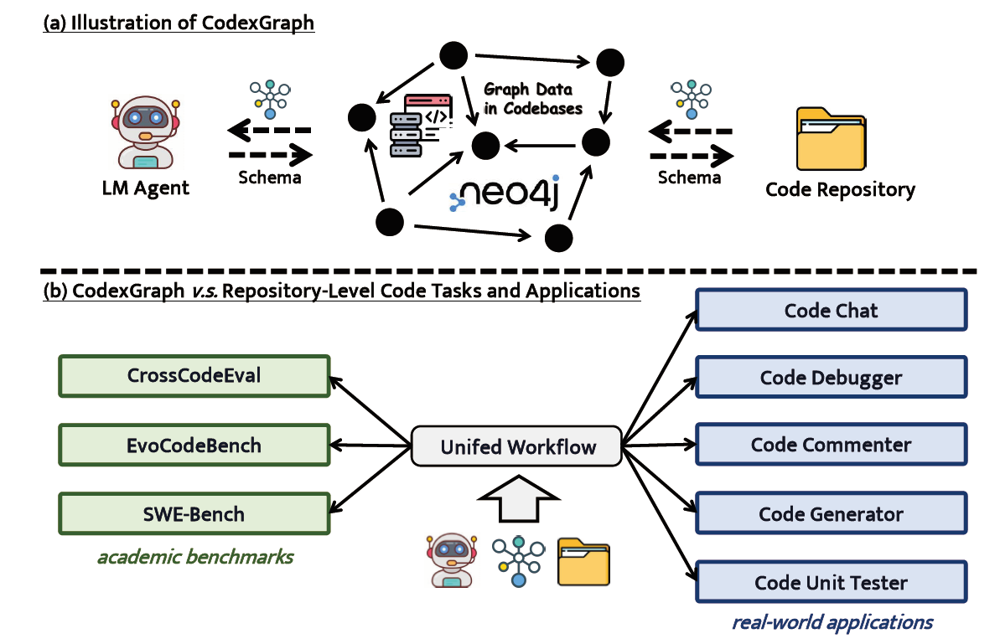

# 编码任务 Agent

## 示例

### CodexGraph

[CodexGraph](https://github.com/modelscope/modelscope-agent/tree/master/apps/codexgraph_agent)

大型语言模型（LLMs）在独立的代码任务（如HumanEval和MBPP）方面表现出色，但在处理整个代码库方面存在困难。这个挑战促使研究人员在代码库规模上增强 
LLM-代码库交互的研究。目前的解决方案依赖于基于相似性的检索或手动工具和API，每种方法都有明显的缺点。基于相似性的检索在复杂任务中通常具有低召回率，
而手动工具和API通常是特定于任务的，需要专业知识，降低了它们在不同代码任务和实际应用中的通用性。为了缓解这些限制，我们介绍了\framework，
这是一个将LLM代理与从代码库中提取的图数据库接口集成的系统。通过利用图数据库的结构属性和图查询语言的灵活性，\framework使LLM代理能够构建和执行查询，
从而实现精确的、代码结构感知的上下文检索和代码导航。我们使用三个基准测试评估了\framework：CrossCodeEval、SWE-bench和EvoCodeBench。
此外，我们开发了五个真实的编码应用程序。通过一个统一的图数据库模式，\framework在学术和实际环境中展示了竞争性能和潜力，展示了它在软件工程中的多样性和功效。

我们的应用演示：https://github.com/modelscope/modelscope-agent/tree/master/apps/codexgraph_agent。
