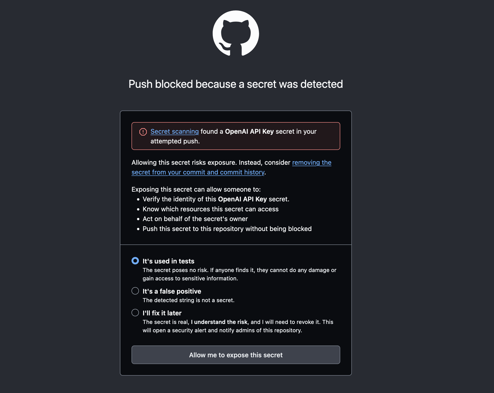
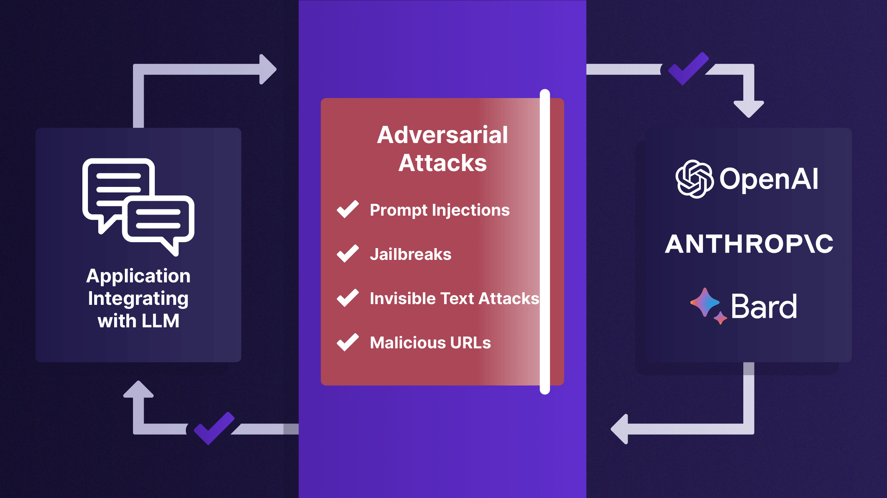

# RAG 数据与 AI 安全

## GitHub Secret



```bash
Current branch main is up to date.
Enumerating objects: 32, done.
Counting objects: 100% (32/32), done.
Delta compression using up to 16 threads
Compressing objects: 100% (16/16), done.
Writing objects: 100% (19/19), 4.59 KiB | 1.15 MiB/s, done.
Total 19 (delta 10), reused 0 (delta 0), pack-reused 0 (from 0)
remote: Resolving deltas: 100% (10/10), completed with 7 local objects.
remote: error: GH013: Repository rule violations found for refs/heads/main.
remote: 
remote: - GITHUB PUSH PROTECTION
remote:   —————————————————————————————————————————
remote:     Resolve the following violations before pushing again
remote: 
remote:     - Push cannot contain secrets
remote: 
remote:     
remote:      (?) Learn how to resolve a blocked push
remote:      https://docs.github.com/code-security/secret-scanning/pushing-a-branch-blocked-by-push-protection
remote:     
remote:     
remote:       —— OpenAI API Key ————————————————————————————————————
remote:        locations:
remote:          - commit: 620252f31718c63dbc6c89d0c0b989187489ef1c
remote:            path: docs/guarding/pipeline-guarding.md:34
remote:          - commit: bb7952d77a7c76a4d29c97bb049af3e709d543f0
remote:            path: docs/guarding/pipeline-guarding.md:34
remote:          - commit: bb7952d77a7c76a4d29c97bb049af3e709d543f0
remote:            path: shirelang/src/test/kotlin/com/phodal/shirelang/ShirePatternPipelineTest.kt:116
remote:     
remote:        (?) To push, remove secret from commit(s) or follow this URL to allow the secret.
remote:        https://github.com/phodal/shire/security/secret-scanning/unblock-secret/xxx
remote:     
remote: 
remote: 
```

## 示例

### Microsoft [Presidio](https://microsoft.github.io/presidio/)

Presidio（源自拉丁语praesidium ‘保护、卫戍’）致力于确保敏感数据得到妥善管理和治理。该系统为私人实体提供快速识别和匿名化功能，
能够处理文本和图像中的信用卡号码、姓名、位置、社会保障号码、比特币钱包、美国电话号码、财务数据等敏感信息。


### Protect AI [LLM Guard](https://llm-guard.com/)

Supported scanners



Prompt scanners

- Anonymize，acts as your digital guardian, ensuring your user prompts remain confidential and free from sensitive data
  exposure.
- BanCode，is designed to detect and ban code in the prompt.
- BanCompetitors, scanner is designed to prevent the inclusion of competitor names in the prompts submitted by users.
  This scanner ensures that prompts containing references to known competitors are either flagged or altered, according
  to user settings, to maintain a strict focus on the user's own products or services.
- BanSubstrings, Ensure that specific undesired substrings never make it into your prompts with the BanSubstrings
  scanner.
- BanTopics, designed to restrict specific topics, such as religion, violence, from being introduced in the prompt using
  Zero-Shot classifier.
- Code, is designed to detect and validate code in the prompt.It can be particularly useful in applications that need to
  accept only code snippets in specific languages.
- Gibberish, is designed to identify and filter out gibberish or nonsensical inputs in English language text. It proves
  invaluable in applications that require coherent and meaningful user inputs, such as chatbots and automated processing
  systems.
- InvisibleText, is designed to detect and remove non-printable, invisible Unicode characters from text inputs. This is
  crucial for maintaining text integrity in Large Language Models (LLMs) and safeguarding against steganography-based
  attacks.
- Language, identifies and assesses the authenticity of the language used in prompts.
- PromptInjection, specifically tailored to guard against crafty input manipulations targeting large language models (
  LLM). By identifying and mitigating such attempts, it ensures the LLM operates securely without succumbing to
  injection attacks.
- Regex, is designed to sanitize prompts based on predefined regular expression patterns. It offers flexibility in
  defining patterns to identify and process desirable or undesirable content within the prompts.
- Secrets, diligently examines user inputs, ensuring that they don't carry any secrets before they are processed by the
  language model.
- Sentiment, scans and evaluates the overall sentiment of prompts using the SentimentIntensityAnalyzer from the NLTK (
  Natural Language Toolkit) library.
- TokenLimit, ensures that prompts do not exceed a predetermined token count, helping prevent resource-intensive
  operations and potential denial of service attacks on large language models (LLMs).
- Toxicity, provides a mechanism to analyze and mitigate the toxicity of text content, playing a crucial role in
  maintaining the health and safety of online interactions. This tool is instrumental in preventing the dissemination of
  harmful or offensive content.

Output scanners

- BanCompetitors, is designed to identify and handle mentions of competitors in text generated by Large Language
  Models (LLMs). This scanner is essential for businesses and individuals who wish to avoid inadvertently promoting or
  acknowledging competitors in their automated content.
- BanSubstrings, scanner provides a safeguard mechanism to prevent undesired substrings from appearing in the language
  model's outputs.
- BanTopics, is designed to detect outputs that touch upon topics that are considered sensitive using Zero-Shot
  classifier.
- Bias, is designed to inspect the outputs generated by Language Learning Models (LLMs) to detect and evaluate potential
  biases. Its primary function is to ensure that LLM outputs remain neutral and don't exhibit unwanted or predefined
  biases.
- Code, can be particularly useful in applications that need to accept only code snippets in specific languages.
- Deanonymize, helps put back real values in the model's output by replacing placeholders.
- JSON, dentifies and validates the presence of JSON structures within given outputs, and returns a repaired JSON if
  possible.
- Language, identifies and assesses the authenticity of the language used in outputs.
- LanguageSame, evaluates and checks if the prompt and output are in the same language.
- MaliciousURLs, detects URLs in the output and analyzes them for harmfulness, such as detecting phishing websites.
- NoRefusal, specifically designed to detect refusals in the output of language models. It can be especially useful to
  detect when someone is trying to force the model to produce a harmful output.
- ReadingTime, estimates and manages the reading time of text content. It is particularly useful for applications where
  content length and reading time need to be controlled, such as in educational materials or time-sensitive reading
  platforms.
- FactualConsistency,is designed to assess if the given content contradicts or refutes a certain statement or prompt. It
  acts as a tool for ensuring the consistency and correctness of language model outputs, especially in contexts where
  logical contradictions can be problematic.
- Gibberish, is tailored to assess the outputs generated by LLMs to identify and flag gibberish or nonsensical content.
  Its key role is to ensure that LLM outputs are coherent and intelligible, devoid of meaningless or random text
  sequences.
- Regex, is designed to sanitize outputs based on predefined regular expression patterns. It offers flexibility in
  defining patterns to identify and process desirable or undesirable content within the outputs.
- Relevance,ensures that output remains relevant and aligned with the given input prompt. By measuring the similarity
  between the input prompt and the output, the scanner provides a confidence score, indicating the contextual relevance
  of the response.
- Sensitive,serves as your digital vanguard, ensuring that the language model's output is purged of Personally
  Identifiable Information (PII) and other sensitive data, safeguarding user interactions.
- Sentiment, is designed to scan and assess the sentiment of generated outputs. It leverages the
  SentimentIntensityAnalyzer from the NLTK (Natural Language Toolkit) library to accomplish this.
- Toxicity, designed to assess the toxicity level of the content generated by language models, acting as a safeguard
  against potentially harmful or offensive output.
- URLReachability, identifies URLs in the text and checks them for accessibility, ensuring that all URLs are reachable
  and not broken.
