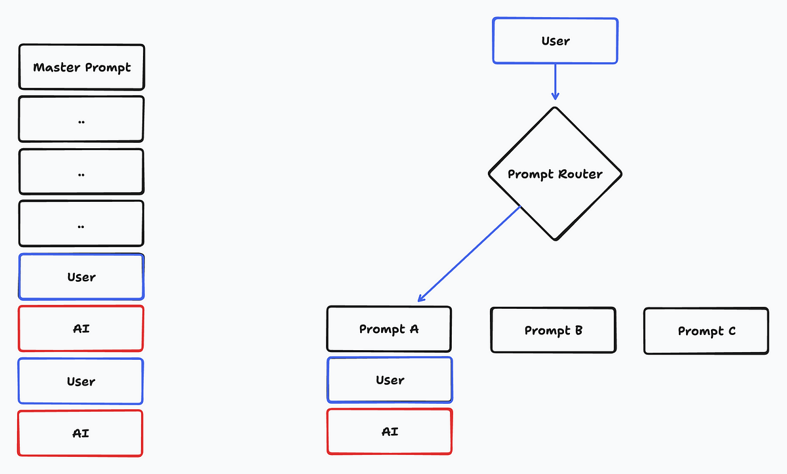
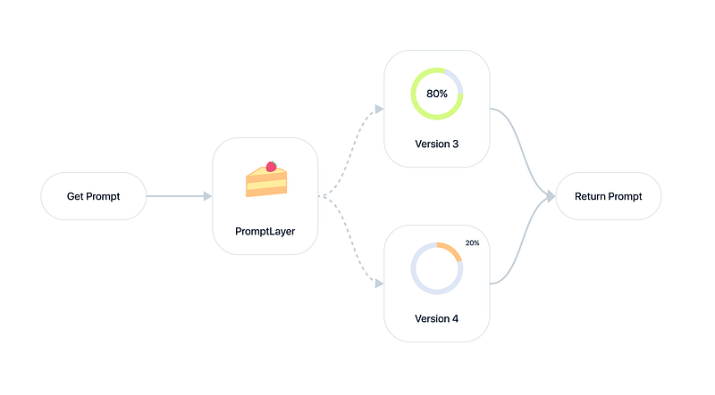

# Agent 调试

## Prompt（提示词） 测试

### Prompt 单元测试

> 验证智能体内部的一个小部分，例如验证智能体在明显的情况下调用了特定的工具。适合测试晦涩的场景，容易验证预期行为。

### Prompt 集成测试

> 从头到尾的复杂场景。这更有价值，因为它能告诉你“它实际上是否有效”。但这往往难以编写断言，因为结果是模糊的，例如对一个模棱两可的问题的回答。

## 示例

### Ellipsis

[Lessons from 15 months of building LLM agents](https://www.ellipsis.dev/blog/lessons-from-15-months-of-building-llm-agents)

- 评估与测试：作者强调了评估（evals）在开发LLM代理过程中的重要性。评估有两种类型：单元测试和集成测试。单元测试检查代理的某个小部分，而集成测试则验证复杂场景的整体表现。由于提示词（prompts）非常脆弱，甚至一个小的修改都可能导致输出质量下降，因此反复测试和验证是确保代理成功的关键。
- 快照与缓存：为了应对LLM的非确定性和高成本，作者建议在开发代理时设置缓存。缓存不仅能使测试结果更具确定性，还能显著加快速度并降低成本。
- 可观测性与日志记录：作者指出，尽管有许多高级的观测工具，但他仍然发现传统的日志记录更为有用。日志记录能够帮助开发者直观地理解代理的行为并诊断问题。
- 提示词的管理与优化：作者认为提示词必须在版本控制中进行管理，尤其是对于复杂的代理而言。此外，他认为现有的LLM代理构建库（如Langchain）在实际应用中并不实用，代理往往需要大量的定制，因此自己编写代理逻辑可能更加高效。

### PromptLayer

https://promptlayer.com/

PromptLayer不仅仅是一个调试工具，它还是一个强大的提示工程和管理平台，提供了多种关键功能，使得AI应用的开发和运营变得更加高效和智能化。

1. **提示工程与管理**：PromptLayer提供了强大的提示版本控制、批量处理和调试工具，使得团队能够更快地迭代和优化提示，确保AI模型能够提供更准确和上下文相关的响应。
2. **可观察性与分析**：通过详细的日志和元数据分析，PromptLayer帮助团队更好地理解AI的行为模式，发现潜在的问题并及时进行优化，减少了AI系统中的“黑箱”操作，增强了透明度。
3. **可视化编辑与部署**：PromptLayer的可视化编辑和自动部署功能，使得即使是非技术团队也能够高效地进行提示工程。这减少了对工程资源的依赖，提升了团队的整体生产力和灵活性。

#### PromptLayer 案例

案例：

| **公司名称**      | **挑战**                         | **PromptLayer解决方案**                          | **结果**                           |
|---------------|--------------------------------|----------------------------------------------|----------------------------------|
| **Ellipsis**  | 快速扩展带来的高请求量导致调试效率低下            | 使用PromptLayer的可观察性平台和元数据搜索功能，快速定位问题并通过UI进行调试 | 调试时间减少90%，调试步骤减少90%，避免了大量工程资源消耗  |
| **ParentLab** | 内容和工程团队需要快速迭代和部署AI提示           | 通过PromptLayer的CMS和可视化编辑功能，简化提示迭代和部署流程        | 提示部署速度提升10倍，节省400多个工程小时，提示质量显著提高 |
| **Speak.com** | 非技术团队需独立迭代AI功能，但缺乏工程支持         | 使用PromptLayer，内容和业务团队可以自主进行提示工程，减少开发时间       | 产品开发和国际扩张中的大量时间和成本节省，关键功能迭代更快速灵活 |
| **ParentLab** | 需要分析用户行为和优化AI响应，但Notion数据库效率低下 | PromptLayer提供日志和分析功能，帮助理解用户行为并持续改进AI响应       | 提示迭代次数增加10倍，提示质量显著提高，节省数百个工程小时   |

#### Prompt Router

- [Prompt Routers and Modular Prompt Architecture](https://blog.promptlayer.com/prompt-routers-and-modular-prompt-architecture-8691d7a57aee/)

有诸多方法可以编程决定将用户的消息路由至哪个提示。

1. 通用大型语言模型（LLM）：最简单且最常见的方法是使用如GPT-4这样的大型语言模型。以下我们会采用这种方法。简而言之，创建一个提示模板，该模板接收用户消息，并返回用于路由的提示模板。
2. 微调模型：通常，如果您能够可靠地获得GPT-4提示作为路由器，您可以微调一个较小的模型以节省成本和延迟。尝试对您的GPT-4输出进行GPT-3.5-Turbo的微调。
3. 向量距离：生成嵌入向量非常快速且成本低廉（与常规完成相比）。您可以通过比较用户消息与可能分类的向量距离，轻松构建一个提示路由器。
4. 确定性方法：有时您可以通过确定性解决方案来决定如何路由。也许您正在字符串中搜索一个关键词……
5. 传统机器学习：最后但同样重要的是，分类是传统机器学习非常常见的一个应用场景。像决策树这样的工具可以帮助您构建比通用大型语言模型更便宜、更快速的提示路由器。

为了简化，我们将使用第一种选项，并为GPT-4编写一个作为路由器的提示。我们的提示模板将接收一个用户问题，并返回一个单词，指示适当的分类：“自我”、“新闻”或“编程”。在您的应用程序代码中，您可以使用这个输出来将问题映射到相应的提示模板。

#### Prompt 管理

- [Scalable Prompt Management and Collaboration](https://blog.promptlayer.com/scalable-prompt-management-and-collaboration/)

这篇文章强调了在使用大型语言模型（LLM）开发AI产品时，提示管理的重要性。文章指出，尽管提示是使基于LLM的产品有效运行的关键，但往往被忽视，
导致产品演进过程中出现效率低下和瓶颈问题。

1. **将提示与代码分离**：将提示与主代码库分离存储，可以加快迭代速度，并使非技术人员更容易参与协作。使用提示管理系统（如PromptLayer）有助于简化这一过程。
2. **模块化设计**：文章借鉴了软件开发中的原则，建议将提示模块化为可重用的组件，如系统消息前言、少样本示例和指令。这种模块化方法简化了提示管理，使非技术人员更易参与。
3. **工作区组织**：保持提示在文件夹中的有序组织和控制访问，对于维护整洁高效的工作流程至关重要。良好的组织减少了风险，增强了协作效率。
4. **协作策略**：有效的提示管理需要建立编辑权限控制机制和版本冻结，以确保工程师与非技术人员之间的协作既稳定又安全。

#### A/B Testing Prompts

Prompt AB Test

那么，究竟如何进行提示语的A/B测试呢？

- 首先，从小规模开始：先将新版本的提示语推向一小部分用户，例如5-10%的用户，或者仅仅是免费层级的客户。这样做可以限制风险，同时还能为您提供有价值的数据。
- 逐步增加：在慢慢提高推广百分比的同时，密切关注用户指标。目标可以是10%、20%、40%，最终达到100%。注意任何红旗警告或负面影响。
- 细分用户：并非所有用户都相同。考虑根据用户类型（免费用户与付费用户）、用户ID或公司等因素进行用户细分。这可以让您在全面推广之前，针对特定群体测试新版本。
- 多种方法结合：A/B测试很有力，但不要仅限于此。将其与合成在线评估和严格的线下测试结合，以全面了解提示语的表现。
- 迭代和优化：A/B测试是一个持续的过程。分析您的结果，对提示语进行调整，然后再次运行测试。持续的迭代是🗝️打造顶级提示语的关键。

关键在于要有条不紊、以数据为驱动，并且勇于尝试。通过从小规模开始，细分用户，通过对实际指标的测试和迭代，他可以充分发挥A/B测试在提示优化方面的潜力。