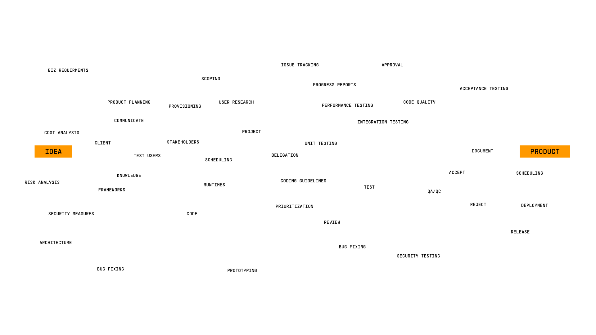
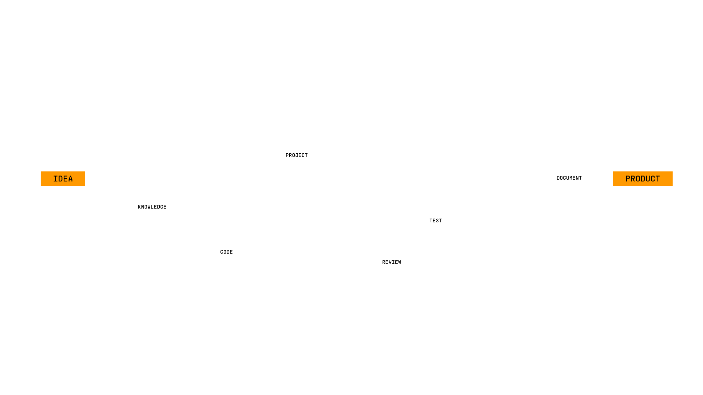
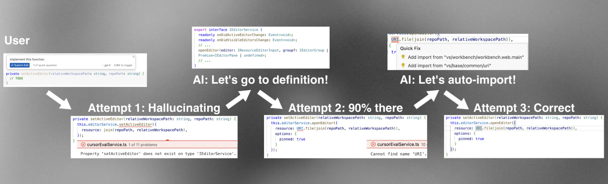
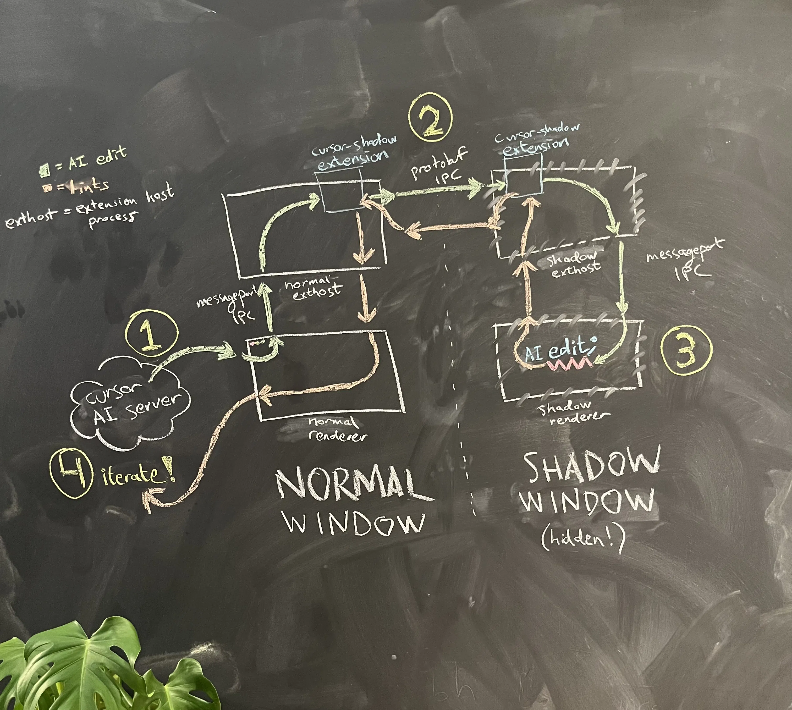

# 编码智能体辅助软件工程

## 示例

### Codium: Cover-Agent && PR-Agent

[CodiumAI Cover Agent](https://github.com/Codium-ai/cover-agent) aims to help efficiently increasing code coverage, by
automatically generating qualified tests to enhance existing test suites.

Below is the roadmap of planned features, with the current implementation status:

* Automatically generates unit tests for your software projects, utilizing advanced AI models to ensure comprehensive
  test coverage and quality assurance. (similar to Meta)
    * Being able to generate tests for different programming languages
    * Being able to deal with a large variety of testing scenarios
    * Generate a behavior analysis for the code under test, and generate tests accordingly
    * Check test flakiness, e.g. by running 5 times as suggested by TestGen-LLM
* Cover more test generation pains
    * Generate new tests that are focused on the PR changeset
    * Run over an entire repo/code-base and attempt to enhance all existing test suites
* Improve usability
    * Connectors for GitHub Actions, Jenkins, CircleCI, Travis CI, and more
    * Integrate into databases, APIs, OpenTelemetry and other sources of data to extract relevant i/o for the test
      generation
    * Add a setting file

### Factory.ai：化繁为简

软件开发包含一系列的任务及子任务，诸如于：

- 依赖编码规范、框架知识、架构设计、安全指标等进行代码编写



如何结合 AI 更好进行知识管理，简化为项目、编码、测试、检视、文档等步骤，实现从想法到产品的快速迭代？



### Cursor：Shadow Workspace

[Shadow Workspace: Iterating on Code in the Background](https://www.cursor.com/blog/shadow-workspace)

Shadow Workspace 设计标准。我们希望 Shadow Workspace 能实现以下目标：

1. LSP 可用性：AI 应该能够看到他们更改后的 lint 提示，能够跳转到定义，并且更广泛地与语言服务器协议 (LSP) 的所有部分进行交互。
2. 可运行性：AI 应该能够运行他们的代码并查看输出。

我们最初专注于 LSP 可用性。 这些目标应满足以下要求：

1. 独立性：用户的编码体验必须不受影响。
2. 隐私性：用户的代码应是安全的（例如，所有代码都保存在本地）。
3. 并发性：多个 AI 应该能够同时进行工作。
4. 通用性：应适用于所有语言和所有工作区设置。
5. 可维护性：代码应尽可能少且易于隔离。
6. 速度：任何地方都不应有分钟级的延迟，并且应有足够的吞吐量以支持数百个 AI 分支。

其中许多反映了为超过十万用户构建代码编辑器的现实情况，我们确实不希望对任何人的编码体验产生负面影响。

问题：



实现：



1. AI 提议对文件进行编辑。
2. 编辑从普通窗口的渲染进程发送到其扩展宿主，然后传送到 Shadow window 的扩展宿主，最后传送到 Shadow window 的渲染进程。
3. 编辑在 Shadow window 中应用， Shadow window是隐藏且独立于用户的，所有 lint 提示都以相同的方式发送回来。
4. AI 接收到 lint 提示，并决定如何进行迭代。

#### shadow_workspace.proto

https://gist.github.com/arvid220u/b976c87c7ec9f6f66595dc0ebc0f07d6

```proto
syntax = "proto3";

package aiserver.v1;
option go_package = "github.com/anysphere/everysphere/schema/aiserver/v1";

service ShadowWorkspaceService {
	rpc GetLintsForChange(GetLintsForChangeRequest) returns (GetLintsForChangeResponse) {}
  rpc ShadowHealthCheck(ShadowHealthCheckRequest) returns (ShadowHealthCheckResponse) {}
}

message ShadowHealthCheckRequest {}

message ShadowHealthCheckResponse {}

// only lints in the supplied files are returned
//
// note that this only returns lints that were changed! unless `get_all_lints_not_just_delta_lints_for_range_in_final_model` is set
message GetLintsForChangeRequest {
  repeated File files = 1;

  message File {
    string relative_workspace_path = 1;

    // the "change" we are getting lints for is the implicit delta between `initial_content` and `final_content`
    string initial_content = 2;
    string final_content = 3;

    // for any lints in the final model that are inside one of these ranges, we return it regardless of whether it existed in the initial model too
    optional RangeCollection get_all_lints_not_just_delta_lints_for_ranges_in_final_model = 4;

    message RangeCollection {
      repeated IRange ranges = 1;
    }

    // simply corresponds to vscode's irange
    message IRange {
      // 1-indexed
      int32 start_line_number = 1;
      // 1-indexed
      int32 start_column = 2;
      // 1-indexed
      // inclusive
      int32 end_line_number = 3;
      // 1-indexed
      int32 end_column = 4;
    }
  }

  // quick fixes will be returned for each lint. potentially a little bit slower
  bool include_quick_fixes = 2;

  // if a new file is not created, some tools will report inaccurate or incomplete lints (e.g., the typescript language server won't properly detect which tsconfig is the right one)
  // the temporarily created file will have a .shadowworkspace-uuid.ts extension, to reduce the chance of conflicts
  // the hope is that it won't affect the user, but it may, so therefore this is off by default for now
  // once we have a proper proxy folder structure, then this should hopefully be obsolete
  // WARNING: this can cause problems for the user!!! (our yarn watch breaks when new files are added and deleted, for example)
  // do not run this for real users! before we have the proxy folder set up
  bool do_not_use_in_prod_new_files_should_be_temporarily_created_for_increased_accuracy = 3;

}

message GetLintsForChangeResponse {
  repeated Lint lints = 1;
  message Lint {
    string message = 1;
    string severity = 2;
    string relative_workspace_path = 3;
    // the position refers to the position in the `final_content` model
    int32 start_line_number_one_indexed = 4;
    int32 start_column_one_indexed = 5;
    int32 end_line_number_inclusive_one_indexed = 6;
    int32 end_column_one_indexed = 7;

    message QuickFix {
      message Edit {
        string relative_workspace_path = 1;
        string text = 2;
        int32 start_line_number_one_indexed = 3;
        int32 start_column_one_indexed = 4;
        int32 end_line_number_inclusive_one_indexed = 5;
        int32 end_column_one_indexed = 6;
      }
      string message = 1;
      string kind = 2;
      bool is_preferred = 3;
      // TODO: this edit can also be a file edit in vscode! currently, we ignore those, and only include text edits
      repeated Edit edits = 4;
    }
    // only included if `include_quick_fixes` is true
    repeated QuickFix quick_fixes = 9;
  }
}
```

## 其它

### 相关材料

开源自主 AI Agent 汇总
伴随 LLM 的快速发展，以 LLM 为大脑的 Agents 能力也越来越强，它们能结合规划、记忆和工具使用，来让 LLM 具备丰富的行动能力。

关于 Autonomous Agents
LLM Powered Autonomous Agents via Lilian Weng
https://lilianweng.github.io/posts/2023-06-23-agent/…
今天我们一起看看都有哪些开源 Agent 项目值得参考
以下是整理好的表格：

| 项目名称     | 开发者            | Stars | 描述                                                                       | 链接                                                         |
|----------|----------------|-------|--------------------------------------------------------------------------|------------------------------------------------------------|
| AutoGPT  | @SigGravitas   | 164k  | 基于 LLM 的通用 Agent 框架，可以自主完成简单任务。四个重要组件：Agent、Benchmark、Forge、Frontend。    | [AutoGPT](https://github.com/Significant-Gravitas/AutoGPT) |
| BabyAGI  | @yoheinakajima | 19.7k | BabyAGI 能够根据给定的目标生成并执行任务，运用了来自 OpenAI、Pinecone、LangChain 和 Chroma 的前沿技术。 | [BabyAGI](https://github.com/yoheinakajima/babyagi)        |
| SuperAGI | @_superAGI     | 15k   | SuperAGI 框架提供了一个开放源代码的平台，用于创建、控制与执行 Autonomous Agents，增强 Agents 的功能性。    | [SuperAGI](https://github.com/TransformerOptimus/SuperAGI) |
| AutoGen  | @pyautogen     | 28.3k | AutoGen 是一个开源编程框架，用于构建 AI Agents 并促进多个 Agents 间的协作以解决任务。                 | [AutoGen](https://github.com/microsoft/autogen)            |
| MetaGPT  | @AlexanderWu0  | 41.6k | MetaGPT 是一个 Multi-Agents 框架，分配不同的角色给 LLM，形成一个协同实体，以应对复杂的任务。              | [MetaGPT](https://github.com/geekan/MetaGPT)               |
| CamelAI  | @CamelAIOrg    | 4.8k  | CAMEL 是一个专为研究自主与交流型 Agent 而设计的开源库，推进领域研究多种类型的 Agents、任务、提示、模型和模拟环境。      | [CamelAI](https://github.com/camel-ai/camel)               |
| Dify     | @dify_ai       | 37.1k | Dify 是一个开源 LLM 应用开发平台，结合 AI 工作流、RAG 管道、Agent 能力、模型管理、可观察性功能等。            | [Dify](https://github.com/langgenius/dify)                 |
| CrewAI   | @crewAIInc     | 17.1k | 用于协调角色扮演、Autonomous Agents 的尖端框架，促进协作智能，解决复杂任务。                          | [CrewAI](https://github.com/joaomdmoura/crewai/)           |
| Botpress | @getbotpress   | 12.2k | Botpress 构建由 OpenAI GPT 提供支持的聊天机器人和助手的终极平台。                              | [Botpress](https://github.com/botpress/botpress)           |
| AgentGPT | @ReworkdAI     | 30.6k | AgentGPT 允许配置和部署 Autonomous Agents，自定义 AI，实现任何目标。                        | [AgentGPT](https://github.com/reworkd/AgentGPT)            |