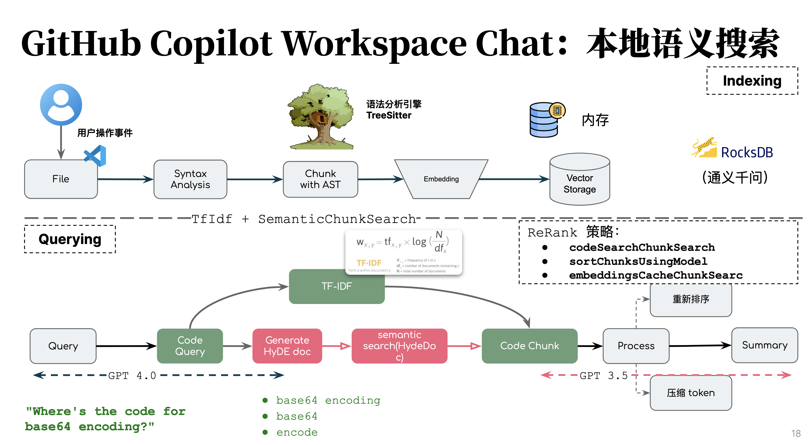

# 编码智能体：Copilot Chat 是如何工作的

```markdown
1. Deciding which workspace information to collect
2. Determining workspace structure…
3. Asking the model to update the user question and provide queries…
4. Running all tools…
5. Collecting workspace information
```

## RAG 过程



## Workspace Agent 模型策略

```
2024-04-15 11:46:05.940 [info] [chat fetch] url https://api.githubcopilot.com/chat/completions
2024-04-15 11:46:05.940 [info] [chat fetch] modelMaxPromptTokens 3072
2024-04-15 11:46:05.940 [info] [chat fetch] modelMaxResponseTokens 4096
2024-04-15 11:46:05.940 [info] [chat fetch] chat model gpt-4
2024-04-15 11:46:07.735 [info] [chat fetch] request.response: [https://api.githubcopilot.com/chat/completions], took 1795 ms
2024-04-15 11:46:19.135 [info] [streamMessages] message 0 returned. finish reason: [stop]
2024-04-15 11:46:19.136 [info] [streamChoices] request done: requestId: [d81668fd-e22d-4cd0-b899-e4a054efb7d3] responseId: [d81668fd-e22d-4cd0-b899-e4a054efb7d3] model deployment ID: []
2024-04-15 11:46:19.153 [info] [chat fetch] url https://api.githubcopilot.com/chat/completions
2024-04-15 11:46:19.153 [info] [chat fetch] modelMaxPromptTokens 7168
2024-04-15 11:46:19.153 [info] [chat fetch] modelMaxResponseTokens 4096
2024-04-15 11:46:19.153 [info] [chat fetch] chat model gpt-3.5-turbo
2024-04-15 11:46:19.785 [info] [chat fetch] request.response: [https://api.githubcopilot.com/chat/completions], took 631 ms
2024-04-15 11:46:19.785 [info] [streamMessages] message 0 returned. finish reason: [stop]
2024-04-15 11:46:19.786 [info] [streamChoices] request done: requestId: [f7263ca2-0fa3-47d6-bb15-4929896db8fa] responseId: [f7263ca2-0fa3-47d6-bb15-4929896db8fa] model deployment ID: [x4dff5e5d11fc]
```

### 理解阶段：GPT 4 生成本地查询机制数据

```Javascript
{
 rephrasedQuestion: "Where's the code for base64 encoding?",
 keywords: [
   {
     keyword: "base64 encoding",
     variations: ["base64 encoder", "base64 encode"]
   },
   {
     keyword: "base64",
     variations: ["base 64"]
   },
   {
     keyword: "encode",
     variations: ["encoded", "encoder", "encoders"]
   }
 ]
}
```


### 总结阶段：GPT 3.5 Turbo  根据返回生成

生成数据示例：


## IDE 信息准备

```
{ header: 'Relevant function implementations', findImpls: relevantFunction },
{ header: 'Relevant class declarations', findImpls: relevantClass },
{ header: 'Relevant type declarations', findImpls: relevantType }
```

```schema
[
 (constructor_declaration
  name: (identifier) @identifier
  body: (constructor_body) @body)
 (method_declaration
  name: (_) @identifier
  body: (block) @body)
 (lambda_expression
  body: (block) @body)
] @function
```


