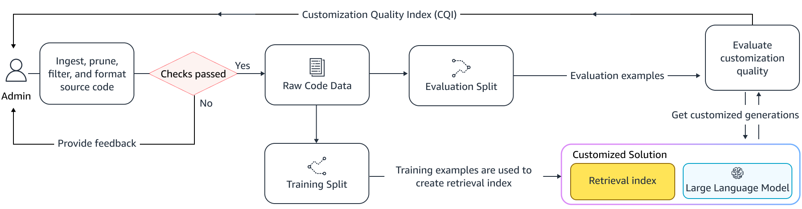
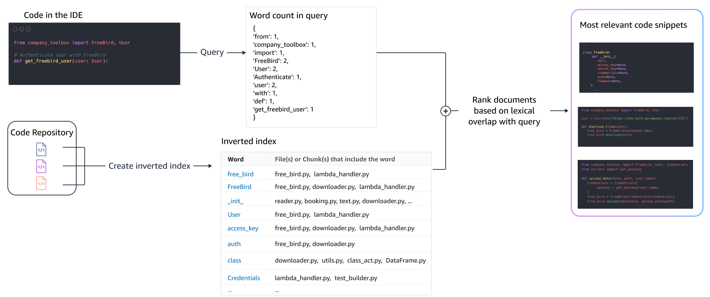
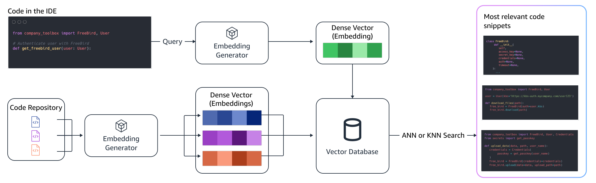

# 本地 AI 智能体

## 示例：AutoDev for VSCode

### 示例：Amazon Q [迁移 Agent](https://aws.amazon.com/cn/q/developer/code-transformation/)

- [Upgrading language versions with the Amazon Q Developer Agent for code transformation](https://docs.aws.amazon.com/amazonq/latest/qdeveloper-ug/code-transformation.html)
- [Modernize your Java application with Amazon Q Developer](https://aws.amazon.com/cn/blogs/devops/modernize-your-java-application-with-amazon-q-developer/)

### [自定义代码库](https://aws.amazon.com/cn/blogs/aws/customize-amazon-q-developer-in-your-ide-with-your-private-code-base/)

[Customizing coding companions for organizations](https://aws.amazon.com/cn/blogs/machine-learning/customizing-coding-companions-for-organizations/)

Indexing

Algorithms

语义检索 [[Contriever](https://arxiv.org/pdf/2112.09118.pdf), [UniXcoder](https://arxiv.org/pdf/2203.03850.pdf)] _–_
将查询和索引的代码片段转换为高维向量，并基于语义相似性对代码片段进行排序。正式来说，通常使用[k近邻 (KNN) 或近似最近邻 (ANN)](https://arxiv.org/abs/2101.12631)
搜索来找到其他具有相似语义的片段。

Semantic retrieval 过程

其它相关：

- [MinJoin: Efficient Edit Similarity Joins via Local Hash Minima](https://arxiv.org/abs/1810.08833)
- [CodeBLEU: a Method for Automatic Evaluation of Code Synthesis](https://arxiv.org/abs/2009.10297)

