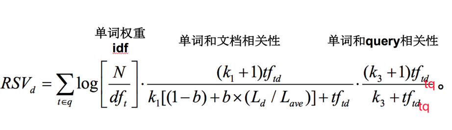
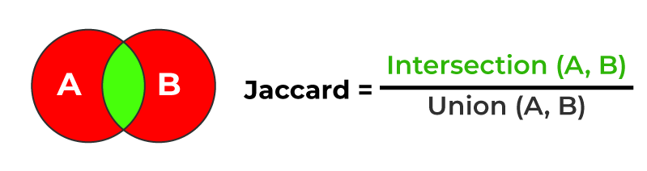

# 编码智能体基础设施

## 查询算法

### BM25 算法

BM25 是一种基于概率的信息检索算法，用于评估文档与查询之间的相关性。BM25 算法的核心思想是通过计算文档中的关键词与查询中的关键词之间的匹配程度，来评估文档与查询之间的相关性。



[Elasticsearch 默认](https://www.elastic.co/guide/en/elasticsearch/reference/current/index-modules-similarity.html)

TF/IDF 基于相似性，具有内置的 tf 归一化，适用于短字段（如姓名）。详见 [Okapi_BM25](https://en.wikipedia.org/wiki/Okapi_BM25)。
此相似性具有以下选项：

| 选项                  | 描述                                                           |
|---------------------|--------------------------------------------------------------|
| `k1`                | 控制非线性词频归一化（饱和）。默认值为 `1.2`。                                   |
| `b`                 | 控制文档长度在多大程度上归一化 tf 值。默认值为 `0.75`。                            |
| `discount_overlaps` | 确定在计算规范时是否忽略重叠标记（位置增量为 0 的标记）。默认情况下，此值为 true，即在计算规范时不计算重叠标记。 |

类型名称：`BM25`

### Jaccard 相似度

Jaccard 相似度是一种用于计算两个集合之间相似度的方法，它是通过计算两个集合的交集与并集之间的比例来评估它们之间的相似度。



Jaccard 相似度的计算公式如下：

```
J(A, B) = |A ∩ B| / |A ∪ B|
```

Kotlin 实现：

```kotlin
fun similarityScore(set1: Set<String>, set2: Set<String>): Double {
    val intersectionSize = set1.intersect(set2).size
    val unionSize = set1.union(set2).size
    return intersectionSize.toDouble() / unionSize
}
```

TypeScript 实现：

```typescript
function similarityScore(set1: Set<string>, set2: Set<string>): number {
    const intersectionSize: number = [...set1].filter(x => set2.has(x)).length;
    const unionSize: number = new Set([...set1, ...set2]).size;
    return intersectionSize / unionSize;
}
```

### TF-IDF

TF-IDF 是一种用于评估文档中关键词重要性的方法，它通过计算关键词在文档中的频率和在整个文档集合中的逆文档频率来评估关键词的重要性。

#### 变体：c-TF-IDF

https://maartengr.github.io/BERTopic/getting_started/ctfidf/ctfidf.html

c-TF-IDF 和传统的 TF-IDF 之间的关键区别在于它们的应用和分析层次：

### 传统的 TF-IDF

- **文档级分析**：TF-IDF 代表词频-逆文档频率。它是一种统计度量，用于评估单词在文档中的重要性相对于整个文档集（语料库）。
- **计算**：
    - **词频（TF）**：测量一个术语 \( t \) 在文档 \( d \) 中出现的频率。
    - **逆文档频率（IDF）**：测量一个术语在所有文档中的重要性。计算公式是 \( \log \left( \frac{N}{n_t} \right) \)，其中 \(
      N \) 是文档总数，\( n_t \) 是包含术语 \( t \) 的文档数。
    - **TF-IDF 得分**：TF 和 IDF 的乘积。这个得分随着单词在文档中出现次数的增加而增加，但会被该单词在语料库中频率的增长所抵消。

### c-TF-IDF

- **簇/主题级分析**：c-TF-IDF 将 TF-IDF 调整为在簇或类别层面上工作，而不是单个文档层面。这种方法在主题建模中特别有用，例如在
  BERTopic 中。
- **计算**：
    - **基于类别的词频（c-TF）**：每个簇（或类别）被视为单个文档。词频是基于这个合并文档中单词的频率计算的，并且针对主题大小的差异进行标准化。
    - **基于类别的逆文档频率（c-IDF）**：调整以考虑每个类别的平均单词数。计算公式是 \( \log \left( 1 + \frac{A}{f_x} \right)
      \)，其中 \( A \) 是每个类别的平均单词数，\( f_x \) 是单词 \( x \) 在所有类别中的频率。
    - **c-TF-IDF 得分**：c-TF 和 c-IDF 的乘积，给出一个单词在特定簇中的重要性相对于其他簇的得分。

### c-TF-IDF 的优势

- **更好的主题表示**：通过关注文档的簇，c-TF-IDF 强调了一个簇中的文档与其他簇的文档之间的区别。
- **定制和模块化**：BERTopic 中的 c-TF-IDF 模型可以进行调优和定制，例如，应用不同的加权方案或减少频繁出现的词。
- **增强的鲁棒性**：像 bm25_weighting 和 reduce_frequent_words 这样的选项提供了对通常不会被过滤掉的常见词的额外鲁棒性。

## 向量数据存储

### 示例：JetBrains + Local Storage

JetBrains 在进行 IDE 搜索时支持 DiskSynchronizedEmbedding 的方式，从远程服务器下载嵌入向量数据，然后将其存储在本地文件系统中。
降低了对远程服务器的依赖，提高了性能和稳定性。

优势：

- 高效的读写操作。使用`RandomAccessFile`进行随机访问，提供高效的读写能力，避免了将整个文件加载到内存中，提高了性能。
- 增量更新。仅更新需要更改的部分，而不是重写整个存储文件，从而提高了写入效率，减少了资源消耗。
- 内存使用优化。通过按需加载和写入数据，显著减少内存占用，非常适用于大规模嵌入向量存储场景。
- 磁盘持久化。通过 LocalEmbeddingIndexFileManager 实现磁盘持久化存储，确保数据的持久性和可靠性。支持从磁盘加载和保存索引，增强数据恢复能力。
- 便于管理和维护。将ID和嵌入向量分开存储，分别为JSON文件和二进制文件，便于管理和维护。

缺点：

- 本地存储限制。依赖本地存储空间，可能会受到硬件限制，如果嵌入向量数据量非常大，可能需要频繁监控和管理存储资源。
- 性能瓶颈。在高并发环境下，读写锁的争用可能成为性能瓶颈。极端情况下，可能会出现性能下降的问题，需要进一步优化和调整。
- 不支持分布式访问。由于数据存储在本地文件系统中，不支持跨服务器或分布式系统访问，限制了应用场景。

### 示例：Sweep + Redis

[Our simple vector database implementation](https://docs.sweep.dev/blogs/vector-db-implementation)

优势：

- 管理多个索引的复杂性：
    - 标准的向量数据库在处理单个索引时表现良好，但在管理多个索引、频繁更新和自托管时变得复杂。
    - 使用 Redis 可以简化这一过程，无需管理多个索引和重建索引的问题。
- 基础设施和依赖管理：
    - 使用外部存储（如 Pinecone）会引入额外的依赖和潜在的故障点。
    - Redis 是一个流行的开源内存数据库，可以轻松自托管，减少了对外部服务的依赖。
- 缓存机制：
    - Redis 非常适合缓存用途，可以快速读取和写入数据，这对于频繁访问的 Embedding 向量非常重要。
    - 通过使用 Redis，系统可以缓存 Embedding 结果，减少对 OpenAI API 的调用次数，降低成本和延迟。

缺点：

- 该方法速度较慢（每个查询大约1秒），但满足他们的需求。
- 系统在超过 100 万个嵌入向量时扩展性不佳，但符合他们当前的需求（通常每个代码库文件少于30k）。

### 示例：通义灵码 + RocksDB

```bash
/Users/phodal/.lingma/tmp/cache/v3.3
├── 000001.vlog
├── 00001.mem
├── DISCARD
├── KEYREGISTRY
├── LOCK
└── MANIFEST
```

## 相关资源

### BERTopic

- [BERTopic: How to Build a Topic Model with BERT](https://maartengr.github.io/BERTopic/algorithm/algorithm.html)


示例代码：

```Python
from umap import UMAP
from hdbscan import HDBSCAN
from sentence_transformers import SentenceTransformer
from sklearn.feature_extraction.text import CountVectorizer

from bertopic import BERTopic
from bertopic.representation import KeyBERTInspired
from bertopic.vectorizers import ClassTfidfTransformer


# Step 1 - Extract embeddings
embedding_model = SentenceTransformer("all-MiniLM-L6-v2")

# Step 2 - Reduce dimensionality
umap_model = UMAP(n_neighbors=15, n_components=5, min_dist=0.0, metric='cosine')

# Step 3 - Cluster reduced embeddings
hdbscan_model = HDBSCAN(min_cluster_size=15, metric='euclidean', cluster_selection_method='eom', prediction_data=True)

# Step 4 - Tokenize topics
vectorizer_model = CountVectorizer(stop_words="english")

# Step 5 - Create topic representation
ctfidf_model = ClassTfidfTransformer()

# Step 6 - (Optional) Fine-tune topic representations with 
# a `bertopic.representation` model
representation_model = KeyBERTInspired()

# All steps together
topic_model = BERTopic(
  embedding_model=embedding_model,          # Step 1 - Extract embeddings
  umap_model=umap_model,                    # Step 2 - Reduce dimensionality
  hdbscan_model=hdbscan_model,              # Step 3 - Cluster reduced embeddings
  vectorizer_model=vectorizer_model,        # Step 4 - Tokenize topics
  ctfidf_model=ctfidf_model,                # Step 5 - Extract topic words
  representation_model=representation_model # Step 6 - (Optional) Fine-tune topic represenations
)
```