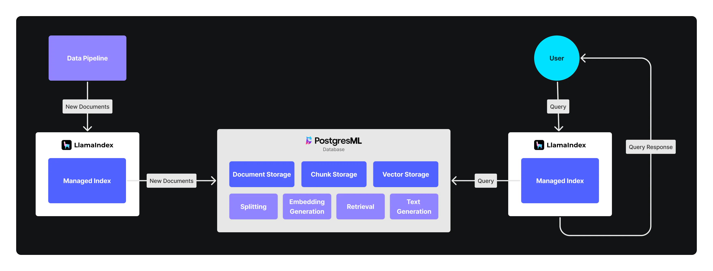

# Rerank

## 示例

### PostgresML

[PostgresML](https://github.com/postgresml/postgresml)

#### Korvus

#### PostgresML + LlamaIndex

- [Improving Vector Search - Reranking with PostgresML and LlamaIndex](https://www.llamaindex.ai/blog/improving-vector-search-reranking-with-postgresml-and-llamaindex)
- [Simplify your RAG application architecture with LlamaIndex + PostgresML](https://www.llamaindex.ai/blog/simplify-your-rag-application-architecture-with-llamaindex-postgresml)

