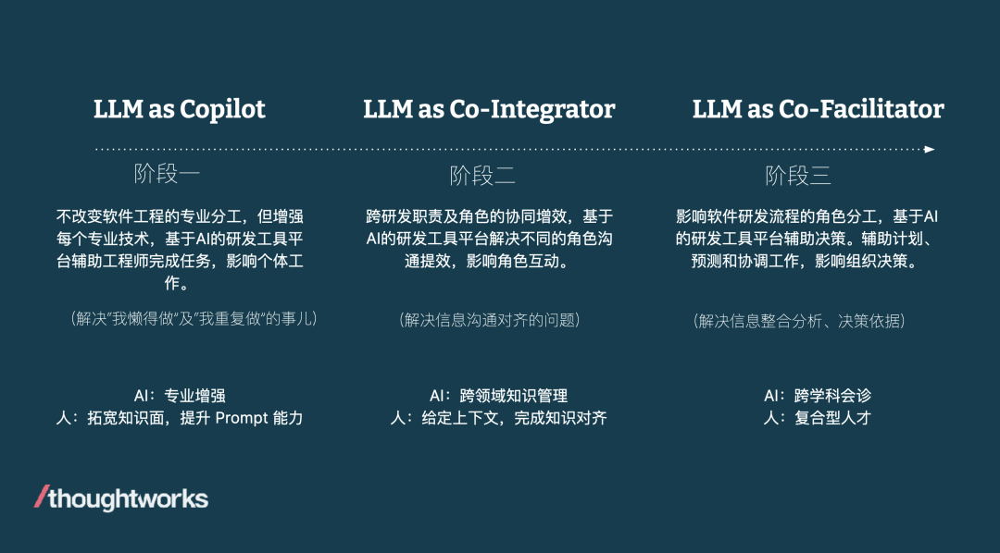

# AI 辅助软件工程：AI4SE 设计原则

> AI4SE（Artificial Intelligence for Software Engineering）是指将人工智能技术应用于软件工程领域，旨在通过 AI
> 算法和工具改进软件开发、维护、测试和管理等环节的效率与效果。AI4SE 的核心目标是通过自动化与智能化技术，降低软件开发的复杂性，提升软件质量，并加快软件工程的进程。

## 核心设计原则

在先前的《[LLM 优先的软件架构设计原则](https://aigc.phodal.com/llm-architecture.html)》一节中，我们思考了适合于 LLM 应用开发的设计原则。
在结合生成式 AI 构建软件领域的实践经验和案例分析后，我们总结了以下 AI4SE 设计原则：

- **以人为本，AI 为辅**
- **上下文智能化**
- **数据驱动的闭环反馈**

### 以人为本，AI 为辅

AI 应被设计为提升人类生产力的工具，而非取代人类。在软件工程领域，AI 的作用是为开发者提供更多选择和更优质的决策支持。我们将
AI 辅助软件工程分为三个阶段/角色，分别是共航者（Co-Pilot）、共融者（Co-Integrator）和共促者（Co-Facilitator）。

#### 共航者（Co-Pilot）

- **减少重复性工作**：通过自动化重复和低价值任务，如数据录入和基础分析，AI 可以释放开发者的时间和精力。
- **辅助决策**：AI 能通过数据挖掘和分析，为开发者提供有价值的洞察和建议，帮助他们在复杂环境中做出更明智的选择。
- **实时反馈与优化**：在任务执行过程中，AI 能提供即时反馈与建议，帮助用户持续优化决策与行动方案。

#### 共融者（Co-Integrator）

- **提高工作效率**：AI 能够优化和自动化工作流程，减少人为错误，提升整体效率。例如，在制造业中，AI 可以实时监控和调整生产线，从而提高生产效率与产品质量。
- **整合多源数据**：AI 可以从多个数据源中提取信息，并进行综合分析，为用户提供全面的视角和深刻的洞察。
- **促进跨领域协作**：AI 可以连接不同领域的知识和资源，促进跨学科和跨行业的合作与创新，推动技术与社会的进步。

#### 共促者（Co-Facilitator）

- **增强学习与发展**：AI 可以作为学习工具，帮助人类持续提升技能和知识。通过智能辅导系统，AI 可以根据学习者的进度和需求，提供个性化的学习路径与资源。
- **组织协调**：AI 能通过全面的分析与预测，帮助组织优化资源分配、进度管理与风险控制，从而提升整体运营效率。

AI 通过这三个角色，超越了简单的工具定位，成为开发者不可或缺的合作伙伴。它不仅帮助我们解决当下的挑战，更为我们赋能，引领我们迈向更加创新与高效的未来。

### 上下文智能化

有效的 AI 辅助研发工具，不仅仅是机械地执行简单的命令，它需要具备上下文感知能力。诸如于 SourceGraph
的文章《[Why context awareness is challenging for code AI](https://sourcegraph.com/blog/how-cody-provides-remote-repository-context)
》对些的深入探讨：

- **人类与 AI 的上下文差异**：人类开发者依赖丰富且个性化的上下文知识，而 AI 则依赖于其训练数据中的通用上下文。这种差异意味着
  AI 必须学会更好地理解和适应特定的任务环境。
- **增强 AI 的上下文感知**：为了提高 AI 的有效性，应通过引入与任务相关的上下文知识来增强其能力，使其能够更接近人类开发者的思维过程。
  这种上下文不仅包括代码本身，还应包括开发者的习惯和项目的历史背景。
- **从繁琐到智能的转变**：虽然理论上可以通过手动复制粘贴代码来提供上下文，但这种方法既繁琐又违背了使用 AI 助手的初衷。目标应是让
  AI 自动检索并利用相关上下文，从而提供更精准且实用的输出。
- **多层次的上下文支持**：根据任务的复杂性，AI 需要获得不同层次的上下文支持，从本地文件级别到仓库级别，再到远程仓库的广泛上下文。
  每个层次的上下文都有助于提高 AI 的决策能力。
- **技术挑战与前景**：目前，许多 AI 工具可以处理本地文件的上下文，但当涉及到整个仓库，尤其是远程仓库的上下文时，仍然面临技术挑战。
  这些挑战包括如何有效检索、分析和应用大量的代码和文档信息。

同时，AI工具应提供灵活的控制选项，以适应不同开发者的需求和工作方式。AI通过提供多种推荐选项，协助开发者依据个人偏好和习惯进行选择，进而提升工作效率。

通过减少对 AI 操作的硬性控制，并增强其上下文感知能力，可以构建更加智能且高效的开发环境。这使得AI真正成为开发者的得力助手。

### 数据驱动的闭环反馈

成功的 AI4SE 不仅依赖于数据的驱动，还必须优先考虑开发者体验。通过构建闭环反馈机制，AI 工具能够不断适应和改进，以满足开发者的实际需求，实现高效、智能的开发支持。

#### 数据驱动与动态反馈

- **数据收集与分析**：AI 系统的性能依赖于高质量的数据。为了确保工具的有效性，AI
  应自动化收集、分析并维护数据，为开发者提供有深度的洞察。这些数据可以包括代码库的变化、开发者的使用习惯以及项目进度等。
- **持续学习与优化**：AI 系统应具备持续学习和适应能力，能够根据实时更新的数据不断调整和优化其表现。这种自我优化的过程使 AI
  工具能够随着项目的发展和用户需求的变化不断进步。
- **透明的决策机制**：AI 工具应向开发者清晰展示其决策依据，使用户能够理解 AI
  的逻辑和推理过程。这种透明性不仅增加了工具的可信度，也帮助开发者在使用过程中更好地掌控和调整 AI 的输出。

#### 围绕开发者体验构建闭环反馈

- **实时反馈机制**：AI 工具应提供实时的反馈，帮助开发者在编写代码、调试和测试的过程中获得及时的支持。这种即时反馈能够让开发者迅速发现和解决问题，提升整体工作效率。
- **用户体验优化**：基于用户的实时反馈，AI 工具应不断优化其界面和功能，以提高易用性和用户满意度。通过迭代改进，工具可以更加贴合开发者的实际需求。
- **个性化建议与调整**：AI 工具应根据开发者的工作习惯和偏好，提供个性化的功能和建议。同时，工具应具备学习能力，能够根据反馈不断调整其行为和建议，确保其适应性和精准度。
- **无缝集成与协作**：AI 工具应无缝集成到开发者的工作流程中，减少上下文切换，提升团队协作的效率。通过这种集成，AI
  不仅能为个体开发者提供支持，还能促进团队间的知识共享与合作。

通过数据驱动的决策和闭环反馈机制，AI4SE 工具能够不断适应和进化，为开发者提供更加智能、精准和高效的支持，最终助力他们在复杂的开发环境中实现卓越的成果。