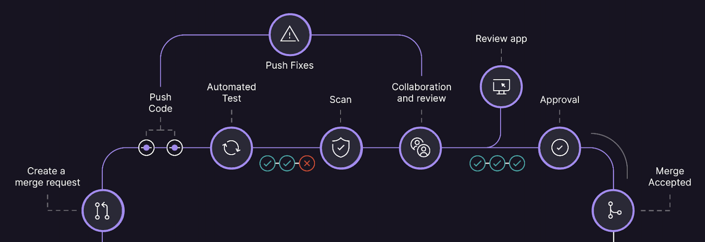

# AI 辅助软件工程：Gitlab 赋能开发者的 AI4SE




GitLab Duo 是团队开发的一套AI驱动功能。它革新了我们的内部工程工作流程，极大提升了开发效率。作为狗粮政策和透明度的坚定拥护者，
我们愿意展示团队如何运用AI技术。这包括GitLab Duo的代码建议和聊天功能，它们每天帮助我们简化开发流程，减少手动操作，从而提高生产力。读者将了解到，
无论是技术密集型的工程团队，还是技术要求较低的团队（例如技术写作和产品管理），都从中获得了显著的好处。

## GitLab Duo 内部使用案例

我们的团队已将 GitLab Duo 的众多功能整合到日常工作中。以下是 GitLab Duo 如何帮助他们完成日常活动的一些例子。

### 总结和文档

**简化代码审查过程**：后台开发人员Gosia Ksionek展示了AI在她工作流程中的实际好处，通过使用 GitLab Duo 简化代码审查过程。她有效地利用GitLab
Duo总结合并请求，使代码更改的审查变得更容易和更快速。除了总结合并请求外，Gosia还利用GitLab
Duo回答编码问题并解释复杂的代码片段。这提高了她的生产力，帮助她更好地理解和管理复杂的代码库。通过这些演示，Gosia突出了GitLab
Duo如何显著改善开发过程中的效率和清晰度，使其成为开发人员不可或缺的工具。

**压缩评论线程**：扩展软件开发副总裁Bartek Marnane使用 GitLab Duo 将冗长的评论线程压缩为简明摘要，确保在更新问题描述时捕捉到所有相关细节。

**创建新文档**：数据科学部门产品组经理Taylor McCaslin利用 GitLab Duo 为GitLab
Duo本身创建了新文档，展示了一个提高清晰度和一致性的元用例，并大大减少了记录新功能所需的时间。

**编写发布说明**：产品规划高级产品经理Amanda Rueda使用GitLab
Duo编写简短而有影响力的发布说明，突出更改及其对用户的价值。通过使用如下面这样精心设计的提示，Amanda增强了她的工作流程，确保每个发布说明都是清晰、简洁且以用户为中心，提升了整体沟通和用户体验：

“请为此更改创建一个两句话的摘要，用于我们的发布说明。语气应为对话式，并使用第二人称。摘要应包括问题或更改的描述，并与我们为你，用户，创造的价值相关联。”

以下是与 GitLab Duo 共同创建的一些发布说明的示例：

- 扩展了路线图的排序选项
- 现在可以使用里程碑和迭代来增强问题板的清晰度
- 设计管理功能扩展到产品团队

**优化文档站点导航**：资深技术写作员Suzanne Selhorn利用 GitLab Duo 通过提供基于工作流的页面顺序来优化左侧导航。Suzanne向GitLab
Duo提供了功能列表，生成了最佳顺序，并更新了左侧导航以匹配。 GitLab Duo 还比使用传统手动方法更快地起草了入门文档。

### 目标设定和团队对齐

**起草和完善OKR**：代码审查后端工程经理François Rosé发现GitLab
Duo聊天在起草和完善OKR方面非常有价值。通过更清晰和有效地表达目标，François增强了目标设定和团队对齐。使用聊天，François确保每个OKR都是明确的、可执行的，并与团队的目标保持一致，从而提高了整体团队表现和凝聚力。以下是他使用的一个示例提示：

```bash
这是我打算创建的一个OKR：

目标：回顾回顾会议，促进团队繁荣
KR：测量100%团队成员的回顾满意度
KR：识别3个异步回顾的改进点
KR：实施1个改进
请提供如何改进这个目标和这些关键结果的直接反馈。
```

**简化招聘和招聘流程**：聊天帮助前端工程师Denys
Mishunov制定了更新技术面试候选人电子邮件模板的明确简洁的文本。团队合作优化了沟通，以确保候选人获得所有必要信息，并使用合并请求进行。这个例子展示了AI工具在招聘流程中增强沟通的实际应用。

### 事件响应和配置

**总结生产事件**：现场可靠性工程师 Steve Xuereb 使用 GitLab Duo 总结生产事件并创建详细的事件回顾，从而简化文档编制过程。

**创建样板 `.gitlab-ci.yml` 文件**：Steve还使用聊天创建样板 `.gitlab-ci.yml`
文件，显著加快了他的工作流程。聊天作为一个有价值的伙伴，提出建议。此外，代码解释提供了详细的答案，在事件发生时很有帮助，提
高了他的生产力和对代码库的理解。

### 代码生成和测试

**全栈开发**：高级前端工程师 Peter Hegman 一直在使用代码建议进行 JavaScript 和 Ruby 开发。这突显了代码建议已成为开发人员跨越完整技术栈的强大工具。

**生成Python脚本**：Denys 进行了一个使用 GitLab Duo 完成非 GitLab 任务的实验。这个例子突显了我们的AI工具在典型软件开发任务之外的灵活性和实用性。

观看Denys如何使用 GitLab Duo 生成 Python 脚本以获取内容数据并将其存储在本地：

### 研究和支持

**生成测试源代码**：高级开发者倡导者 Michael Friedrich 使用 GitLab Duo 为 CI/CD 组件生成测试源代码。
以这种方式使用 GitLab Duo 有助于确保代码的一致性、良好的文档记录，并与我们的最佳实践保持一致。

**简化研究任务**
：我们的团队成员在有关于 GitLab 功能的问题时，经常求助于聊天，简化他们的研究和支持任务。Michael分享说，“当我有关于GitLab功能的问题时，
我会默认使用聊天，而不是打开 100 个浏览器标签。这种工作流程帮助我高效地在我们的社区论坛上协助用户。例如，我最近使用这种方法帮助一个用户进行SSH部署。”
使用聊天不仅节省时间，还提供快速、准确的信息，增强了我们为社区提供的支持。

### 功能测试

**测试新功能**：我们的工程师使用 GitLab Duo 测试新的功能，如代码建议中的Markdown支持。我们的一个团队成员指出，“我需要测试代码建议中的Markdown支持，以便在VS
Code中编写博客文章和GitLab文档。我看到它已合并到17.0版本。”通过内部测试这些功能，我们确保它们在发布前达到我们的质量标准。

### 理解外部代码库

**介绍外部项目解析功能**：GitLab Duo的 `/explain` 功能，在帮助理解导入 GitLab 的外部项目方面极为有效。这一功能在 Michael
最近与开源专家
Eddie Jaoude 的直播中得到了重点介绍。Michael 表示：“我利用 `/explain` 功能来深入理解外部项目的源代码。我曾在直播中分享这一思路，
它有助于我们更好地了解开源项目及其依赖关系。”这一功能对于开发者而言，在快速掌握不熟悉的代码库及其依赖关系方面显得尤为珍贵，
极大地提升了他们的工作效率和代码理解能力。

## 其它

相关文章：

- [Developing GitLab Duo : How we are dogfooding our AI features](https://about.gitlab.com/blog/2024/05/20/developing-gitlab-duo-how-we-are-dogfooding-our-ai-features/)
