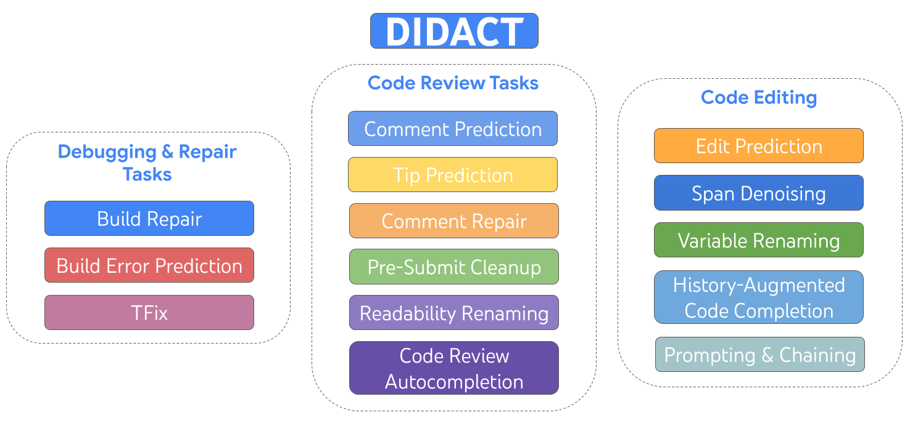
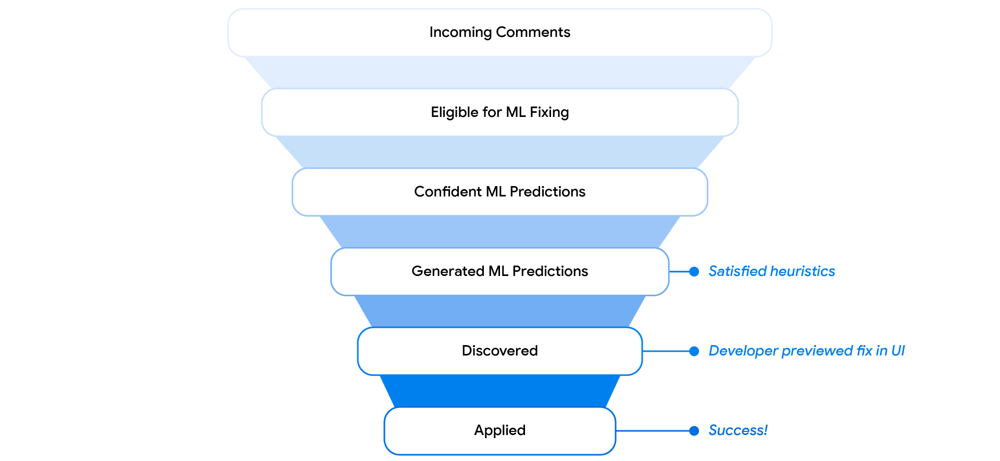
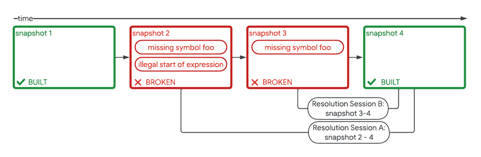
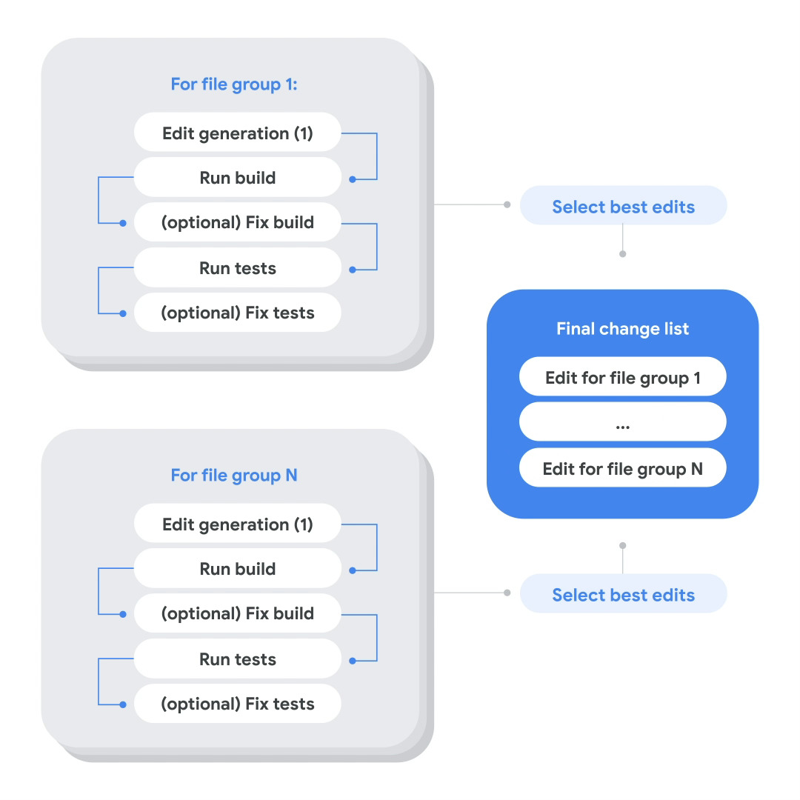

# AI 辅助软件工程：Google 开发者活动驱动的 AI 赋能

## Google DIIDACT 框架：动态集成开发人员活动

文章：[AI in software engineering at Google: Progress and the path ahead](https://research.google/blog/ai-in-software-engineering-at-google-progress-and-the-path-ahead/)

Google
在内部探索了[LLM for Dev Activity](https://research.google/blog/large-sequence-models-for-software-development-activities/)
方式， 以提升开发人员效率：

> DIDACT (Dynamic Integrated Developer ACTivity) 是一种用于训练大规模机器学习（ML）模型的软件开发方法。与传统只使用完成代码的方式不同，DIDACT
> 创新的地方在于，它使用软件开发过程本身作为模型的训练数据来源。这意味着模型不仅能看到开发者在工作时所见的上下文，还能学习他们所采取的行动，从而更好地理解软件开发的动态过程，并与开发者的实际工作方式对齐。

### DIIDACT 框架： [Smart Paste](https://research.google/blog/smart-paste-for-context-aware-adjustments-to-pasted-code/)

**智能粘贴**是谷歌开发的一种内部工具，旨在通过自动调整粘贴代码来优化编码工作流程。这个工具利用生成式人工智能来创建上下文感知的修改，从而提高代码开发的效率。以下是其主要特点和优势的概述：

1. **自动化的粘贴后调整**：智能粘贴分析周围的代码环境，并对粘贴的代码进行必要的修改，比如添加缺失的语法、重命名变量或更改类型。这减少了粘贴代码后手动调整的工作量。
2. **用户行为洞察**：谷歌的单一代码库分析显示，大约有25%的粘贴操作会立即被修改，这可能会打断编码流程。智能粘贴通过预先进行这些常见调整，试图最小化这种中断。
3. **生成式人工智能集成**：该工具利用先进的人工智能模型（如DIDACT），预测并实现必要的变更，确保粘贴的代码与现有代码库平滑集成。
4. **高采纳率和性能**：在大约40,000名工程师的研究中，智能粘贴被使用于所有粘贴操作的6.9%，其中42.5%的建议被接受。这表明工作流效率有显著提升。
5. **训练和校准**：该模型使用谷歌单一代码库中的粘贴后编辑数据进行训练，包括不需要进行编辑的情况。这个全面的数据集帮助模型学习何时建议变更以及何时保持代码原样。
6. **用户体验设计**：该工具旨在以用户友好的方式提供高置信度的修改建议。建议会以视觉提示显示，并在特定时间内自动丢弃，以避免打断用户的工作流程。
7. **内联差异预览**：为了保持用户控制并清晰显示建议的变更，使用内联差异预览。这在编辑器中直接突出显示插入和删除的片段，使用户可以通过简单的快捷键接受建议。
8. **未来增强计划**：计划包括探索模型在复制粘贴交互之外的能力，并重新审视针对小而高置信度变更的自动应用模式。

智能粘贴代表了人工智能辅助编码工具的重大进步，减少了代码集成所需的手动工作，并提高了开发人员的整体生产力。

### DIIDACT 框架：[Code Review](https://research.google/blog/resolving-code-review-comments-with-ml/)

代码更改审查是规模化软件开发过程中的关键部分，占据了代码作者和代码审查者大量的时间。在这个过程中，审查者检查提议的代码，并通过用自然语言撰写的评论向作者提出代码更改请求。

### DIIDACT 框架：[AutoCommenter](https://arxiv.org/abs/2405.13565)

Paper：[AI-Assisted Assessment of Coding Practices in Modern Code Review](https://arxiv.org/abs/2405.13565)

现代代码审查（Sadowski等人，2018年；Rigby和Bird，2013年）（与整体代码审查（Fagan，1976年）相比）多年来在开源和工业环境中有机地发展壮大。已经形成了一组常见的同行评审标准（Rigby和Bird，2013年；Rigby等，2012年；Bacchelli和Bird，2013年），其中包括编码最佳实践。许多公司、项目甚至编程语言都正式定义了这些标准，以"样式指南"的形式（goo，2024；lin，2024；pyt，2024；rus，2024），通常涵盖以下方面：

- 格式化：行限制、空格和缩进的使用、括号和大括号的放置等；
- 命名：大写、简洁、描述性等；
- 文档：文件级、函数级和其他注释的预期放置和内容；
- 语言特性：在不同（代码）上下文中使用特定语言特性；
- 代码习惯：使用代码习惯来提高代码清晰度、模块化和可维护性。

开发人员通常对现代代码审查流程报告高度满意（Sadowski等人，2018年；Winters等人，2020年）。其中一个主要好处是对于不熟悉代码库、特定语言特性或常见代码习惯的代码作者来说，这是一个学习经验。在审查过程中，专家开发人员教育代码作者使用最佳实践，同时审查（并学习）代码贡献及其影响。
静态分析工具如linters（Johnson，1977年）可以自动验证代码是否符合某些最佳实践（例如格式化规则），有些工具甚至可以自动修复违规。然而，细致的指导方针或带有例外的指导方针在整体上很难完全自动验证（例如命名约定和对旧代码中合理偏差的正当性），有些指导方针根本无法通过精确规则捕捉（例如代码注释的清晰性和具体性），而是依赖于人类判断和集体开发者知识。因此，一般期望人类审阅员检查代码变更是否违反最佳实践。
代码审查过程的最大成本是所需的时间，尤其是来自专家开发人员的时间。即使有了显著的自动化措施，并尽可能保持流程轻量化，开发人员每天仍然可以轻松花费数小时进行此任务（Sadowski等人，2018年）。
机器学习的最新进展，特别是大型语言模型（LLMs）的能力，表明LLMs适合于代码审查自动化（例如（Tufano等人，2024年，2022年；Hong等人，2022年；Li等人，2022b，a；Thongtanunam等人，2022年））。然而，在规模化部署端到端系统的软件工程挑战仍未被探索。同样，缺乏对这些系统整体效力和用户接受度的外部评估。

本文探讨了部分自动化代码审查流程的可能性，特别是检测最佳实践违规，从而为代码作者提供及时反馈，使审阅员能够专注于整体功能。具体而言，本文报告了我们在Google工业环境中开发、部署和评估AutoCommenter——一种自动化代码审查助手的经验，目前每天由数万名开发人员使用。

### DIIDACT 框架：[Build Repair](https://research.google/blog/safely-repairing-broken-builds-with-ml/)

我们在集成开发环境中展示了修复，并对这一功能进行了控制实验。这个实验显示，在多个生产力衡量指标上都取得了统计上显著的增益，包括代码更改数量增加了
2%。
这些增益不仅仅是为了它们自身的好处，而且通过自动化消除了开发者的重复劳动，为他们提供更多时间进行创造性问题解决。这通过消除障碍促进了专注，
从而让开发者能够更长时间保持他们的工作流状态。实际上，我们现在观察到，在一个月内遇到构建中断的用户中，约有34%最终采纳了这种由
ML 建议的修复方案。

为了评估通过我们的修复引入不正确甚至危险代码的风险，我们检查了回顾性的安全性和可靠性相关指标，包括：

- 变更列表回滚率：生产中的问题通常通过回滚引入错误的变更列表来解决。
- 新的检测工具失败率：谷歌运行的检测工具可以检测和标记单元测试和模糊测试中的内存损坏或泄漏问题；例如AddressSanitizer、MemorySanitizer和GWP-Asan。

我们在使用构建修复的变更列表和未使用的变更列表之间监测了这些指标，发现没有可检测的差异。

### DIIDACT 框架：[代码迁移](https://research.google/blog/accelerating-code-migrations-with-ai/)

多年来，谷歌一直使用专门的基础设施来执行复杂的代码迁移。该基础设施使用静态分析和如 [Kythe](https://kythe.io/)
和 [Code Search](https://abseil.io/resources/swe-book/html/ch17.html)
等工具来发现需要更改的位置及其依赖关系。然后使用如 [ClangMR](https://clang.llvm.org/docs/RefactoringEngine.html) (Clang’s
refactoring engine)等工具进行更改。

我们将迁移过程概念性地分为三个阶段：

- 确定需要修改的代码库位置
- 编辑生成和验证
- 更改审查和发布

虽然这些阶段中的每一个都受益于 AI，我们主要关注第 2 阶段。

为了生成和验证代码更改，我们利用了在谷歌内部代码和数据上微调过的 Gemini 模型版本。

每次迁移需要以下输入：

- 一组文件和预期更改的位置：路径 + 文件中的行号
- 一到两个描述更改的提示
- [可选] 少量示例，以确定文件是否确实需要迁移

多阶段代码迁移过程的示例执行。

用户提供的文件位置通过预先存在的静态工具和人工输入的组合进行收集。我们的迁移工具包会自动扩展这组文件，添加其他相关文件，包括：测试文件、接口文件和其他依赖项。
这一步骤尚未由 AI 驱动，但使用了符号交叉引用信息。

在许多情况下，用户提供的迁移文件集并不完美。由于过滤输入列表可能很繁琐，一些文件可能已经部分或完全迁移。因此，为了避免冗余更改或在编辑生成过程中混淆模型，
我们提供了少量示例，并要求模型预测文件是否需要迁移。

编辑生成和验证步骤是我们发现自动系统最有益的地方。我们的模型在谷歌的单体代码库和流程数据上按照 DIDACT 方法进行了训练。在推理时，
我们用自然语言指令以及模型的一般指令对每一行预计需要更改的地方进行标注。在每次模型查询中，输入上下文可以包含一个或多个相关文件。

模型然后预测文件之间的差异（diff），并且可以更改相关部分，以确保最终代码正确。
