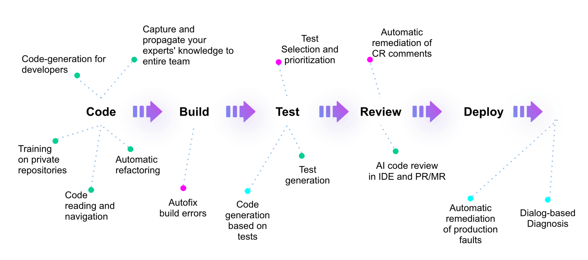
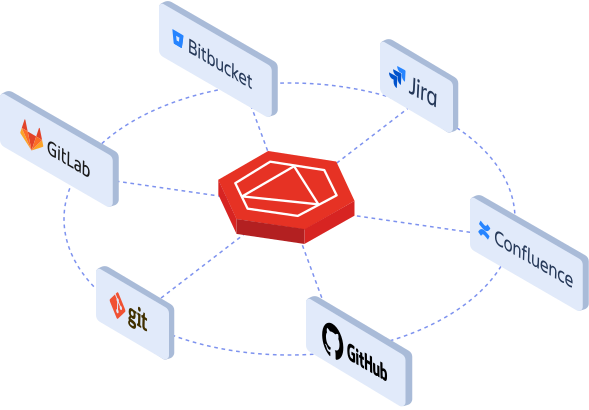

# AI 辅助软件工程案例分析：Tabnine DevOps 驱动的 AI4SE

本节将探讨 Tabnine 如何巧妙地将生成式 AI 融入 SDLC，通过优化各个开发环节，从而提升开发团队的生产效率及其协作水平。

PS：尽管 Tabnine 的一些观点和产品示例是虚构的，但是他们的技术博客和产品展示给我们提供了一些有趣的想法，可以帮助我们更好地理解
AI4SE 的未来。

## AI 与 SDLC 的深度融合

- **效率和生产力:**。AI 显著减少了开发人员的任务时间，例如，代码重构时间减少 30%，代码生成时间减少 45%，文档编写时间减少
  50%；它将高复杂度任务的完成率提高了 30%。
- **开发人员满意度:**。AI 工具提高了开发人员专注于有意义工作的能力，使满意度从45%提高到88%。
- **采用和集成:**。AI 无缝集成到主要 IDE 中，并支持多种编程语言和框架；可定制模型可以在特定数据上进行训练，以提高输出质量。

### 1. 规划阶段的AI助力

在SDLC的规划阶段，开发人员通常需要花费大量时间查找和理解项目的现有代码。Tabnine 通过分析本地和全球代码库，提供即时的代码建议和解决方案，
使开发人员能够迅速找到所需的信息，从而减少无效的时间消耗，并帮助团队更好地制定开发计划。

### 2. 创建阶段的代码生成

Tabnine的AI工具在代码创建过程中尤为强大。通过智能代码补全和生成功能，开发人员可以依赖Tabnine在低复杂度任务（如创建简单类）和高复杂度任务（如解析数据结构）中提供的支持。
这样的自动化不仅加快了开发速度，还减少了错误的发生概率。

### 3. 测试阶段的自动化生成

AI在测试阶段的应用也极大地提升了效率。Tabnine能够自动生成单元测试，确保代码的高覆盖率，同时减少了开发人员手动编写测试用例的负担。
它还支持生成符合现有测试框架的断言，从而简化了测试过程。

### 4. 修复错误与实时反馈

在错误修复阶段，Tabnine的AI提供实时的错误检测和修复建议，帮助开发人员迅速定位并解决问题。这种基于上下文的个性化建议，
可以显著减少调试时间，并提高代码的可靠性。

### 5. 文档编写的自动化

文档编写是开发过程中常被忽视但至关重要的部分。Tabnine通过生成全面的代码文档，包括API指南、注释和内联文档，不仅提高了代码的可读性，
还帮助新开发人员更快地理解和维护代码。

### 6. 代码维护的智能支持

在维护阶段，Tabnine通过提供代码的全局视图和上下文相关的建议，简化了代码的重构和优化。它能够帮助团队成员理解复杂的代码结构，
从而加速新成员的入职流程，并确保代码的长期可维护性。

## Tabnine + SDLC 智能体

### Onboarding Agent：加速新成员入职

[Onboarding Agent](https://www.tabnine.com/blog/introducing-tabnines-onboarding-agent-revolutionizing-developer-onboarding/)
是 Tabnine 推出的一项新功能，
专为开发人员在新项目中快速适应而设计。它通过提供项目结构、可运行脚本和依赖关系的简明总结，极大地简化了新开发人员的入职过程。

Onboarding Agent不仅提升了团队的整体效率，还增强了开发人员的自主性，使他们能够更快地融入团队并开始有效工作。

1. **集成与可用性**：
    - 作为 Tabnine Chat 的内置命令，无缝集成。
    - 对所有 Tabnine SaaS 用户和支持 Tabnine AI 的 IDE 兼容。

2. **操作简便**：
    - 可通过简单命令 (/onboarding) 或在新对话开始时自动触发。
    - 提供项目结构、可运行脚本、依赖关系等的简明总结。

3. **互动和个性化**：
    - 不仅提供信息摘要，还作为一个导游，为用户提供定制的后续问题建议。
    - 让开发人员可以根据自己的需要深入探索项目的特定部分。

对开发人员的益处：

- **提高效率**：加快了新项目的熟悉过程，节省时间。
- **增强自主性**：使开发人员能够独立地了解和操作项目。
- **快速上手**：帮助他们更快地成为项目团队的有效成员。

对组织的益处：

- **降低成本**：减少了资深团队成员辅助新人的时间成本。
- **优化工作流程**：简化了新成员加入或项目切换带来的工作中断。
- **知识分享**：促进组织内部的效率和知识共享文化。

Onboarding Agent 代表了开发工具领域的重要进展，旨在提升开发效率，加速项目启动时间，为组织带来更高的创新能力和竞争力。

### Jira-to-Code：从需求到代码的智能转化

[Tabnine 与 Atlassian Jira 的集成](https://www.tabnine.com/blog/unveiling-tabnines-vision-for-the-future-the-atlassian-jira-to-code-ai-agent/)
展示了AI在将需求直接转化为代码方面的巨大潜力。通过Tabnine的Jira-to-code智能体，开发团队可以从Jira任务中自动生成功能完备的应用程序。尽管这一功能仍处于早期阶段，但它展示了AI如何通过简洁、个性化和反思性的方法，大幅度提升软件开发的效率。

最近公布的智能体，如SWE-Agent、gpt-engineer、Devika和Devin展示了巨大的潜力，并展示了AI智能体在软件开发生命周期中不断增加的潜力。
这些智能体配备了类似于开发人员可用工具的广泛工具包，以完成他们的任务。为了在企业环境中使这些智能体成为高效的现实，我们认为智能体应具备以下特性：

- **简洁性**：与智能体的交流必须简洁明了。这不仅适用于向智能体提供输入，也适用于消耗其输出。软件开发的重要部分是从通常不充分定义的定义中发现所需的行为。智能体的效果很大程度上取决于能够快速迭代任务，并以紧凑的输入和输出进行交互。
- **个性化和增量化**：智能体必须意识到当前代码库、组织的最佳实践、文档和它所协助的人类开发者的风格和偏好。一个生成与当前代码库不一致代码的智能体，可能会限制其适用性，而不是重新利用组件。
- **可靠性**：人类必须信任智能体提供的输出。审查智能体生成的成千上万行代码以发现微妙的错误，可能会限制委托任务给智能体的价值。
- **探索性**：一个有效的智能体必须能够在需要时向人类探询额外的上下文和指令。人 <-> AI 对话的效果对智能体在实际生活中的成功至关重要。
- **自我意识（反思性）**：智能体必须能够意识到当其完成一个任务并得到不满意的结果时。一个有效的智能体应该能够向人类反馈如何完成任务，以指导其改进过程。

Tabnine实现AI智能体的方法

- **自然语言交互**：通过Tabnine Chat提供企业级、以代码为中心的聊天应用程序，允许开发者使用自然语言与AI模型交互，关联Jira工单并手动修改生成的代码。
- **上下文感知**：向智能体提供Tabnine关于项目的丰富信息，并支持IDE操作工具，检索信息来自向量内存和语义内存。
- **沙盒执行环境**：允许智能体执行生成的代码并检查其符合测试用例，未来计划通过集成额外工具改进。
- **提出澄清问题和后续问题**：智能体会在任务执行中主动向人类开发者提出澄清和后续问题，以应对任务的现实复杂性。
- **智能体反思机制**：智能体会反思其工作，并可能对计划进行内部调整或提出更多问题，保持“人在循环”的反馈机制。

### 与 Bitbucket 的全面集成

[Tabnine与Atlassian Bitbucket](https://www.tabnine.com/blog/tabnine-atlassian-ai-enabled-software-development-built-around-you/)
的集成进一步展示了AI在增强开发运维（DevOps）流程中的作用。通过与Bitbucket的深度连接，Tabnine能够为整个团队提供个性化的代码建议，并帮助团队共享代码上下文，提升协作效率。此外，Tabnine还支持对AI模型进行定制，以优化在特定代码库中的表现，为开发团队提供更精准的支持。

从 DevOps 和 AI 的角度来看， Tabnine 与 Atlassian 产品的集成展示了如何利用人工智能增强开发运维（DevOps）流程的效率和质量。以下是一些关键点的总结：

1. **全面的代码感知和个性化建议**：通过与 Bitbucket 和其他 Git 仓库的集成，能够在开发者 IDE
   中提供高度个性化的代码完成建议。这不仅仅是静态的代码补全，还包括变量类型、注释、已打开文件和项目的上下文信息，从而显著提升了开发者的工作效率和代码质量。
2. **全局代码感知和团队协作**：通过与 Bitbucket 的全局连接， Tabnine
   扩展了其能力，使得整个工程团队能够共享和利用更丰富的代码上下文。这对于大型企业和跨部门协作的团队尤为重要，可以加强对代码库的理解和重用，从而提升整体的开发效率和协作水平。
3. **AI 模型定制和性能优化**： Tabnine 通过定制 AI 模型，利用 Bitbucket 中存储的代码库进行优化，特别是针对不常见的编程语言或框架。这种个性化和优化能力提高了
   AI 在软件开发过程中的表现，为开发团队提供更精准和高质量的代码生成和支持。
4. **提升团队生产力的工具和平台支持**： Atlassian 和 Tabnine 的集成不仅仅是工具级别的整合，更是为工程团队提供了全方位的工具和平台支持，帮助团队在
   DevOps 实践中更有效地运用人工智能技术，从而加速交付周期、提高软件质量和团队的整体生产力。

综上所述， Tabnine 与 Atlassian 产品的结合展示了如何从 DevOps
和人工智能的融合中获得多方面的利益，为软件开发团队提供了强大的工具和平台支持，推动团队在敏捷开发和持续交付中取得更大的成功。

## 其它

### 软件开发中AI的未来：

- AI将全面了解组织的整个工作区，导致全面的测试覆盖率和文档编写。
- 它将显著减少代码维护所花的时间，使团队能够专注于创新。
- 像Tabnine这样的AI工具提供安全、可定制且上下文相关的解决方案，满足企业需求，确保知识产权的控制和法律标准的合规。

通过解决这些关键领域，AI帮助软件开发团队克服了高工作量、复杂需求、技术债务和人才保留等挑战，最终提高了SDLC的整体效率和效果。

### 相关文章

- [From CI to AI: The AI layer in your organization](https://www.tabnine.com/blog/from-ci-to-ai-the-ai-layer-in-your-organization/)
- [How AI code assistants speed up and simplify the SDLC](https://www.tabnine.com/blog/how-ai-code-assistants-speed-up-and-simplify-the-sdlc/)
