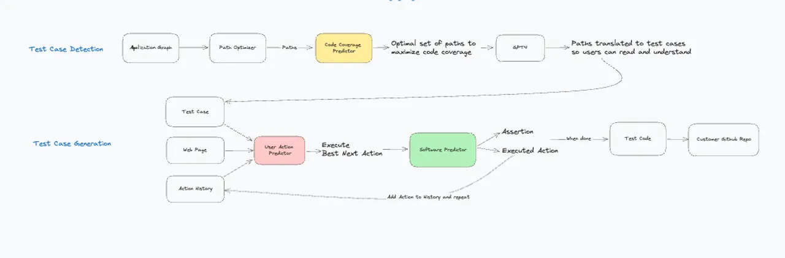

# AI 辅助软件工程：AI  生成 API 测试

## 示例

### 示例：HTTPie AI

https://httpie.io/blog/ai

HTTPie AI 助手使用大模型来提高开发者在测试和与 API 交互时的效率，例如你可以通过简单的自然语言快速地从海量文档中发现并创建相应的请求。

### Checksum: 模拟行为生成测试

[Why We Built A System of AI Agents to Automate E2E Testing](https://checksum.ai/blog/the-engineering-of-an-llm-agent-system)

客户将 JavaScript SDK 集成至他们的 HTML 中，Checksum 将收集匿名使用模式数据。接着，通过这些数据，训练出的模型能够高效执行以下三项任务：

1. 检测测试流程，包括标准路径与边缘情况，以吻合真实的使用模式。
2. 在实时环境中执行测试流程，并生成 Playwright 或 Cypress 代码。
3. 在测试运行过程中维护这些测试，确保软件更新时，测试套件也能同步更新。

LLM 智能体是连接各项功能并能够执行代码的 LLM，已相对成熟。但在 Checksum，其洞察力更进一步。公司并未单独训练一个 LLM 模型以生成完整测试。
其解决方案是将多个模型集成，形成一个系统，旨在将线上执行流程转换为端到端的测试代码。

整个系统由主 Checksum LLM 协调，该模型在系统中扮演着至关重要的角色。

代码：https://github.com/checksum-ai/checksum-ai-runtime

相关文章：

* [Pix2Struct](https://arxiv.org/abs/2210.03347)
* [OS-Copilot: Towards Generalist Computer Agents with Self-Improvement](https://arxiv.org/abs/2402.07456)
* [CoVA: Context-aware Visual Attention for Webpage Information Extraction](https://arxiv.org/abs/2110.12320)

