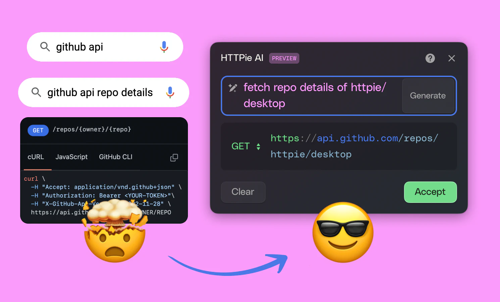

# AI 辅助软件工程：AI 生成 API 测试

## 示例

### 示例：HTTPie AI

[HTTPie AI 助手](https://httpie.io/blog/ai) 利用先进的自然语言处理技术，使用户能够通过简单的自然语言描述来生成和管理 API
请求，而不需要手动编写请求代码。HTTPie AI 可以理解用户的意图，将其转换为相应的 HTTP 请求，从而简化与 API 的交互过程，提高开发者的工作效率。

