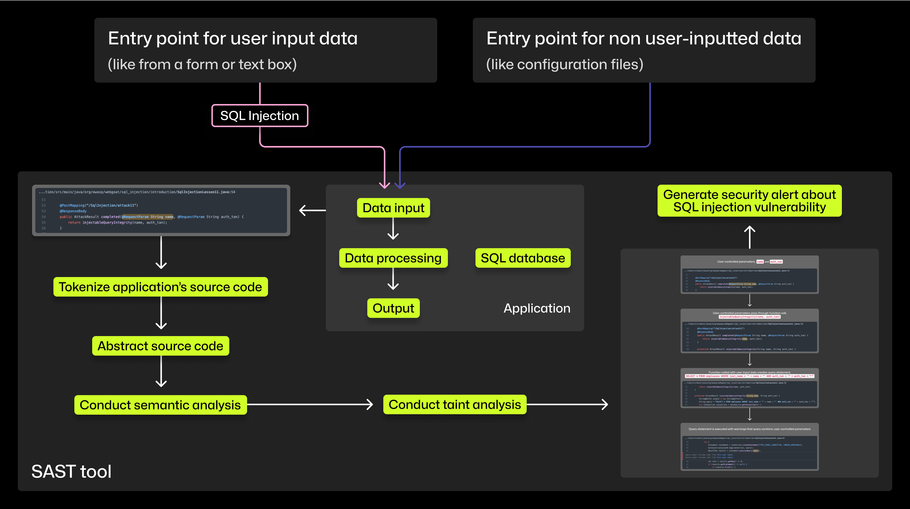
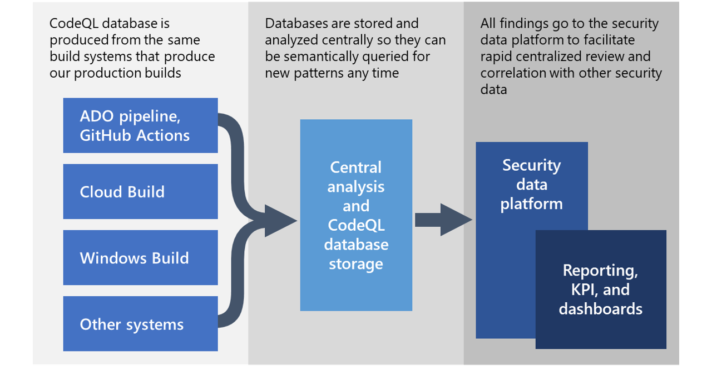

# AI 辅助软件工程：AI 辅助代码质量检查

对开发人员的提效，好的情况会提速50%，差的可能还拖慢进度（如针对初级开发者）。这取决于编程方式、开发任务的类型、使用的编程语言，
以及在使用聊天接口时如何制定恰当的提示指令。警惕AI生成代码可能带来的代码质量下滑([GitClear研究](https://www.gitclear.com/coding_on_copilot_data_shows_ais_downward_pressure_on_code_quality))
，监控代码质量变化并做好保障措施。

## 基础：理解 SAST

主要用途：

- 自动化源代码扫描，以预防漏洞并在开发管道早期捕获它们。
- 扩展漏洞检测。通过变体分析技术，SAST工具可以在代码库的不同部分检测到已知漏洞的变体，从而发现新的漏洞。
- 协助手动代码审查。在CodeQL中，GitHub的SAST工具，你的代码被视为数据进行分析。



阅读：[The architecture of SAST tools: An explainer for developers](https://github.blog/2024-02-12-the-architecture-of-sast-tools-an-explainer-for-developers/)

### 步骤示例

基于提供的详细描述，以下是高级 SAST（静态应用安全测试）工具（如 CodeQL）在扫描 SQL 应用程序中查找漏洞（特别是 SQL
注入攻击）时采取的五个主要步骤：

1. **对源代码进行词法分析：**。SAST
   工具首先执行词法分析，将源代码分解为标记（tokens）。标记代表编程语言语法的标准化元素，这有助于后续分析。这一步骤使工具能够专注于有意义的代码组成部分，而忽略无关的字符。
2. **将源代码抽象为AST（抽象语法树）：**
   。在完成词法分析后，工具从源代码构建抽象语法树（AST）。AST 将代码组织成层次结构，展示代码各部分之间的关系，比如哪些语句属于哪些函数。这种抽象有助于理解代码的结构和含义。
3. **进行语义分析：**。借助 AST，进行语义分析以解释代码的预期行为和逻辑。语义分析使得SAST工具能够专注于代码的语义，而不是注释或格式。这一步骤对于识别由于不正确或不安全的编码实践导致的漏洞至关重要。
4. **进行污点分析：**
   。污点分析用于跟踪用户控制的输入数据在整个代码库中的流动路径。它识别输入数据的来源（数据进入系统的位置）、净化器（确保输入安全的函数）和污点（如果用未经净化的输入数据调用可能会存在漏洞的函数）。通过追踪输入数据从源头到污点的流动，工具评估是否应用了适当的验证和净化。如果未经净化的输入达到污点，工具会发出潜在的安全漏洞警报。
5. **生成安全警报：**
   。基于语义分析和污点分析的结果，SAST
   工具为在代码中检测到的潜在漏洞生成安全警报。这些警报优先考虑未经净化的输入数据可能导致安全问题的路径，例如SQL注入漏洞。警报为开发团队提供可操作的信息，使他们能够有效地优先处理和解决安全问题。

这些步骤说明了 SAST 工具（如 CodeQL）如何利用先进的分析技术，在开发生命周期早期检测到漏洞，从而增强代码安全性。

## 业内案例：基于查询语言

### GitHub CodeQL

文档：https://codeql.github.com/

```codeql
import TaintTracking::Global<UnsafeDeserializationConfig>

from PathNode source, PathNode sink
  
where flowPath(source, sink)
  
select sink.getNode().(UnsafeDeserializationSink).getMethodAccess(), source, sink,
  "Unsafe deserialization of $@.", source.getNode(), "user input"
```

[CodeQL 查询过程](https://www.microsoft.com/en-us/security/blog/2021/02/25/microsoft-open-sources-codeql-queries-used-to-hunt-for-solorigate-activity/)



CodeQL 是一种强大的语义代码分析引擎，现在已经成为 GitHub 的一部分。它的处理流程主要分为两个阶段，特别适用于大规模源代码的分析：

1. **数据库构建阶段：**
    - CodeQL 在源代码编译成二进制文件时，构建一个数据库来捕获编译代码的语义模型。
    - 对于解释性语言，由于没有编译器，CodeQL 会解析源代码并构建自己的抽象语法树模型。
2. **查询数据库：**
    - 构建好的数据库可以反复查询，使用 CodeQL 语言进行分析。这种语言专门设计用于从数据库中选择复杂的代码条件，能够详细分析代码模式和结构。
3. **语义分析：**
    - CodeQL 允许在集中的基础设施中进行语义分析，跨多个代码库进行查询。这种集中分析能力使得 Microsoft 能够同时在数千个代码库中进行查询。
    - 语义分析涉及查找可能跨越不同代码部分（如程序集、库或模块）的模式，这些部分是基于构建的具体代码的。

相关文章：

- [CodeQL zero to hero part 1: The fundamentals of static analysis for vulnerability research](https://github.blog/2023-03-31-codeql-zero-to-hero-part-1-the-fundamentals-of-static-analysis-for-vulnerability-research/)
- [CodeQL zero to hero part 2: Getting started with CodeQL](https://github.blog/2023-06-15-codeql-zero-to-hero-part-2-getting-started-with-codeql/)
- [CodeQL zero to hero part 3: Security research with CodeQL](https://github.blog/2024-04-29-codeql-zero-to-hero-part-3-security-research-with-codeql/)

### Synk QL

https://docs.snyk.io/scan-using-snyk/snyk-code/snyk-code-custom-rules/create-query

AST

```bnf
<query> ::= <term> | <term> ' ' <query>
<term> ::= <literal> | <regexp> | <predicate> | <template>
<literal> ::= '"' <value> '"'
<regexp> ::= '~"' <value> '"'
<predicate> ::= 'PRED:' <predicate-name>
<template> ::= <template-name> '<' <template-params>  '>'
<template-params> ::= <term> | <term> ',' <template-params>
```

示例：

```
Taint<PRED:"SourceFoo",PRED:XssSanitizer,PRED:XssSink>
```

### GitQL

#### 示例 1：https://github.com/filhodanuvem/gitql

```SQL
select hash, author, message from commits limit 3
select hash, message from commits where 'hell' in full_message or 'Fuck' in full_message
select hash, message, author_email from commits where author = 'cloudson'
select date, message from commits where date < '2014-04-10'
select message from commits where 'hell' in message order by date asc
select distinct author from commits where date < '2020-01-01'
```

#### 示例 2：https://github.com/AmrDeveloper/GQL

```SQL

SELECT DISTINCT title AS tt FROM commits
SELECT author_name, COUNT(author_name) AS commit_num FROM commits GROUP BY author_name, author_email ORDER BY commit_num DESC LIMIT 10
SELECT commit_count FROM branches WHERE commit_count BETWEEN 0 .. 10

SELECT * FROM refs WHERE type = "branch"
SELECT * FROM refs ORDER BY type

SELECT * FROM commits
SELECT author_name, author_email FROM commits
SELECT author_name, author_email FROM commits ORDER BY author_name DESC, author_email ASC
SELECT author_name, author_email FROM commits WHERE name LIKE "%gmail%" ORDER BY author_name
SELECT * FROM commits WHERE LOWER(name) = "amrdeveloper"
SELECT author_name FROM commits GROUP By author_name
SELECT author_name FROM commits GROUP By author_name having author_name = "AmrDeveloper"
```

## 业内案例：基于机器学习

### Facebook 示例：Aroma

诸如SAST (Static Application Security Testing) 和 DAST (Dynamic Application Security Testing)
：这两种测试方法结合了不同的工具和技术，分别用于静态和动态地评估应用程序的安全性。

- Facebook's [Aroma](https://ai.meta.com/blog/aroma-ml-for-code-recommendation/)：一个代码推荐系统，可以从大型代码库中提取代码模式，并为开发者提供优化建议。


与传统的代码搜索工具相比，Aroma的代码推荐功能具有几个优势：

- Aroma 在语法树上执行搜索。与其寻找字符串级或标记级匹配，Aroma可以找到与查询代码语法上相似的实例，并通过修剪无关的语法结构来突出显示匹配代码。
- Aroma 自动将相似的搜索结果聚集在一起生成代码推荐。这些推荐代表了惯用的编码模式，比未聚集的搜索匹配更易于理解。
- Aroma 快到可以实时使用。实际上，即使对于非常大的代码库，它也能在几秒钟内创建推荐，而不需要提前进行模式挖掘。
- Aroma 的核心算法与语言无关。我们已经在内部代码库中的Hack、JavaScript、Python和Java代码库中部署了Aroma。

Aroma在创建代码推荐的过程中分为三个主要阶段：


1. **基于特征的搜索**：
    - Aroma 解析代码库中的每个方法并创建其解析树。
    - 从解析树中提取结构特征，创建稀疏向量，并将这些向量组成索引矩阵。
    - 当工程师编写新代码片段时，Aroma 创建相应的稀疏向量，并与索引矩阵进行点积计算，快速检索出相似性最高的前 1000
      个方法体作为候选集。
2. **重新排序和聚类**：
    - Aroma对候选方法进行重新排序，根据查询代码片段的实际相似性进行排列。
    - 通过修剪方法语法树，删除与查询代码片段不相关的部分，保留最佳匹配的部分。
    - 运行迭代聚类算法，找到彼此相似且包含用于创建代码推荐的额外语句的代码片段聚类。
3. **交集：创建代码推荐**：
    - 以第一个代码片段为基准，逐步与聚类中的其他方法进行修剪，保留所有方法共有的代码。
    - 经过修剪过程后的代码作为代码推荐返回，确保推荐内容在不同聚类之间有显著差异，让工程师可以学习多种编码模式。

## 传统工具

### Code Quality

CodeRabbit Supported Tools: https://docs.coderabbit.ai/tools/

| Technology                  | Tools                                                                                                                        | Category                       |
|-----------------------------|------------------------------------------------------------------------------------------------------------------------------|--------------------------------|
| All                         | [Gitleaks](https://docs.coderabbit.ai/tools/gitleaks)                                                                        | Code Security                  |
| CircleCi                    | [CircleCi](https://docs.coderabbit.ai/tools/circleci)                                                                        | Configuration Validation       |
| CloudFormation              | [Checkov](https://docs.coderabbit.ai/tools/checkov)                                                                          | Code Security                  |
| Cppcheck                    | [Cppcheck](https://docs.coderabbit.ai/tools/cppcheck)                                                                        | Code Quality                   |
| CSS                         | [Biome](https://docs.coderabbit.ai/tools/biome)                                                                              | Code Quality                   |
| Docker                      | [Hadolint](https://docs.coderabbit.ai/tools/hadolint), [Checkov](https://docs.coderabbit.ai/tools/checkov)                   | Code Quality, Code Security    |
| GitHub Actions              | [Actionlint](https://docs.coderabbit.ai/tools/actionlint)                                                                    | Code Quality                   |
| Go                          | [golangci-lint](https://docs.coderabbit.ai/tools/golangci-lint)                                                              | Code Quality                   |
| Helm                        | [Checkov](https://docs.coderabbit.ai/tools/checkov)                                                                          | Code Security                  |
| Javascript                  | [Biome](https://docs.coderabbit.ai/tools/biome)                                                                              | Code Quality                   |
| JSON, JSONC                 | [Biome](https://docs.coderabbit.ai/tools/biome)                                                                              | Code Quality                   |
| JSX                         | [Biome](https://docs.coderabbit.ai/tools/biome)                                                                              | Code Quality                   |
| Kotlin                      | [Detekt](https://docs.coderabbit.ai/tools/detekt)                                                                            | Code Quality                   |
| Kubernetes                  | [Checkov](https://docs.coderabbit.ai/tools/checkov)                                                                          | Code Security                  |
| Markdown                    | [Markdownlint](https://docs.coderabbit.ai/tools/markdownlint), [LanguageTool](https://docs.coderabbit.ai/tools/languagetool) | Code Quality, Grammar Checking |
| PHP                         | [PHPStan](https://docs.coderabbit.ai/tools/phpstan)                                                                          | Code Quality                   |
| Plaintext                   | [LanguageTool](https://docs.coderabbit.ai/tools/languagetool)                                                                | Grammar and Spell Checking     |
| Java                        | [PMD](https://docs.coderabbit.ai/tools/pmd)                                                                                  | Code Quality                   |
| Protobuf                    | [Buf](https://docs.coderabbit.ai/tools/buf)                                                                                  | Code Quality                   |
| Python                      | [Ruff](https://docs.coderabbit.ai/tools/ruff)                                                                                | Code Quality                   |
| Regal                       | [Regal](https://docs.coderabbit.ai/tools/regal)                                                                              | Code Quality                   |
| Ruby                        | [Rubocop](https://docs.coderabbit.ai/tools/rubocop)                                                                          | Code Quality                   |
| Semgrep                     | [Semgrep](https://docs.coderabbit.ai/tools/semgrep)                                                                          | Code Security                  |
| Shell (sh, bash, ksh, dash) | [ShellCheck](https://docs.coderabbit.ai/tools/shellcheck)                                                                    | Code Quality                   |
| Swift                       | [SwiftLint](https://docs.coderabbit.ai/tools/swiftlint)                                                                      | Code Quality                   |
| Terraform                   | [Checkov](https://docs.coderabbit.ai/tools/checkov)                                                                          | Code Security                  |
| TSX                         | [Biome](https://docs.coderabbit.ai/tools/biome)                                                                              | Code Quality                   |
| Typescript                  | [Biome](https://docs.coderabbit.ai/tools/biome)                                                                              | Code Quality                   |
| YAML                        | [YamlLint](https://docs.coderabbit.ai/tools/yamllint)                                                                        | Code Quality                   |

### Linter

- [Accessibility Testing Linter](https://ebay.gitbook.io/oatmeal/accessibility
    - [axe-core](https://github.com/dequelabs/axe-core)  Accessibility engine for automated Web UI testing.
- [ArchGuard Linter](https://archguard.org/) 是一个由 Thoughtworks
  发起的面向微服务（分布式场景）下的开源架构治理平台。它可以在设计、开发过程中，帮助架构师、开发人员分析系统间的远程服务依赖情况、数据库依赖、API
  依赖等。并根据一些架构治理模型，对现有系统提出改进建议。