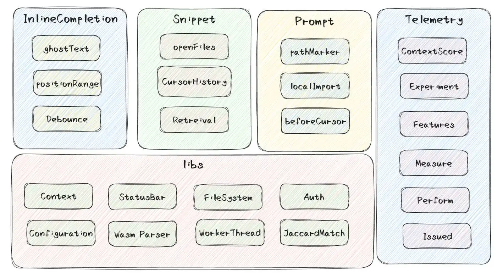

# AI 辅助软件工程：代码补全

## 示例

### 补全插件示例：GitHub Copilot

- 《[花了大半个月，我终于逆向分析了Github Copilot](https://github.com/mengjian-github/copilot-analysis)》
- 《[再次揭秘Copilot：sourcemap逆向分析](https://github.com/mengjian-github/copilot-analysis-new)》

- 对于编辑器输入的边界判断，包括太少、太多、取消等等很多场景齐全的考虑
- 缓存思想，利用多级缓存策略保护后台，模型运算本身就是一件昂贵的事情
- prompt的设计，不仅仅包含了上下文代码，在文件解析、编辑器打开的相关代码上还做了很多
- 利用简单的Jaccard算法计算分词后的文本相似度，能够快速决策出当前上下文相关的snippet
- 实验特性，在Copilot中，大量的参数、优先级、设置字段都是通过实验来控制的，有一套完整的监控上报体系，帮助Copilot去调整这些参数，以达到更好的效果

### 补全插件示例：Cody

结合《[The lifecycle of a code AI completion](https://sourcegraph.com/blog/the-lifecycle-of-a-code-ai-completion)》

每个Cody补全都经过以下四个步骤：

- 规划 - 分析代码上下文以确定生成补全的最佳方法，例如使用单行补全还是多行补全。
- 检索 - 从代码库中查找相关代码示例，为LLM提供最合适的上下文。
- 生成 - 使用LLM根据提供的提示和上下文生成代码补全。
- 后处理 - 对AI生成的原始补全进行细化和过滤，以提供最相关的建议。

Cody的目标是提供与开发者工作流程无缝集成的高质量补全。

详细步骤如下：

1. **规划阶段:**
    - **上下文准备:** 根据上下文确定生成自动补全建议的最佳方法。这涉及使用启发式和规则将请求分类为单行或多行补全。
    - **语法触发器:** 使用诸如Tree-sitter之类的工具分析代码结构，确定精确的语法线索，影响补全行为。
    - **建议小部件（Suggestion widget）交互:** 利用与建议小部件的交互（例如在VS Code等IDE中）来增强补全建议的相关性和可用性。
2. **检索阶段:**
    - **上下文检索:** 从编辑器上下文中收集相关的代码示例，例如最近查看的文件或打开的选项卡。
    - **优化:** 使用滑动窗口 Jaccard 相似性搜索等技术，根据与当前光标位置相关的相关性检索和排名代码片段。
    - **上下文嵌入:** 尝试使用嵌入索引等技术来提高上下文理解和补全建议的相关性。
3. **生成阶段:**
    - **模型利用:** 使用 Claude Instant 等大型语言模型（LLM）根据提供的提示生成代码补全。
    - **改进:** 解决 FIM "填充中间" 支持、减少延迟和质量调整等挑战，通过优化提示结构和理解模型响应动态。
    - **降低延迟:** 实施 Token 限制、stop-words、流式响应和高效的 TCP 连接处理等策略，以减少端到端的延迟。
4. **后处理阶段:**
    - **质量保证:** 应用后处理技术来优化生成的补全。
    - **内容改进:** 避免重复内容，适当截断多行补全，并使用语法分析和概率评分评估补全的相关性。
    - **过滤:** 实施过滤器来移除明显低质量的补全建议，同时确保在显示足够相关建议和不过度展示之间取得平衡。

每个阶段在提升 Cody 代码补全功能的整体质量、速度和用户体验方面都发挥着关键作用，旨在利用先进的人工智能能力，同时优化代码编辑环境中的实际使用场景。

### 补全插件示例：Continue

文章：[How can you improve the code suggestions you get from LLMs?](https://blog.continue.dev/improve-code-suggestions/)

在使用 LLM（大型语言模型）工具时，有几点需要注意，以确保获得高质量的代码建议并避免错误。Josh
Collinsworth 在他的文章中提出了一些值得关注的问题和改进方法，以下是总结和一些建议：

1. **提供明确而全面的指示（prompt）**
    - **优点**：
        - 如果你很了解自己在做什么，这个方法很容易操作。
        - 可以根据具体情况进行定制。
    - **缺点**：
        - 指示可能需要非常精确，以至于直接写代码更容易。
        - 过程缓慢且繁琐，每个人每次都要重复进行。

2. **添加系统消息，包含应始终遵循的指示**
    - **优点**：
        - 可以设置一次，然后忘记（类似于环境变量）。
        - 对许多事情效果很好（例如操作系统版本）。
    - **缺点**：
        - 很难事先预测所有可能的指示。
        - 由于上下文长度限制，系统消息中的信息量有限。

3. **自动过滤明显错误的建议，并请求新建议**
    - **优点**：
        - 可以确保代码不违反许可证，使用特定库等。
        - 过滤器捕获建议时，可以自动重新提示。
    - **缺点**：
        - 很难事先确定哪些过滤器是必要且充分的。
        - 过滤系统可能会变得庞大，导致运行缓慢且成本高。

4. **改进从代码库和软件开发生命周期中检索和使用上下文的方式**
    - **优点**：
        - 有很多指南可以帮助建立基本的RAG系统。
        - 使用文档和代码片段作为上下文可以减轻知识截断问题。
    - **缺点**：
        - 构建一个能够即时自动确定相关上下文的系统很困难。
        - 可能需要很多集成，并且必须永久维护。

5. **使用不同的 LLM 并使用多个 LLM**
    - **优点**：
        - 大多数 LLM 工具使用 1-15B 参数模型进行代码补全，并使用 GPT-4 回答问题。
        - 可以针对特定情况使用模型（例如专有编程语言）。
    - **缺点**：
        - 可能无法使用你想要和需要的模型。
        - 你需要的许多模型可能根本不存在。

6. **通过微调改进现有的LLM**
    - **优点**：
        - 可以使模型学习你的首选风格。
        - 可以针对每个用例进行高度定制。
    - **缺点**：
        - 可能需要人们生成大量领域特定的指示和 100+GPU 小时。
        - 在学习新知识/能力方面效果不佳。

7. **使用领域自适应继续预训练改进开源LLM**
    - **优点**：
        - 有许多具有开放权重的相当强大的基础模型（如 Llama 2）。
        - 这里有[Meta 创建 Code Llama](https://arxiv.org/abs/2308.12950) 和 [Nvidia 创建 ChipNeMo](https://research.nvidia.com/publication/2023-10_chipnemo-domain-adapted-llms-chip-design)的方法。
    - **缺点**：
        - 可能需要数十亿个相关公司数据的标记和数千个GPU小时。
        - 这是一个具有挑战性、昂贵且耗时的方法。

8. **从头开始预训练自己的LLM**
    - **优点**：
        - 可以通过预处理训练数据决定学习哪些知识/能力。
        - 这是创建最好的模型（如 GPT-4 和DeepSeek Coder）的方法。
    - **缺点**：
        - 可能需要数万亿个互联网数据的标记和相关公司数据，以及数百万个GPU小时。
        - 这是最具挑战性、昂贵且耗时的方法。

**结论**：
为了确保我们的代码助手不会落下任何乘客，我们需要更高的可配置性，比目前大多数AI代码辅助工具提供的更多。若系统中的任何部分不在你的控制之下，
你会发现建议可能会随时发生变化。我们需要采用以上列出的所有方法，以确保代码助手能够持续改进和适应用户需求。
