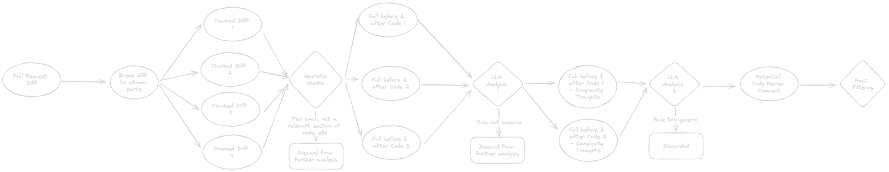
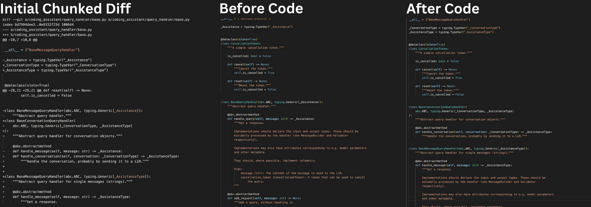
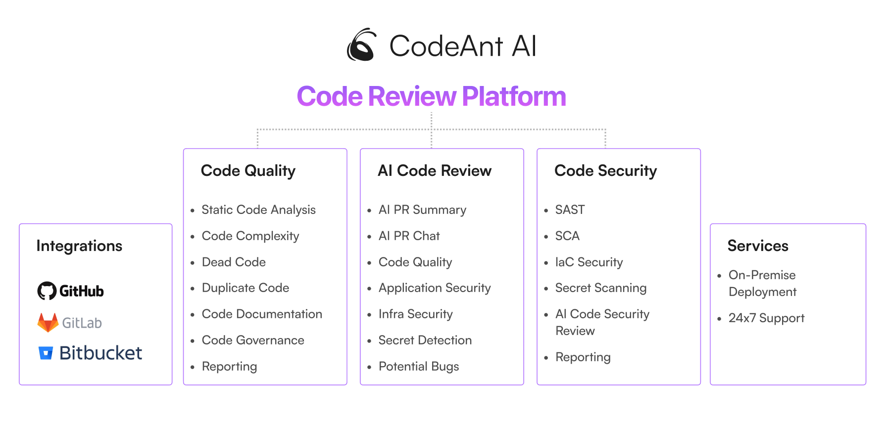
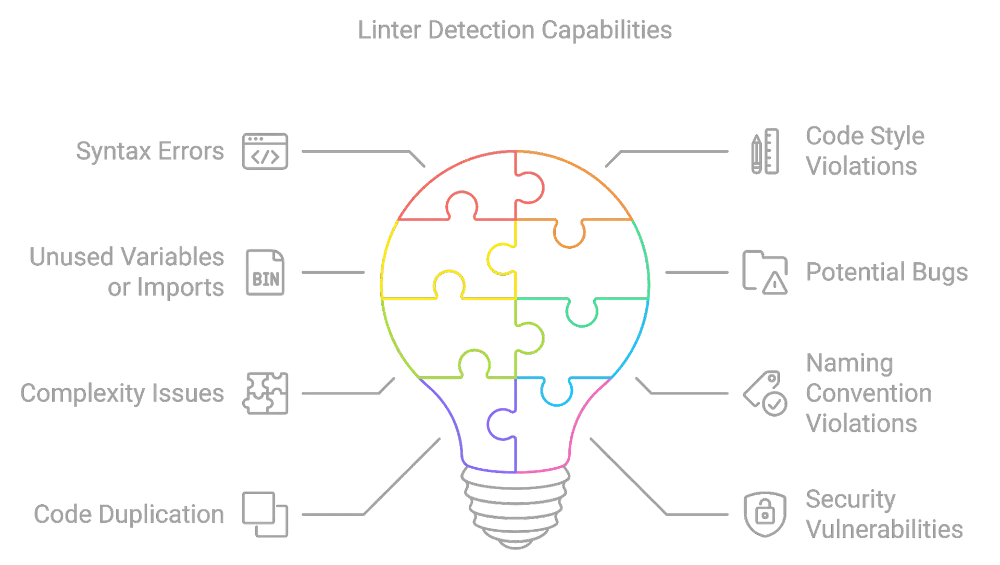

# AI 辅助软件工程：代码检视

CR（CodeReview）是代码指标保障中的重要一环，也是研发日常工作中的一个重要组成部分，我们希望通过对于CR过程和CR投入产出的情况进行分析，
评估当前CR工作的投入产出情况，驱动CR工作过程改进带来质量和效率的提升。

关键影响因素：

- CR评审需要快速响应，避免由于CR导致流程阻塞，一般应当在一个工作日内完成
- 挑选能对你代码做出最全面最准确评价的人为评审者，保障评审质量
- 避免单次提交过多代码，尽可能小的，增量的，实现一个完整功能的提交

## Why

结合《[How AI is Transforming Traditional Code Review Practices](https://coderabbit.ai/blog/how-ai-is-transforming-traditional-code-review-practices)》的总结：

#### AI 在代码审查中的应用现状

代码审查是软件开发过程中至关重要的一环，传统上由人类开发者负责审阅代码，确保其符合编码标准，促进最佳实践，并在团队内部提升领域知识。然而，这个过程并不快速或完美。[据
SmartBear 对 Cisco Systems 编程团队的研究](https://smartbear.com/resources/case-studies/cisco-systems-collaborator)，审查
200-400 行代码通常需要 60 到 90 分钟，才能达到 70-90% 的缺陷发现率。尽管如此，软件开发人员普遍认为代码审查非常重要。

#### 传统代码审查的挑战

1. **时间限制**：开发人员常常时间紧迫，要同时处理多个任务和截止日期，全面的代码审查与这些宝贵的时间相竞争，可能导致项目延期或代码审查质量下降。
2. **认知偏见和可变性**：不同开发人员的思维方式不同，导致审查的一致性和深度存在较大差异。
3. **容易出错**：复杂或大型代码库中的微妙错误和依赖问题容易被忽视，导致漏洞和技术债务。
4. **知识孤岛**：技术知识往往在大型团队中被孤立，阻碍了对代码库的全面理解，降低了代码审查的效果。

#### AI 在代码审查中的作用

1. **自动化重复任务**：AI 可以自动化代码审查中的重复任务，如检查编码标准、文档和模板代码合规性，减轻人工审查者的认知负担。
2. **快速发现缺陷**：AI 可以在几分钟内扫描成千上万行代码，精准识别逻辑错误和复杂的安全漏洞，让人类审查者专注于更高层次的架构和设计考虑。
3. **一致性和客观性**：AI 不会受到情绪和偏见的影响，能够以统一的标准审查每一行代码，确保审查的一致性。
4. **即时反馈**：AI 能够实时分析代码并提供反馈，帮助开发人员在代码审查讨论的上下文中立即识别问题，减少后期修复错误的成本和努力。
5. **学习和适应**：先进的 AI 系统可以从过去的审查、开发人员的修正和不断变化的编码实践中学习，提供越来越相关和准确的反馈。
6. **知识共享和增强**：AI 可以整合代码库和外部来源的见解，提供最佳实践建议、编码技巧，甚至提供类似项目的示例，打破知识孤岛，促进持续学习和改进的文化。

#### AI 驱动的代码审查的未来

AI 技术在代码审查过程中的集成不仅是增量改进，而是一种变革性变化。当前的 AI 技术可以充当软件开发团队的助手，加速并分担繁琐的手动分析和错误发现工作。未来的进步将使
AI 演变成一个协作者，能够进行更复杂的推理，提供设计建议、最佳实践，甚至预测或模拟代码变更对软件功能和性能的影响。

通过深度洞察代码质量、提供个性化反馈，AI 将在开发团队中树立学习和改进的文化。要充分实现 AI 在代码审查中的潜力，需要有意识地整合
AI 和人类开发人员之间的持续合作。软件开发的未来光明，AI 无疑是这一前景的领先力量。

未来的代码审查将越来越依赖于 AI 技术，通过自动化重复任务、快速发现缺陷、一致性和即时反馈，AI
将显著提高代码审查的效率和质量。然而，人类开发者的直觉、创造力和经验仍然是不可替代的，AI 和人类的协同合作将引领软件开发进入一个新的时代。

## 原则

### [上下文感知的代码检视](https://coderabbit.ai/blog/the-benefits-of-context-aware-code-reviews)

或称为上下文感知代码，是一种能够根据其运行环境或上下文动态调整行为的代码。这种代码不仅仅是根据输入数据执行特定任务，还会考虑更广泛的系统环境、历史数据、当前状态和预期未来状态来优化其功能。
上下文感知代码的关键特点包括：

1. **环境感知**：代码能够检测并响应其运行环境的变化。例如，根据可用资源、网络条件或硬件配置调整性能。
2. **历史数据利用**：代码利用过去的操作和数据来影响当前决策。例如，使用以前的用户行为数据来个性化当前的用户体验。
3. **状态感知**：代码根据系统或应用的当前状态进行调整。例如，在高负载期间降低非关键功能的优先级以保持系统稳定。
4. **预测和预防**：代码使用预测模型来预见潜在问题并采取预防措施。例如，根据过去的模式预测可能的安全威胁并采取相应措施。
5. **动态适应**：代码能够实时适应新情况，而无需重新部署。例如，电商网站根据实时库存数据和用户浏览习惯动态调整推荐商品。

上下文感知代码的实现通常涉及高级技术，如机器学习、数据分析和复杂的事件处理。通过结合这些技术，代码可以更加智能化和灵活，为用户提供更优质的服务和体验。

以 API 为例。上下文感知审查会仔细检查它们与现有系统的兼容性、对软件基础设施的影响，以及它们是否符合最佳实践。这确保了API能顺利整合到现有框架中，有效实现项目目标。
上下文感知代码审查中常考虑的因素包括：

- 遵循编码标准：审查确保更改遵循项目特定的编码规范，如文件命名和目录结构。它们还评估更改是否正确使用现有的库、类或方法，而不是重复功能。
- 对现有代码的影响：代码审查必须评估更改是否会引入错误，并确定需要的额外测试以防止这些问题。审查者还要确保任何必要的API或用户文档更新没有被忽略。
- 基础设施和性能考虑：审查评估更改是否需要数据库或API迁移，并考虑对系统性能的潜在影响。他们还检查更改是否可能导致代码库其他部分的性能下降。
- 安全性和鲁棒性：审查过程涉及尝试“破坏”新更改，以发现任何潜在的错误或安全漏洞。目标是确保新增加的内容是鲁棒且安全的。
- 一致性和优化：审查者检查新API与现有API的一致性，并评估变更日志条目是否准确反映了更改。他们还考虑提出的解决方案是否是最适合当前问题的。

上下文感知代码审查通过其深入的方式，真正提升了软件开发实践。这不仅仅是自动化检查，而是对代码库的深刻理解，确保每行代码都能良好运行并无缝集成到整个系统中。
与传统代码审查的区别

## How

### 如何识别复杂代码

[Finding the Traps We Set for Ourselves](https://sourcery.ai/blog/reviewing-code-complexity/)

**复杂代码的两种类型——必要复杂性和偶发复杂性**

在深入探讨如何在审查过程中捕捉复杂性之前，我们需要对复杂代码有一个认识。 并非所有复杂代码的复杂性都是相同的。有些代码复杂性是绝对必要的，
因为我们使用代码来解决复杂的问题。这种是必要复杂性——它是完成任务所需的复杂性。 另一方面，有些复杂性是我们自己引入到代码中的，而实际上并不需要。
这种复杂性可以从代码中消除，我们仍然可以完成任务——这就是偶发复杂性。 当我们考虑在审查中捕捉复杂代码时，我们只关注偶发复杂性——即为了实现代码目标而不需要存在的复杂性。

**识别复杂代码**

我们可以尝试很多方法来识别引入的过于复杂的代码——但我认为有四个方面是最能捕捉到项目中多余复杂性的关键。

1. **重建现有功能或创建重复代码**  
   如果新引入的代码重复了代码库中的现有功能，这强烈表明我们可以减少代码的复杂性。我们可以在新代码中重用现有功能，或将其抽象化以便更通用的使用。这也可能表明新代码没有经过充分规划，或者开发者对代码库不够熟悉。
2. **缺乏解耦**  
   当代码块试图做过多事情时，会增加未来出现问题的风险。如果我在审查代码时发现函数、类或模块试图一次做太多事情，我会立即标记为需要审查和重构的复杂区域。通过将代码分解成具有明确目的和职责的小部分，我们可以使其更易于理解、更易于维护，并在未来更容易扩展。
3. **深层嵌套或高认知/圈复杂度**  
   代码嵌套越深，理解起来就越困难。这是一种视觉上容易标记的复杂性，而增加的认知复杂性直接影响未来开发的速度。如果你发现代码过于嵌套，那么在合并之前明显需要重构代码。
4. **过度设计**  
   我描述的前三种复杂性相对简单易于识别。判断代码更改是否过度设计则有点棘手，需要对代码库和代码更改的目标有较好的理解。假设你有这些知识，你需要检查代码更改是否实现了这些目标，并且以尽可能简单的方式实现。一个典型的过度设计的标志是试图不必要地为新功能进行未来预测，或涵盖可能永远不会发生的用例或边界情况。

你可以在审查过程中查找其他类型的复杂性，但如果你能够检查这四个方面，你应该能够开始减少进入项目的不必要复杂性。

### Prompt 设计

[Tackling Complex Tasks with LLMs](https://sourcery.ai/blog/tackling-complex-tasks-with-llms/)



#### 分解为多个部分以提高效率

帮助 LLM 处理复杂任务的一个常见方法是增加它可用的上下文。但这会带来两个大问题：

- 提供给LLM的上下文越多，收益递减，到了某个点后，反而会影响输出的准确性，在代码审查的情况下可能会导致假阳性或幻觉。
- 扩展上下文是昂贵的！尤其是当我们需要提供大量上下文时。

在审查代码变化的复杂性问题时，我们总是从查看代码变化的diff开始。仅仅diff是不足以让我们检查是否存在重大复杂性问题的。我们需要能够看到代码变化如何与周围代码互动。
但我们通常不能仅仅发送完整的代码库，甚至是变化前后的完整文件作为上下文。这会产生过多的噪声，并且成本高昂且效率低下。

所以我们在审查过程中的第一步是将代码变化分解成可以单独分析的原子块。通常，对于代码变化，我们会查看相关的变化，比如在同一个函数或类中的变化，并将diff中的所有变化分成多个这样的块。

现在我们从查看包含许多变化的diff，转到查看一系列小变化——但实际上，并非所有这些小变化都与我们的分析相关。

#### “确定性”过滤

典型的拉取请求中的大多数代码变化不太可能增加坏的复杂性。也许变化并没有实际触及代码，也许只是添加了一些新的导入，或者只是一个过小的变化。我们将这些我们知道不太可能影响代码复杂性的潜在变化分组到多个启发式检查中，然后将第一步中的所有小代码变化都放入这些检查中。如果我们能在前期看到它们不会影响复杂性，那么就没有理由让LLM介入。

这对于你可能要求LLM执行的每种复杂任务都不一定相关，但如果有办法在确定性地预筛选掉一些输入数据部分，你可以显著简化后续分析，并使整个过程更流畅、更便宜。

```Bash
INFO:__main__:Skipping hunk 13-13 in file diff: coding_assistant/query_handler/base.py (limited new code introduced)
INFO:__main__:Skipping hunk 29-29 in file diff: coding_assistant/query_handler/openai.py (limited new code introduced)
INFO:__main__:Skipping hunk 121-123 in file diff: coding_assistant/query_handler/openai.py (limited new code introduced)
```

#### 扩展上下文

现在我们已经筛选出了初步关注的代码变化部分，我们可以考虑增加额外的上下文。为了帮助分析过程，我们保持附加上下文相对简单。我们将需要检查复杂性变化的代码块从
diff 转变为稍微扩展的代码版本——添加与代码功能相关但在diff中丢失的行。



##### 将 Diff 扩展到前后代码

未来还有很多其他方法可以进一步扩展上下文——例如提供函数的使用位置上下文、PR本身的问题上下文等。由于我们减少了需要扩展上下文的地方，我们能够更高效地添加有用的上下文。
在我们所看的例子中，通过将其分解为多个块并在转向LLM之前进行筛选，我们节省了超过5000个tokens。

#### 将结果转化为有用的评论

我们现在有一组潜在的代码变化需要在代码审查中标记，并有理由担心它们过于复杂。现在我们需要弄清楚如何实际告诉开发者这个潜在问题，并帮助他们决定是否需要修复。
这可能是我们整个过程最简单的一步——我们可以回到LLM，要求它将推理和建议改进转化为对开发者有用的评论，结合相关的代码变化。

#### 再交给另一个LLM进行过滤

尽管我们已经相当严格地尝试减少可能的复杂性风险，但我们仍然经常看到假阳性和无用的代码审查评论。我们在测试中发现，这些假阳性和无用的评论常常出现在我们早期
LLM 步骤生成的回应过于笼统的情况下。

为了减少这些情况，我们可以依赖另一个LLM请求来检查我们给开发者的反馈是否过于笼统。如果是这样，我们会将其作为潜在的响应丢弃。
在我们实验和开发复杂性检查过程中，我们发现这减少了 80% 以上的假阳性。

我们处理复杂性检查的过程有很多步骤，涉及到与LLM的来回交流，但我们认为这是值得的。在我们在这篇文章中看到的例子中，它将 LLM
请求使用的 tokens 减少了 77%，
并且相比于仅使用单个 LLM 请求和扩展上下文，减少了几个潜在的假阳性回应。

## 示例

### CodeAnt.AI


https://docs.codeant.ai/introduction

> CodeAnt AI helps detect and auto-fix the most impactful code issues and security vulnerabilities. It integrates directly from IDEs to Pull Requests and CI/CD pipelines.



secrets Detector

| **Detector Name**        | **Description**                                              |
|--------------------------|--------------------------------------------------------------|
| ArtifactoryDetector      | Detects secrets related to Artifactory.                      |
| AWSKeyDetector           | Identifies AWS access keys and secrets.                      |
| AzureStorageKeyDetector  | Finds Azure storage keys.                                    |
| BasicAuthDetector        | Detects basic authentication credentials.                    |
| CloudantDetector         | Identifies Cloudant database credentials.                    |
| DiscordBotTokenDetector  | Finds Discord bot tokens.                                    |
| GitHubTokenDetector      | Detects GitHub access tokens.                                |
| GitLabTokenDetector      | Identifies GitLab tokens.                                    |
| Base64HighEntropyString  | Detects high entropy Base64 strings that are likely secrets. |
| HexHighEntropyString     | Identifies high entropy hexadecimal strings.                 |
| IbmCloudIamDetector      | Detects IBM Cloud IAM credentials.                           |
| IbmCosHmacDetector       | Finds IBM COS HMAC keys.                                     |
| IPPublicDetector         | Identifies public IP addresses that may be sensitive.        |
| JwtTokenDetector         | Detects JSON Web Tokens (JWT).                               |
| KeywordDetector          | Uses keywords to identify potential secrets.                 |
| MailchimpDetector        | Finds Mailchimp API keys.                                    |
| NpmDetector              | Identifies NPM tokens.                                       |
| OpenAIDetector           | Detects OpenAI API keys.                                     |
| PrivateKeyDetector       | Identifies private keys.                                     |
| PypiTokenDetector        | Finds PyPI tokens.                                           |
| SendGridDetector         | Detects SendGrid API keys.                                   |
| SlackDetector            | Identifies Slack tokens.                                     |
| SoftlayerDetector        | Finds SoftLayer credentials.                                 |
| SquareOAuthDetector      | Detects Square OAuth tokens.                                 |
| StripeDetector           | Identifies Stripe API keys.                                  |
| TelegramBotTokenDetector | Finds Telegram bot tokens.                                   |
| TwilioKeyDetector        | Detects Twilio API keys.                                     |

[Code Search and Replacement Guide](https://docs.codeant.ai/code_governance/search_replace)

#### **代码搜索与替换核心指南**

1. **匹配与重写**
   - 使用占位符 `:[name]` 捕获动态内容。
   - **匹配模板**：`print(:[message])`
   - **重写模板**：`logger.error("Error: %s", :[message])`

2. **高级用法**
   - 正则嵌入：`:[var~regex]`，如匹配数字 `foo(404)`。
   - 结构化匹配：识别平衡括号与嵌套代码。
   - 忽略空格与格式差异。

3. **重写属性**
   - **字符串转换**：`.lowercase`、`.UPPERCASE`、`.Capitalize`
   - **位置信息**：`.line`、`.column`、`.file`
   - 解决冲突：使用 `:[var].value` 处理保留属性名。

**示例**：  
`print("Error")` → `logger.error("Error: %s", "Error")`

**核心优势**：精确匹配、灵活重写、高效重构。

### Ellipsis

https://docs.ellipsis.dev/features/review#team-style-guide

#### Comment Quality

```yaml
version: 1.3
pr_review:
  confidence_threshold: 0.9
```

#### Style Guide

```yaml
version: 1.3
pr_review:
  rules:
    - "Code should be DRY (Dont Repeat Yourself)"
    - "There should no secrets or credentials in the code"
    - "Extremely Complicated Code Needs Comments"
    - "Use Descriptive Variable and Constant Names"
    - "API routes must have error handling, they shouldn't intentionally return a HTTP 500"
    - "Use retries when calling external API services"
    - "Don't log sensitive data"
    - "Follow the Single Responsibility Principle"
    - "Function and Method Naming Should Follow Consistent Patterns"
```

### Codium PR-Agent

> [CodiumAI](https://github.com/Codium-ai/pr-agent) PR-Agent aims to help efficiently review and handle pull requests,
> by providing AI feedbacks and suggestions

PR Agent


在处理PR（Pull Request）时，有两种常见情况：

1. PR足够小，可以放入一个提示中（包括系统提示和用户提示）。
2. PR太大，无法放入一个提示中（包括系统提示和用户提示）。

针对这两种情况，我们首先采用以下策略：

#### 仓库语言优先策略

我们根据以下标准优先考虑仓库的语言：

1. 排除二进制文件和非代码文件（例如图片、PDF等）。
2. 确定仓库中使用的主要语言。
3. 按仓库中最常见的语言对PR文件进行排序（按降序排列）：
   ```plaintext
   [[file.py, file2.py], [file3.js, file4.jsx], [readme.md]]
   ```

#### 小型PR

对于小型PR，我们可以将整个PR放入一个提示中：

1. 排除二进制文件和非代码文件（例如图片、PDF等）。
2. 扩展每个补丁周围的上下文至补丁上方和下方各3行。

#### 大型PR

##### 动机

大型Pull Request可能非常长，并包含大量信息，其相关程度对pr-agent而言各不相同。我们的目标是能够在单个LMM提示中尽可能多地打包信息，同时保持信息的相关性。

##### 压缩策略

我们优先考虑添加内容而不是删除内容：

- 将所有删除的文件合并到一个列表中（deleted files）。
- 文件补丁是块的列表，移除文件补丁中所有仅删除类型的块。

##### 自适应和基于token的文件补丁适配

我们使用tiktoken在上述修改后对补丁进行标记，并使用以下策略将补丁适配到提示中：

1. 在每种语言内，我们按文件中的token数量对文件进行排序（按降序排列）：
   ```plaintext
   [[file2.py, file.py], [file4.jsx, file3.js], [readme.md]]
   ```
2. 按上述顺序遍历补丁。
3. 将补丁添加到提示中，直到提示达到最大token长度的一定缓冲区。
4. 如果仍有剩余补丁，则将剩余补丁作为一个名为“其他修改文件”的列表添加到提示中，直到提示达到最大token长度（硬停止），并跳过其余补丁。
5. 如果尚未达到最大token长度，则将删除的文件添加到提示中，直到提示达到最大token长度（硬停止），并跳过其余补丁。

#### 示例

通过上述策略，我们可以有效地压缩和管理PR内容，使其适合在提示中使用，并确保信息的相关性和完整性。


### 示例：CodeRabbit

CodeRabbit是一款先进的AI驱动代码审查工具，旨在对拉取请求（PR）和合并请求（MR）提供快速且有上下文意识的反馈。它显著减少了手动代码审查所需的时间和精力，
提供了一个新的视角，并且经常能发现人眼容易忽略的问题。开发者可以直接在代码中与机器人互动，提供额外的上下文、提出问题或生成代码。系统通过学习用户的反馈不断改进。

AST 解析：[ast-grep](https://ast-grep.github.io/guide/rule-config.html)  is a new AST based tool for managing your code,
at massive scale.


#### 代码审查

本文总结了如何利用 AST Grep 和生成式 AI（LLMs）来维护代码质量，并将其称为 AI 原生的通用代码检查工具。以下是关键点的总结：

1. **代码标准的重要性**：遵守代码标准可以提高代码库的一致性、可读性和可维护性，避免未来出现维护问题和增加错误率。
2. **静态代码分析工具（Linters）的作用**：作为代码质量的第一道防线，Linters帮助识别代码问题并强制执行编码标准。
3. **Linters的挑战**：尽管Linters很有用，但它们有时会过于严格，产生大量警告和错误，导致开发者对它们的感情复杂。
4. **生成式AI的兴起**：生成式AI可以生成代码、配置文件等，但生成的代码可能不完全符合组织的特定要求和编码标准。
5. **AST Grep的介绍**：AST Grep是一种强大的工具，允许开发者使用简单的正则表达式样式的查询语言来匹配代码模式。
6. **AST Grep的用途**：除了强制执行编码标准，AST Grep还可以用来深入了解代码意图，如检测网络调用、错误处理模式、资源管理和并发模式。
7. **结合AST Grep和生成式AI**：通过将AST Grep提取的代码模式和上下文信息传递给LLM，可以生成更准确的问题修复建议。
8. **CodeRabbit工具**：CodeRabbit是一个AI代码审查工具，它结合了LLMs和AST Grep，帮助开发者提高生产力和代码质量。
9. **CodeRabbit的优势**：CodeRabbit提供了一种确定性的代码质量检查方法，减少了生成式AI可能产生的噪音和变异性，同时提供了实用的修复建议。



出自：[The AI-Native Universal Linter: Code Quality at Scale with AST Grep and LLMs](https://www.coderabbit.ai/blog/ai-native-universal-linter-ast-grep-llm)

### 一些常见且实用的代码检查工具

以下是一些在不同编程语言中非常强大的代码检查工具示例：

1. **Biome.js**：一种可插拔的代码质量工具，适用于 JavaScript/TypeScript 项目。Biome.js 提供了一个统一的界面，能够运行多种
   lint 规则、格式化器和静态分析器，大大简化了代码质量工具的设置和配置。要自定义 Biome.js，需要创建一个 `biome.config.js` 或
   `biome.config.ts` 文件。
2. **Ruff**：一个快速且用户友好的 Python 代码检查工具。Ruff 集成了格式化器和 linter，并包含来自其他 Python 专用代码检查工具的规则。它涵盖了
   800 多条 lint 规则，替代了 50 多个与 Python 代码质量相关的软件包。Ruff 使用 `pyproject.toml` 或 `.ruff.toml` 文件作为配置指导。
3. **PHPStan**：一个针对 PHP 的静态代码分析工具，用于发现潜在的错误并推广最佳实践。PHPStan 的配置文件通常为 `phpstan.neon`
   或 `phpstan.neon.dist`。

需要注意的是，使用代码检查工具时通常需要为每个工具单独配置，这可能会导致以下问题：

- 工具本身的复杂性
- 与组织编码规范的不一致或冲突规则
- 不同工具的粒度差异
- 持续维护的成本

#### Code Review 配置示例

CodeRabbit 基于抽象语法树 (AST) 模式提供审查指令。在底层实现上，CodeRabbit 使用 ast-grep 来支持这一功能。ast-grep 是用 Rust
编写的，并使用 tree-sitter 解析器为多种流行语言生成 AST。

```yaml
#...
reviews:
  #...
  path_instructions:
    - path: "**/*.js"
      instructions: |
        Review the JavaScript code against the Google JavaScript style guide and point out any mismatches
    - path: "tests/**.*"
      instructions: |
        Review the following unit test code written using the Mocha test library. Ensure that:
        - The code adheres to best practices associated with Mocha.
        - Descriptive test names are used to clearly convey the intent of each test.
  tools:
    ast-grep:
      essential_rules: true # option to enable essential security rules
      rule_dirs:
        - "custom-name"
      packages:
        - "myorg/myawesomepackage" # custom package name following the format organization/repository
```

AST Grep 规则示例：

```yaml
rule:
  # atomic rule
  pattern: "search.pattern"
  kind: "tree_sitter_node_kind"
  regex: "rust|regex"
  # relational rule
  inside: { pattern: "sub.rule" }
  has: { kind: "sub_rule" }
  follows: { regex: "can|use|any" }
  precedes: { kind: "multi_keys", pattern: "in.sub" }
  # composite rule
  all: [ { pattern: "match.all" }, { kind: "match_all" } ]
  any: [ { pattern: "match.any" }, { kind: "match_any" } ]
  not: { pattern: "not.this" }
  matches: "utility-rule"
```

### 示例：Sourcery

[Better LLM Prompting using the Panel-of-Experts](https://sourcery.ai/blog/panel-of-experts/)

#### Prompt 技巧：专家小组

这是一种受“思维树”方法启发的提示方式，该方法设想了一种树状的推理过程，模型提出各种解决方案，并通过搜索算法一步步迭代这些方案。

这种思维树后来被发展成为一种提示策略，使用的提示如下：

```shire
想象有三位不同的专家正在回答这个问题。
所有专家都将写下他们思考的1个步骤，
然后与小组分享。
接着，所有专家将继续下一步，如此循环。
如果在任何步骤中，有专家意识到自己犯了错误，他们将退出。
问题是……
```

这种策略（至少从轶事来看）在推理任务上取得了比“思维链”更好的效果。

“专家小组”是对此的进一步扩展，使用类似的提示，但唤起了小组讨论的想法，并借鉴了大型语言模型（LLM）的训练数据中包含许多此类讨论的观点。
LLM 的一个大问题是，一旦它们开始了一个错误的推理线路，通常会将错误进行到底，而不是意识到错误。而拥有不同角色的专家小组更有可能引入不同的观点和论据，
这有望带来更好的推理和结果。

开头 Prompt：

```shire
You are a panel of three experts on code documentation - Alice, Bob and Charles.

When given a diff containing code changes, your task is to determine any updates required to the docstrings in the code.
You will do this via a panel discussion, trying to solve it step by step and make sure that the result is correct.

At each stage make sure to critique and check each others work - pointing out any possible errors.
```

结束 prompt：

```shire
Where you find a function with a docstring, one person should put forward the argument for updating it,
then the others should critique it and decide whether the update is necessary.

The existing docstrings must be present in the diff.
Only include a function if the update to the docstring is significant and is directly related to the changed lines.

Once you have the complete list of updates return them as a json list in the following format.
You should not add any further points after returning the json.
<json schema here>
```

#### LLM 应用程序测试

[Unit Testing Code with a Mind of Its Own](https://sourcery.ai/blog/unit-testing-llm-output/)

> LLM 应用程序测试是针对大型语言模型（LLM）的输出进行验证和评估的测试方法。它旨在确保LLM在应用程序中的表现符合预期，减少错误或不准确的生成，并提升系统的可靠性和用户体验。

我们测试LLM输出的方式与我们进行标准单元测试的方式并没有太大的不同。在结构上它们看起来是一样的——我们使用pytest，有fixtures，设置参数化测试等。

```Python
def test_find_hardcoded_secret(
    review_config: ReviewConfig,
) -> None:
    diff = Diff(
        clean_triple_quote_text(
            """
                diff --git a/.env b/.env
                index 99792dd..0000000
                --- a/.env
                +++ b/.env
                @@ -0,0 +1,2 @@
                 # Created by Vercel CLI
                +POSTGRES_PASSWORD="REDACTED"
            """
        )
    )
    comments = review_security_issues.invoke(diff, review_config.to_runnable_config())
    assert len(comments) == 1
    [comment] = comments
    assert comment.location == ".env:2"
    assert comment.file == ".env"
    assert comment.comment_type == ReviewCommentType.ISSUE
    assert comment.importance == ReviewCommentImportance.BLOCKING
    assert comment.area == CommentRequestReviewCommentArea.SECURITY
    assert comment.diff_line_for_comment == '+POSTGRES_PASSWORD="REDACTED"'
    assert (
        comment.diff_context
        == ' # Created by Vercel CLI\n+POSTGRES_PASSWORD="REDACTED"'
    )
    assert comment.start_line_in_file == 2
    assert comment.end_line_in_file == 2
    assert comment.start_line_in_diff == 1
    assert comment.end_line_in_diff == 1
```

我们有几种策略来应对这一问题：

- 评论类型验证：我们确认评论的类型，如“问题”或“测试”（这些由LLM生成，但限定在固定的类型集内），是否符合我们根据差异已知特性所期望的结果。
- 内容相关性检查：我们不寻找确切的短语，而是扫描与预期输出一致的关键词或主题。
- 排除检查：我们确保不相关的反馈类型（例如类似表扬的评论）不会出现在输出中。

回顾之前的测试示例——你可能注意到我们并没有直接检查评论的具体内容。相反，我们检查是否存在评论，是否是阻止性的安全评论，以及评论是否定位在正确的行上。

我们仍处于使用单元测试来帮助验证LLM响应的早期阶段。这些测试让我们在开发中更加自信，能够更快地推进，但我们仍在思考如何进一步改进这些测试。

- 使用 LLM 审查 LLM：我们的一些更复杂的测试可能会受益于添加一个中间层的LLM来分析响应，以帮助识别某些响应特征或将响应分类到一个我们可以确定地断言的类别中。
  但这也可能增加测试中的不确定性，所以我们需要看看这种方法的效果如何。
- 确定 CI 容忍度：由于测试中的固有变异性，我们不希望CI在任何测试失败时都失败。但确实存在一个容忍度，我们正在努力确定这个阈值应该是多少，每次CI运行应该运行多少次测试，
  以及每个测试的“通过阈值”应该是什么样子。目前我们要求95%的LLM测试通过，这对目前来说是一个不错的水平。

通过在Sourcery中对LLM响应进行单元测试，我们已经看到了早期的好处，无论是在更有信心地进行更改而不担心回归问题，还是在验证新更改是否达到预期效果方面都取得了进展。

#### 其它

这篇文章的标题是 “[Improving LLM Responses After the Fact](https://sourcery.ai/blog/improving-llm-responses/)
”（改善LLM生成的评论）。文章探讨了如何通过优化和筛选生成的代码审查评论，来提高这些评论的“有用性”。

1. **问题背景**：
    - 初期的代码审查引擎生成的评论质量不一，有的评论有价值，有的则是无关紧要甚至是错误的。
    - 文章指出，生成的评论是否**有用**比其是否**准确**更重要，尤其在代码审查的场景下。
2. **有用性作为衡量标准**：
    - 作者及其团队将“有用性”定义为评论是否能为PR作者提供有价值的、可操作的反馈，并制定了一个“有用性评分”，即有用评论占所有生成评论的比例。
    - 虽然有用性是一个主观指标，但通过团队评审和汇总，他们能够跟踪评论质量的变化。
3. **初步尝试**：
    - 初期团队尝试通过调整提示词或让LLM解释评论的有用性，来改善生成评论的质量。然而，这些方法效果有限，因为LLM往往对其生成内容的有用性有自信（即使它们可能不是真正有用）。
4. **不同的优化和筛选方法**：
    - 团队最终决定采用另一种方法，即为每个生成的评论设置一组验证标准：**事实正确性、与代码的关联性、可操作性、具体性、以及对作者的价值
      **。
    - 通过对这些标准进行组合验证，他们发现可以显著提升评论的有用性。
5. **结果和展望**：
    - 最终，团队通过将“与代码的关联性、可操作性、具体性和对作者的价值”这四个标准结合，成功将评论的平均有用性从40%提升到60%。
    - 文章最后提到，团队还在考虑进一步的改进方案，比如增加上下文信息或使用基于评分的验证器来进行更精细的判断。

文章通过不断尝试不同的策略，最终找到了一种有效的方法来改善LLM生成的代码审查评论的有用性。这种方法包括：

- 明确定义有用性标准。
- 为生成的评论设置多维度的验证条件。
- 结合多种验证条件来筛选最有用的评论。
  这些步骤帮助作者团队显著提升了生成评论的实际有用性。

### Google 示例：DIDACT

- [AI-Assisted Assessment of Coding Practices in Modern Code Review](https://arxiv.org/abs/2405.13565)
- [Resolving code review comments with ML](https://research.google/blog/resolving-code-review-comments-with-ml/)


## **3\. 主流 AI 代码评审工具概览**

当前的 AI 代码评审工具市场呈现出百花齐放的态势，既有专注于特定评审环节的专业工具，也有将评审能力作为其更广泛 AI 编码辅助功能一部分的综合性平台。本章节将对其中一些主流工具进行详细介绍，重点分析其生成式 AI 相关的评审功能、核心技术、集成能力以及各自的特点。

**GitHub Copilot for Pull Requests / Copilot Code Review:**

* **功能特性:** 该工具能够提出编辑建议、生成文档、评审代码逻辑，并以自然语言总结拉取请求（PR）的核心内容。它能从项目现有的代码库和上下文中学习，从而提供更贴切的反馈 17。具体而言，它可以自动编写 PR 摘要，对 PR 进行审查，并为 CodeQL 代码扫描发现的问题提供修复建议 25。作为一项 AI 驱动的功能，它会扫描代码变更及相关的上下文信息，以自然语言和代码建议的形式给出反馈 14。在 Visual Studio Code (VS Code) 中支持对选定代码进行评审，在 VS Code 和 GitHub 网站上均支持对所有变更进行评审 27。  
* **核心技术:** 其背后主要由 OpenAI 的 GPT 系列模型驱动，例如使用 GPT-4 生成 PR 描述 17。大型语言模型会分析由代码变更、PR 上下文信息（如标题和正文）以及用户定义的编码规范所构成的提示（prompt）14。  
* **集成能力:** 深度集成于 GitHub 生态系统 17，并支持 VS Code 集成 27。  
* *分析与考量 14:* GitHub 的策略是将 Copilot 嵌入到开发者工作流的各个环节。其 PR 评审功能充分利用了代码仓库的上下文信息，并与安全扫描工具（CodeQL）集成，旨在打造一个更全面的 AI 辅助开发流程。其“负责任使用”文档也体现了对 LLM 局限性的认知 14。

**Amazon Q Developer (前身为 CodeWhisperer):**

* **功能特性:** Amazon Q Developer 能够审查代码库中的安全漏洞和代码质量问题，涵盖静态应用安全测试（SAST）、密钥检测、基础设施即代码（IaC）问题、常规质量问题、部署风险评估以及软件组成分析（SCA）等多个方面 28。它能生成问题描述和推荐的修复方案，部分修复方案甚至可以直接在代码中应用 28。当在 GitHub 上创建新的 PR 或重新打开已关闭的 PR 时，它会自动触发代码评审 29。它提供了一种代理式的编码体验，能够本地读写文件、生成代码差异（diffs）并执行命令行指令 30。  
* **核心技术:** 其能力源于生成式 AI 和基于规则的自动推理的结合。Amazon Q 的检测器基于 AWS 和 Amazon 多年来积累的安全最佳实践进行训练和构建 28。  
* **集成能力:** 支持集成到主流 IDE（如 VS Code, JetBrains）、AWS 生态系统以及 GitHub 17。  
* *分析与考量 17:* Amazon Q Developer 定位为一个贯穿软件开发生命周期的综合性助手，尤其强调在 AWS 云环境下的工作流整合与安全性，它巧妙地将生成式 AI 的灵活性与成熟的检测规则相结合。

**Snyk Code (整合 DeepCode AI):**

* **功能特性:** Snyk Code 专注于利用 AI（基于数十亿行代码训练）捕获复杂的安全缺陷（SAST）和逻辑错误 17。它能在 IDE 和 PR 中提供实时的、内联的扫描结果，并具备高准确度的自动修复功能 31。其提供的修复建议对开发者友好，包含上下文相关的解释 31。其 AI 训练的检测引擎能够理解代码的上下文和数据流向 32。此外，它采用混合 AI 模型自动修复常见的安全问题，如跨站脚本（XSS）漏洞 31。  
* **核心技术:** 其机器学习引擎通过分析数百万个开源库进行学习，并结合“人在环路”（human-in-the-loop）的 AI 方式构建知识库 31。为了保障数据隐私，Snyk Code 采用了定制的、自托管的逻辑求解器 31。其 AI 能力也受益于 Snyk 安全情报数据库的增强 33。  
* **集成能力:** 支持集成到 IDE、PR 流程、CI/CD 工具、主流版本控制系统（如 GitHub, GitLab, Bitbucket）以及 Jira 17。  
* *分析与考量 17:* Snyk 的核心优势在于其深厚的安全技术积累，它利用从海量开源数据和专家经验中持续学习的 AI 来保障代码安全。其强调“开发者友好”的修复方式和 IDE 集成，旨在有效地将安全实践“左移”至开发早期。

**Codacy (集成 AI Guardrails):**

* **功能特性:** Codacy 提供实时的静态代码分析、安全分析（包括 SAST、DAST、SCA、IaC）、代码质量度量以及自动化的 PR 检查 17。其“AI Guardrails”功能可以扫描并自动修复由 AI 或人工编写的、违反预设规则的代码 34。通过其 MCP (Meta Code Platform) 服务器，开发者可以直接在 IDE 中通过提示查询代码库的各项质量和安全指标 34。此外，它还能针对复杂或重复的代码提出重构建议，并为未覆盖的代码行生成单元测试 34。  
* **核心技术:** Codacy 将全面的安全与质量分析能力同 AI Guardrails 相结合。它把成熟的静态分析方法与开发者已有的 AI 编码助手配对使用 34。  
* **集成能力:** 支持集成到主流 IDE（如 VS Code, Cursor, Windsurf）、Git 代码仓库（如 GitHub, Bitbucket, GitLab）以及 Slack 和 Jira 34。  
* *分析与考量 17:* Codacy 将自身定位为一个全面的代码质量与安全平台，其“AI Guardrails”功能特别针对 AI 生成代码可能带来的风险，通过在开发过程中实时应用成熟的分析技术来加以防范。

**SonarQube (集成 AI 插件 / AI Code Review):**

* **功能特性:** SonarQube 是一款历史悠久的静态分析工具，近年来通过集成 AI 驱动的插件，提供了更深层次的洞察、预测性建议和更智能的反馈 17。它能够评审 AI 生成的代码，确保其安全性、可靠性和高质量 37。它能检测缺陷、代码异味、安全漏洞，并检查代码是否符合 PCI、OWASP、CWE 等合规标准 1。SonarQube 可以自动检测或允许用户标记 AI 生成的代码 37。其 AI CodeFix 功能不仅能提出改进建议，甚至可以自动实施这些改进 38。  
* **核心技术:** SonarQube 采用一种混合模型，将基于规则的分析与机器学习洞察相结合 3。它具备先进的 SAST 和污点分析能力 37，其静态分析引擎经过多年持续优化 37。  
* **集成能力:** 支持集成到 IDE（通过 SonarLint）、CI/CD 工具（如 Jenkins）以及版本控制系统（如 GitHub, GitLab）1。  
* *分析与考量 3:* SonarQube 凭借其在静态分析领域的坚实基础，通过引入 AI 技术来专门应对 AI 生成代码的评审挑战，并提供更智能的修复方案。其混合分析方法是其关键特色之一。

**Tabnine (Code Review Agent \- 私测阶段):**

* **功能特性:** Tabnine 的代码评审代理（Code Review Agent）根据预定义的规则集（每种支持语言超过140条规则，其中约一半与安全相关）或用户自定义的规则来检查代码是否符合组织规范 39。一旦发现偏差，它会在 PR 中标记问题并提供指导和修复建议 39。这些规则覆盖了安全性、正确性、可读性、性能和架构等多个方面 39。  
* **核心技术:** 规则可以从最佳实践文档中生成，或者通过分析“黄金标准”代码库中的模式提取而来 39。其代码评审代理所使用的 LLM 是 GPT-4o mini 39。此外，它还拥有一个企业级上下文引擎 41。  
* **集成能力:** 在私测阶段，支持 GitHub 和命令行界面（CLI）集成 39。  
* *分析与考量 39:* Tabnine 的方法在很大程度上是基于规则的，但这些规则的创建过程可以得到 AI 的辅助，并由 AI 代理来执行。其支持定义组织特有的规则，这对企业级应用而言是一个重要特性。

**Sourcegraph Cody:**

* **功能特性:** Cody 是一款 AI 编码助手，通过 Sourcegraph 强大的代码搜索能力，能够实现对整个代码库（而非仅仅当前文件）的深度理解 42。它提供代码自动补全、代理式聊天（Agentic Chat）、基于聊天的问答、代码生成与修改等功能 42，并支持自定义提示 44。  
* **核心技术:** Cody 支持使用来自多家供应商的多种 LLM（如 Anthropic, OpenAI, Google, Mistral）21。它采用检索增强生成（RAG）技术，利用 Sourcegraph 的搜索 API 为 LLM 提供代码库上下文 44。在代码自动补全功能中，它使用 Tree-Sitter 进行代码解析和意图识别 45。  
* **集成能力:** 支持集成到主流 IDE（如 VS Code, JetBrains, Visual Studio）以及 Git 托管平台（如 GitHub, GitLab）42。  
* *分析与考量 42:* Cody 的主要差异化优势在于其通过 RAG 技术实现的对代码库全局上下文的强大检索能力，旨在提供更相关、更准确的 AI 辅助。其对多种 LLM 的支持也提供了灵活性。虽然主要定位是编码助手，但其上下文理解能力对高效执行评审任务至关重要。

**Qodo Merge (前身为 CodiumAI PR-Agent):**

* **功能特性:** Qodo Merge 能够自动化 PR 分析的多个环节，包括生成 PR 描述、评审代码、提出改进建议、进行问答、生成测试用例、更新更新日志（CHANGELOG）以及生成文档等 6。它在 PR 中提供了基于命令的交互界面（例如 /review, /improve）6，并支持在 PR 内与 AI 进行聊天 23。  
* **核心技术:** 该工具使用多种 LLM（默认模型为 Claude Sonnet 3.7 和 Gemini 2.5 Pro，同时支持 GPT-4.1, o4-mini, Deepseek 等）23。它采用了 PR 压缩策略来优化 LLM 的提示，并使用 JSON 格式的提示来实现模块化的工具设计 48。Qodo Merge 版本还集成了静态代码分析能力 48，并利用 RAG 技术进行上下文增强 48。此外，它还能从被采纳的建议中学习，不断优化自身性能 23。  
* **集成能力:** 支持 GitHub, GitLab, Bitbucket, Azure DevOps 等平台，并提供 CLI 工具 6。  
* *分析与考量 23:* Qodo Merge/PR-Agent 深度聚焦于 PR 的整个生命周期，提供了一套丰富的斜杠命令。其对多种 LLM 的支持以及 PR 压缩、RAG 等技术的运用，展现了其在利用 AI 实现全面 PR 辅助方面的先进性。PR-Agent 的开源特性也值得关注。

**CodeRabbit:**

* **功能特性:** CodeRabbit 提供具有上下文感知能力的逐行代码评审，并支持一键修复。它还能生成 PR 摘要、序列图、发布说明以及每日站会报告等 5。其代理式聊天功能可以提供建议或执行多步骤任务 24。CodeRabbit 结合了静态分析器、代码风格检查器（linters）、安全工具以及生成式 AI 的高级推理能力 24，并能从用户反馈中学习 24。  
* **核心技术:** CodeRabbit 使用基础模型、生成式 AI 推理以及代码图分析（用户评论中提及抽象语法树 AST 分析）来实现对代码的深度理解 24。其架构采用 Cloud Run 服务，以实现对非受信代码分析脚本的可扩展且安全的执行 56。  
* **集成能力:** 支持 GitHub, GitLab, Azure DevOps, Bitbucket, VS Code, Jira, Linear 等多种平台和工具 5。  
* *分析与考量 24:* CodeRabbit 强调通过结合静态工具、生成式 AI 和代码图分析来实现对代码的深度理解。其为保障分析脚本安全执行而构建的基础设施 56 是一个值得注意的技术细节，解决了 AI 代码评审中的一个关键挑战。

其他提及的工具:  
Zencoder 10、CodeScene（行为分析）17、Ponicode（单元测试生成）17、ReviewPad（PR 管理）17、CodeGrip（轻量级缺陷/异味/漏洞检测）17、Mutable AI（重构）17、Replit、CodeT5、OpenAI Codex、Figstack、Intellicode、CodeGeeX、Codeium、AskCodi、Codiga 46。以及 Traycer、Bito、PullSense、Codeant AI、Sweep AI、CodePeer、PullRequest、Graphite Reviewer、Korbit AI、Kody、Claude AI Sonnet、CloudAEye、Sourcery、Greptile 6。

* *分析与考量:* 市场上工具数量众多，表明这是一个充满活力且快速发展的领域。许多工具专注于特定细分市场（如测试、重构、行为分析），或者提供更广泛的编码辅助功能，并将评审作为其能力之一。

**表1: 主流 AI 代码评审工具比较概览**

| 工具名称 (Tool Name) | 主要 GenAI 评审功能 (Primary GenAI Review Features) | 核心 AI 技术/技巧 (Core AI Technology/Techniques) | 主要集成点 (Key Integrations) | 突出特点 (Noteworthy Aspects) |
| :---- | :---- | :---- | :---- | :---- |
| GitHub Copilot for PRs / Copilot Code Review | PR 摘要与描述生成、漏洞检测与修复建议、逻辑评审、与 CodeQL 集成 | OpenAI GPT 模型 (如 GPT-4)、LLM 结合代码变更/PR 上下文/编码指南形成提示 | GitHub 生态、VS Code | 深度集成 GitHub、关注 AI 生成代码的负责任使用 |
| Amazon Q Developer | SAST、密钥检测、IaC 问题、质量问题、部署风险、SCA、自动 PR 评审、部分问题可应用修复 | 生成式 AI、基于规则的自动推理、Amazon Q 检测器 (基于 AWS/Amazon 安全实践) | IDEs (VS Code, JetBrains)、AWS 生态、GitHub | AWS 生态中心、安全优先、结合生成式 AI 与规则引擎 |
| Snyk Code (含 DeepCode AI) | SAST、复杂安全漏洞与逻辑错误检测、实时内联结果、高精度自动修复、开发者友好的修复建议与解释 | 机器学习 (分析开源库)、人在环路 AI、自定义自托管逻辑求解器、Snyk 安全情报数据库增强 | IDEs、PRs、CI/CD、SCMs (GitHub, GitLab, Bitbucket)、Jira | 安全聚焦、持续学习 AI、开发者友好修复、自托管 AI 引擎保障隐私 |
| Codacy (含 AI Guardrails) | 实时静态代码分析、SAST、DAST、SCA、IaC、质量度量、自动 PR 检查、AI Guardrails 扫描并自动修复违规代码、通过提示查询度量、重构建议、单元测试生成 | 综合安全/质量分析与 AI Guardrails、可信静态分析结合现有 AI 编码助手、MCP 服务器 | IDEs (VS Code, Cursor, Windsurf)、Git 仓库 (GitHub, Bitbucket, GitLab)、Slack、Jira | 全面质量与安全平台、AI Guardrails 针对 AI 生成代码风险 |
| SonarQube (含 AI 插件 / AI Code Review) | AI 生成代码评审 (安全、可靠性、质量)、缺陷/代码异味/安全漏洞/合规性检测、AI CodeFix 自动修复 | 混合模型 (规则分析 \+ ML 洞察)、高级 SAST 与污点分析、持续优化的静态分析引擎 | IDEs (SonarLint)、CI/CD (Jenkins)、SCMs (GitHub, GitLab) | 强大的静态分析基础、AI 增强以评审 AI 生成代码、混合分析方法 |
| Tabnine (Code Review Agent) | 基于预定义/自定义规则检查代码 (安全、正确性、可读性、性能、架构)、标记偏差并提供修复建议 | 规则由最佳实践文档或"黄金标准"仓库模式生成、LLM (GPT-4o mini)、企业上下文引擎 | GitHub、CLI (私测阶段) | 强规则驱动、支持组织自定义规则、企业级上下文感知 |
| Sourcegraph Cody | 基于代码库全局上下文的 AI 辅助 (代码补全、代理式聊天、问答、代码生成/修改)、自定义提示 | 多 LLM 支持 (Anthropic, OpenAI, Google, Mistral)、RAG (结合 Sourcegraph 搜索 API)、Tree-Sitter (代码解析) | IDEs (VS Code, JetBrains, Visual Studio)、Git 托管平台 (GitHub, GitLab) | 强大的代码库全局上下文理解 (RAG)、多 LLM 选择灵活性 |
| Qodo Merge (原 CodiumAI PR-Agent) | PR 分析自动化 (描述、评审、改进、问答、测试生成、文档等)、PR 内命令式交互与聊天 | 多 LLM 支持 (Claude Sonnet 3.7, Gemini 2.5 Pro, GPT-4.1 等)、PR 压缩策略、JSON 提示、静态代码分析、RAG 上下文增强、从采纳建议中学习 | GitHub、GitLab、Bitbucket、Azure DevOps、CLI | PR 生命周期深度自动化、多 LLM 支持、先进的提示工程技术、部分开源 |
| CodeRabbit | 上下文感知逐行评审与一键修复、PR 摘要、序列图、报告生成、代理式聊天、结合静态分析/linters/安全工具与 GenAI 推理、从用户反馈中学习 | 基础模型、GenAI 推理、代码图分析 (AST)、安全执行分析脚本的云架构 (Cloud Run) | GitHub、GitLab、Azure DevOps、Bitbucket、VS Code、Jira、Linear | 深度代码理解 (代码图分析)、安全执行环境、用户反馈驱动学习 |

这个市场同时存在专注于 AI 评审的工具和将评审功能作为其更广泛 AI 编码辅助能力一部分的通用型助手。一些像 Snyk 或 Codacy 这样的工具，在代码分析领域拥有深厚的技术积累，并在现有基础上集成生成式 AI 17。另一些工具，如 GitHub Copilot 或 Sourcegraph Cody，则是原生的 LLM 编码助手，并逐步扩展其功能至代码评审领域 17。这种市场格局表明，工具的演进路径主要有两条：一是在现有的 SAST/DAST 工具基础上增加 AI 能力，二是从 AI 代码生成器扩展到评审领域。这对于特定功能的深度（例如，Snyk 可能比通用助手有更深入的安全分析能力）具有一定影响。

“上下文为王”是反复出现的主题，各种工具采用不同策略（如 RAG、代码图分析、全代码库分析）来提升建议的相关性。通用的 LLM 建议往往不足以满足实际需求，工具的差异化体现在其对特定代码库的理解深度上 6。例如，Zencoder 的 "Repo Grokking™" 10、Sourcegraph Cody 利用代码搜索实现的 RAG 42、Qodo Merge 对“整个代码库”的理解 6 以及 CodeRabbit 的代码图分析 24，都指向了对深度、项目特定上下文的关键需求。这是对早期 AI 工具主要局限性——缺乏上下文感知能力——的直接回应 3。

许多工具提供“免费增值”模式或为开源项目/个人开发者提供免费套餐，同时为团队和企业提供包含高级功能的付费版本。这种策略有助于工具的推广和用户反馈的收集，同时也为商业化的高级功能奠定了基础 10。例如，Codacy、DeepCode、Ponicode 都提供免费版本 17，Zencoder 有免费计划 10，CodiumAI PR Agent 也是免费的 47，CodeRabbit 对公共仓库免费 24。这种低门槛的进入策略吸引了大量个人开发者和小型团队，为后续向付费版本转化，获取更高级功能或商业用途创造了条件。

可以预见，激烈的市场竞争可能会导致行业整合或进一步的专业化细分。那些能够展示出卓越上下文理解能力和无缝工作流集成能力的工具将占据优势。同时，像 Qodo PR-Agent 这样的开源选项 23 也为市场提供了有价值的替代方案和参考基准。

## **7\. 结论与战略建议**

生成式 AI 正在为代码评审领域带来一场深刻的变革，其潜力远不止于简单的自动化。它有望显著提升开发效率、代码质量以及整体的开发者体验，将代码评审从一项繁重任务转变为更具洞察力和协作性的过程。

* 变革潜力的回顾:  
  生成式 AI 通过自动化 PR 分析、智能建议、高级错误与漏洞检测、辅助重构乃至文档生成等功能，正在重新定义代码评审的边界。它使得评审过程更快、更一致，并能揭示人工评审可能忽略的深层问题。主流工具如 GitHub Copilot、Amazon Q Developer、Snyk Code、Codacy、SonarQube 等，已经展示了将 LLM、传统分析方法与机器学习相结合的强大能力，旨在提供更全面、更智能的评审支持。  
* 人机协作的未来:  
  尽管 AI 能力日益增强，但它并非旨在完全取代人类评审员的专业判断。未来的代码评审将是一个深度的人机协作过程 1。AI 将主要负责处理重复性任务、大规模模式识别和初步分析，而人类评审员则可以将精力更集中于理解复杂的业务逻辑、进行关键的架构决策以及处理需要深度上下文和创造性思维的场景。开发者的角色将演变为 AI 的引导者、 критический оценщик AI 输出的审阅者，以及复杂问题的最终决策者。  
* **对利益相关者的战略建议:**  
  * **对于开发团队/组织:**  
    * *工具选择:* 应根据团队的具体需求（如特定语言支持、安全侧重、预算）、现有工作流程、集成能力以及工具对上下文的理解深度，审慎评估和选择 AI 代码评审工具（可参考表1的比较）。建议进行小范围试点项目以评估效果。  
    * *集成策略:* 规划将 AI 工具无缝集成到 IDE、版本控制系统（SCM）和 CI/CD 流水线中，以最大化其效益 4。  
    * *定制化配置:* 充分利用工具提供的自定义规则和微调功能，使 AI 的反馈与组织的编码标准和特定代码库的特性保持一致 3。  
    * *培训与技能提升:* 投入资源对开发者进行培训，使其能够有效地使用 AI 工具，批判性地解读 AI 建议，并提供有价值的反馈以帮助 AI 模型持续改进 3。  
    * *建立使用指南:* 制定明确的 AI 代码评审使用指南，包括何时可以信任 AI 的建议，何时必须寻求人工复核，以及如何处理 AI 可能引入的错误或漏洞 14。  
    * *监控与迭代:* 持续监控 AI 工具对生产力、代码质量和开发者满意度的影响，并根据反馈不断迭代优化流程和工具配置。  
  * **对于 AI 工具供应商和研究人员:**  
    * *提升上下文理解能力:* 继续投入研发，增强 AI 对项目特定深度上下文、业务逻辑和开发者意图的理解能力 45。  
    * *增强可解释性 (XAI):* 开发更透明的模型，使其能够清晰地阐释其建议背后的推理过程 81。  
    * *减少误报/漏报:* 持续提升模型的准确性和可靠性，以建立用户信任 3。  
    * *关注 AI 生成代码的安全性:* 开发强大的机制，确保 AI 的建议和生成的代码本身是安全的 32。  
    * *负责任的 AI 开发:* 在软件工程中应用 AI 时，应主动解决偏见、隐私和问责等伦理问题 12。  
* 最终展望:  
  AI 代码评审领域充满活力且发展迅速。所有利益相关者都需要保持持续学习和适应的心态。长远来看，一个智能、自适应且高度协作的代码评审生态系统将极大地提升软件质量和开发速度。

在代码评审中有效采用 AI 不仅仅是技术问题，更关乎流程变革和人员适应。组织需要调整其工作流程，并培训开发人员有效地与 AI 工具协同工作 3。仅仅部署 AI 工具并不能带来最大收益。研究表明，需要定制规则并将 AI 与人类洞察力相结合 3。同时，也需要通过技能提升来克服学习曲线 9。这表明这是一种社会技术转变，而不仅仅是纯粹的技术转变。

“最佳”AI 代码评审工具高度依赖于具体情境，并取决于组织的特定优先事项（例如，安全重点、语言支持、集成需求、预算）。不存在一刀切的解决方案（这一点从第3节和表1中工具的多样性可以推断出来）。例如，Snyk 31 在安全性方面表现出色。GitHub Copilot 25 深度集成到其生态系统中。Qodo Merge 23 提供广泛的 PR 自动化命令。Sourcegraph Cody 42 在代码库范围的上下文理解方面表现优异。这种专业化意味着组织必须仔细将其需求与工具功能相匹配。

开发者、AI 工具和工具供应商/研究人员之间的持续反馈循环对于该领域的演进至关重要。用户反馈有助于改进模型，而研究突破则带来更好的工具 3。许多工具明确表示它们会从用户反馈或接受的建议中学习（例如 CodeRabbit 24，Qodo 23）。GitHub 也要求用户对 Copilot 的评审提供反馈 14。这种迭代改进周期是机器学习的基础，并将推动 AI 代码评审的成熟。

软件开发的未来将越来越以人机伙伴关系为特征。成功驾驭这一未来需要个人、团队和整个行业采取积极主动和适应性的方法，专注于负责任的创新，并最大限度地发挥人类智能和人工智能的互补优势。

