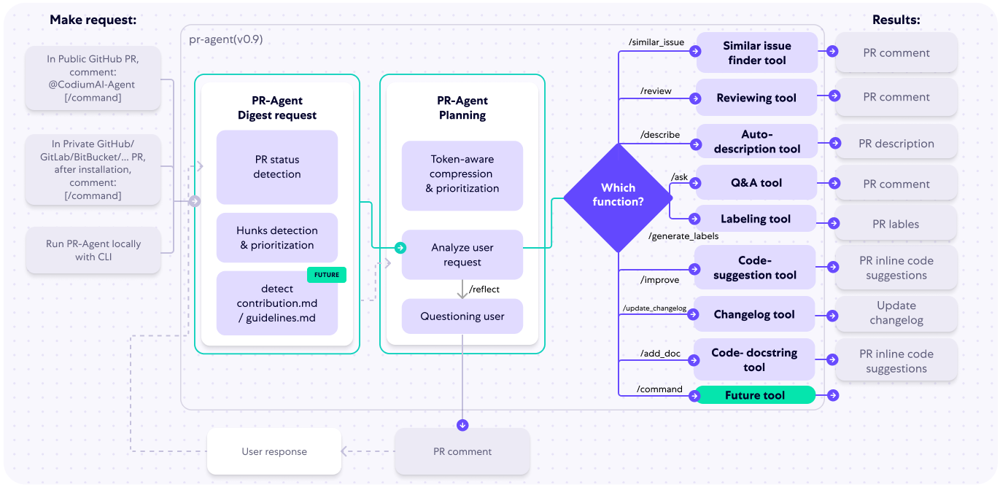
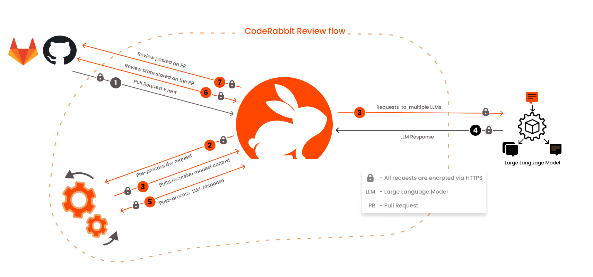

# AI 辅助软件工程：代码检视

CR（CodeReview）是代码指标保障中的重要一环，也是研发日常工作中的一个重要组成部分，我们希望通过对于CR过程和CR投入产出的情况进行分析，
评估当前CR工作的投入产出情况，驱动CR工作过程改进带来质量和效率的提升。

关键影响因素：

- CR评审需要快速响应，避免由于CR导致流程阻塞，一般应当在一个工作日内完成
- 挑选能对你代码做出最全面最准确评价的人为评审者，保障评审质量
- 避免单次提交过多代码，尽可能小的，增量的，实现一个完整功能的提交

## 示例

### Codium PR-Agent

> [CodiumAI](https://github.com/Codium-ai/pr-agent) PR-Agent aims to help efficiently review and handle pull requests,
> by providing AI feedbacks and suggestions

PR Agent



在处理PR（Pull Request）时，有两种常见情况：

1. PR足够小，可以放入一个提示中（包括系统提示和用户提示）。
2. PR太大，无法放入一个提示中（包括系统提示和用户提示）。

针对这两种情况，我们首先采用以下策略：

#### 仓库语言优先策略

我们根据以下标准优先考虑仓库的语言：

1. 排除二进制文件和非代码文件（例如图片、PDF等）。
2. 确定仓库中使用的主要语言。
3. 按仓库中最常见的语言对PR文件进行排序（按降序排列）：
   ```plaintext
   [[file.py, file2.py], [file3.js, file4.jsx], [readme.md]]
   ```

#### 小型PR

对于小型PR，我们可以将整个PR放入一个提示中：

1. 排除二进制文件和非代码文件（例如图片、PDF等）。
2. 扩展每个补丁周围的上下文至补丁上方和下方各3行。

#### 大型PR

##### 动机

大型Pull Request可能非常长，并包含大量信息，其相关程度对pr-agent而言各不相同。我们的目标是能够在单个LMM提示中尽可能多地打包信息，同时保持信息的相关性。

##### 压缩策略

我们优先考虑添加内容而不是删除内容：

- 将所有删除的文件合并到一个列表中（deleted files）。
- 文件补丁是块的列表，移除文件补丁中所有仅删除类型的块。

##### 自适应和基于token的文件补丁适配

我们使用tiktoken在上述修改后对补丁进行标记，并使用以下策略将补丁适配到提示中：

1. 在每种语言内，我们按文件中的token数量对文件进行排序（按降序排列）：
   ```plaintext
   [[file2.py, file.py], [file4.jsx, file3.js], [readme.md]]
   ```
2. 按上述顺序遍历补丁。
3. 将补丁添加到提示中，直到提示达到最大token长度的一定缓冲区。
4. 如果仍有剩余补丁，则将剩余补丁作为一个名为“其他修改文件”的列表添加到提示中，直到提示达到最大token长度（硬停止），并跳过其余补丁。
5. 如果尚未达到最大token长度，则将删除的文件添加到提示中，直到提示达到最大token长度（硬停止），并跳过其余补丁。

#### 示例

通过上述策略，我们可以有效地压缩和管理PR内容，使其适合在提示中使用，并确保信息的相关性和完整性。


### 示例：CodeRabbit

CodeRabbit是一款先进的AI驱动代码审查工具，旨在对拉取请求（PR）和合并请求（MR）提供快速且有上下文意识的反馈。它显著减少了手动代码审查所需的时间和精力，
提供了一个新的视角，并且经常能发现人眼容易忽略的问题。开发者可以直接在代码中与机器人互动，提供额外的上下文、提出问题或生成代码。系统通过学习用户的反馈不断改进。

AST 解析：[ast-grep](https://ast-grep.github.io/guide/rule-config.html)  is a new AST based tool for managing your code,
at massive scale.



#### Code Review 配置示例

CodeRabbit 基于抽象语法树 (AST) 模式提供审查指令。在底层实现上，CodeRabbit 使用 ast-grep 来支持这一功能。ast-grep 是用 Rust
编写的，并使用 tree-sitter 解析器为多种流行语言生成 AST。

```yaml
#...
reviews:
  #...
  path_instructions:
    - path: "**/*.js"
      instructions: |
        Review the JavaScript code against the Google JavaScript style guide and point out any mismatches
    - path: "tests/**.*"
      instructions: |
        Review the following unit test code written using the Mocha test library. Ensure that:
        - The code adheres to best practices associated with Mocha.
        - Descriptive test names are used to clearly convey the intent of each test.
  tools:
    ast-grep:
      essential_rules: true # option to enable essential security rules
      rule_dirs:
        - "custom-name"
      packages:
        - "myorg/myawesomepackage" # custom package name following the format organization/repository
```

AST Grep 规则示例：

```yaml
rule:
  # atomic rule
  pattern: "search.pattern"
  kind: "tree_sitter_node_kind"
  regex: "rust|regex"
  # relational rule
  inside: { pattern: "sub.rule" }
  has: { kind: "sub_rule" }
  follows: { regex: "can|use|any" }
  precedes: { kind: "multi_keys", pattern: "in.sub" }
  # composite rule
  all: [{ pattern: "match.all" }, { kind: "match_all" }]
  any: [{ pattern: "match.any" }, { kind: "match_any" }]
  not: { pattern: "not.this" }
  matches: "utility-rule"
```

### Google 示例：DIDACT

- [AI-Assisted Assessment of Coding Practices in Modern Code Review](https://arxiv.org/abs/2405.13565)
- [Resolving code review comments with ML](https://research.google/blog/resolving-code-review-comments-with-ml/)
