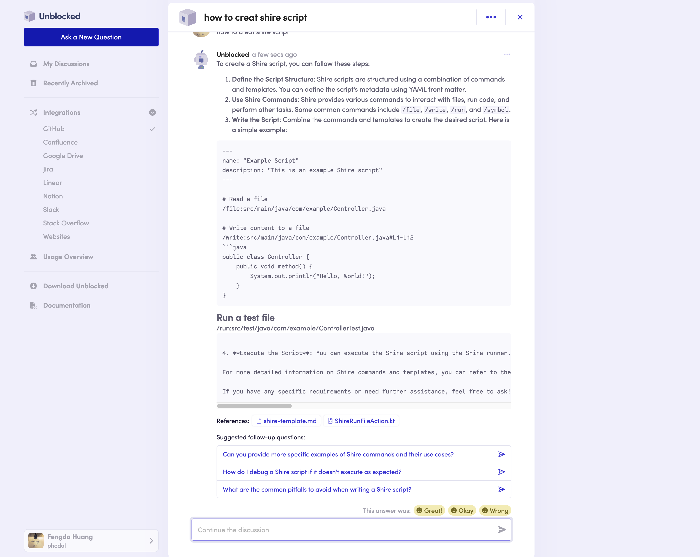

# AI 辅助软件工程：研发数字化

## 示例

### [Unblocked](https://getunblocked.com/)

Usecase:

- 新员工入职。Unblocked 帮助新团队成员找到所需答案，以便他们可以立即开始贡献。
- 征服遗留代码。Unblocked 将您的代码与其历史联系起来，以便您的团队在进行更改之前了解其影响。
- 自动化内部支持。通过使跨职能团队能够自主回答问题，保持工程团队专注于他们的工作。

尽管现有许多开发工具，开发团队仍然面临显著的效率问题，特别是在找到和保持代码库的共同理解上。频繁的打断和分散的代码相关信息导致延误和挫败感。比如
[Retool 的 2022 年工程时间状态](https://retool.com/reports/state-of-engineering-time-2022)
调查显示，大量开发者的时间被浪费在寻找正确的上下文和代码所有权信息上。Unblocked
旨在解决这个特定的低效问题，通过减少搜索信息和等待同事回复的时间，帮助开发者最大化他们的生产力。

#### 什么：Unblocked 提供的解决方案

Unblocked 是一个开发者工具，设计用来提供关于特定代码库的准确和有帮助的答案。不同于提供通用答案的通用型大型语言模型（LLM），Unblocked
连接到构建应用程序时使用的系统，如 GitHub、Jira、Slack 等，以提供精确的答案。它使用针对代码库优化的大型语言模型，理解代码库的细微差别和具体内容。Unblocked
支持多种集成，包括 GitHub、Bitbucket、Jira、Linear、Slack、Confluence 和 Stack Overflow for Teams，并计划未来支持 GitLab 和
Notion。此外，Unblocked 还具有创建和引用与代码文件相关的视频的功能，使视频内容在 IDE 中易于发现。

#### 如何：Unblocked 的实现和功能

1. **与多个数据源集成**：Unblocked 连接到存储代码相关对话和信息的各种系统，包括源码管理平台、问题跟踪器和通信工具。这样，它可以聚合并检查所有连接的内容，提供准确和上下文丰富的答案。

2. **优化的 LLM**：通过使用针对特定代码库优化的 LLM，Unblocked 能够理解并响应有关代码的详细查询，比如特定的实现细节和设计决策。

3. **无缝访问**：Unblocked 确保通过多种界面轻松获取答案：macOS 应用程序、IDE 插件（如 Visual Studio Code）以及直接在 Slack
   中。这使得开发者无需离开当前的工作流程就能获得所需信息。

4. **主动知识呈现**：即使开发者不知道具体要问的问题，Unblocked 也能主动呈现相关讨论和信息，确保他们在处理代码库的不同部分时拥有必要的上下文和理解。

5. **视频集成**：Unblocked 允许创建解释代码库部分内容的视频。这些视频与录制过程中引用的相关文件和内容链接，使其在 IDE
   中易于发现。每个视频还包含转录和可链接的时间索引，方便快速导航。

通过解决开发工作流程中的特定低效问题，Unblocked 旨在显著提高生产力，减少开发者花在搜索信息上的时间，从而让他们更多地专注于编写代码。

