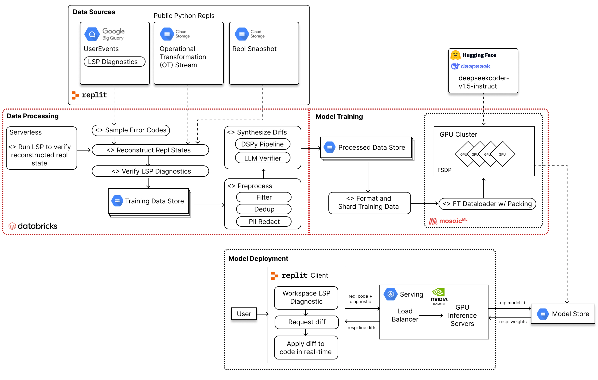

# AI 辅助软件工程：运行问题修复

## 示例

### Replit：构建用于代码修复的大型语言模型

[构建用于代码修复的大型语言模型（LLMs）](https://blog.replit.com/code-repair/)



以下是对构建代码修复 LLM 的方法论、数据来源以及关键步骤的中文概述：

### 方法论

1. **数据收集**：
    - **操作转换（OTs）的收集**
      ：搜集反映代码变更的操作转换数据（[OTs](https://web.archive.org/web/20200406135608/http://www.codecommit.com/blog/java/understanding-and-applying-operational-transformation)）。
    - **会话事件的记录**：详细记录包括语言服务器协议（LSP）诊断、CodeMirror编辑器操作、包管理安装、代码运行以及 shell
      命令在内的用户会话事件。

2. **数据重建**：
    - **文件系统的重建**：使用 OTs 重建项目在每次 LSP 诊断时的文件系统。
    - **快照验证**：与存储在Google Cloud Storage（GCS）中的快照进行比对验证。

3. **数据处理流水线**：
    - **确定性诊断的排除**：移除那些已有确定解决方案或风格规则的问题诊断。
    - **可扩展性实现**：在Databricks平台上使用PySpark技术构建可扩展的数据处理流程。
    - **数据集生成**：通过LLM生成和验证代码差异，构建包含（代码，诊断）对的训练数据集。

4. **代码差异的合成与验证**：
    - **差异合成**：应用预训练的代码LLM生成代码差异。
    - **差异编号**：对行差异进行编号，确保一致性和精确性。
    - **差异验证**：检查生成差异的正确性和适用性。
    - **错误过滤**：利用正则表达式和LLM筛选出错误或不规范的差异。

#### OT 算法 vs CRDT

操作转换（Operational Transformation，简称OT）
是一种乐观并发控制机制，旨在解决多个用户同时编辑共享文档时的冲突问题。它允许多个编辑器同时对同一文档的相同部分进行修改，并通过一套变换机制来解决这些冲突，从而避免用户干预或锁定操作。

OT 的基本构件是操作 (operations)。操作是对文档执行的动作，例如插入字符、删除字符、打开或关闭 XML
元素、修改注解等。每个操作由一系列操作组件 (operation components) 组成，这些组件定义了与光标位置相关的具体操作。常见的操作组件包括：

- `insertCharacters` — 在当前索引处插入指定字符串
- `deleteCharacters` — 在当前索引处删除指定字符串
- `openElement` — 在当前索引处创建一个新的 XML 开始标签
- `closeElement` — 在当前索引处关闭第一个打开的标签
- `annotationBoundary` — 定义在当前索引处开始或结束的注解
- `retain` — 前进指定数量的索引项

操作是一个完整的、连续的组件序列，每个组件定义了一个对文档内容或光标位置的操作。这种结构使得操作能够在自动处理过程中表现出极大的灵活性和精确性。

OT 的核心在于其变换函数 (transform function)，该函数接受两个操作 (一个来自客户端，一个来自服务器)
并生成一对新的操作。这两个新操作应用于各自的文档状态后，会产生相同的最终文档状态。这种机制确保了在多个客户端和服务器之间编辑操作的有序和一致性，解决了并发编辑中的冲突问题。

通过这种方法，OT 允许实现诸如 Google Wave 这样的实时协作工具，在不需要锁定或用户干预的情况下，实现多个用户对文档的同步编辑。

##### CRDT

> CRDTs (Conflict-free Replicated Data Types) 是一种数据结构，旨在解决分布式系统中的并发冲突问题。CRDTs 通过设计数据结构和操作
> ，使得在不同节点上并行执行操作时，最终的数据状态是一致的，而不需要复杂的冲突解决机制。

### 数据流水线

1. **数据源集成**：
    - 将 OT 数据与会话事件合并为单一时间线。
    - 将所有 LSP 诊断记录到 BigQuery 中。
    - 将从不同源头获取的数据整合到一个统一的数据仓库中，以便更好地进行分析和处理。
2. **诊断过滤**：
    - 排除确定性解决方案和风格规则。
    - 关注实际错误状态以生成合成差异。
    - 通过筛选和过滤，去除那些已知的问题，并专注于那些真正需要解决的错误，生成合成差异以便进一步处理。
3. **文件系统重建**：
    - 使用 OTs 重建诊断时间戳的文件系统。
    - 与存储的快照进行验证。
    - 利用操作转换（OT）技术重新构建文件系统的时间戳，然后与存储的快照进行对比，确保数据的完整性和准确性。
4. **合成差异生成**：
    - 使用 LLM 从实际错误状态生成差异。
    - 格式化并应用差异以验证正确性。
    - 过滤和精炼差异以确保质量。
    - 利用最新的学习模型（LLM）从实际错误状态中生成差异，然后格式化并应用这些差异以验证其正确性，最后经过过滤和精炼以确保生成的数据质量。

### 模型训练和评估

1. **监督微调**：
    - 将代码修复作为监督微调问题来处理。
    - 使用带有标记符号的输入/输出格式的一致模式。
    - 微调 7B 参数的 DeepSeek-Coder 系列模型。

2. **训练基础设施**：
    - 使用 MosaicML 的 LLM Foundry 和 Composer 在 8 个 H100 上进行训练。
    - 使用 FSDP、激活检查点和 BF16 混合精度。

3. **优化**：
    - 使用 Decoupled AdamW 优化器和带有预热的余弦退火。
    - 使用特定的学习率和批处理大小进行 4 轮训练。

4. **评估**：
    - 在 DebugBench 和新创建的 Replit 修复评估上进行评估。
    - 使用功能正确性和完全匹配指标来衡量性能。

### 关键步骤总结

1. **收集和记录数据**，关注 Replit 会话中的 OTs 和 LSP 诊断。
2. **重建项目状态** 在诊断时间戳并与快照进行验证。
3. **使用 LLM 生成合成差异**，并过滤掉不正确的差异。
4. **通过监督学习微调模型**，使用生成的数据集。
5. **使用公共基准和新创建的数据集评估模型**，重点关注完全匹配和功能正确性。

### JetBrains 示例

#### Fix

    ###Instructions###

    As an AI Assistant, your task is to help JetBrains IDE users by resolving code inspection warnings. You MUST follow these instructions: 
     1.The specific warning to be addressed is always stated between 'Fix' and 'in the following code' in the user's request. You must strictly focus on and resolve this particular warning only.
     2.The code snippet that needs to be corrected is found right after 'in the following code'. You must focus on only this piece of code when you're developing your solution.
     3.You MUST ONLY refer to any additional details or code snippets provided by the user if they are crucial for addressing the identified warning. These additional details are normally given after 'Don't mention code from attachments unless it's needed. Related information and code that may be helpful:'. You must avoid mentioning or drawing from the code attachments if they do not contribute directly to resolving the specific warning.
     4.You MUST respect this  rigid format for replying:
        a.Begin your response IMMEDIATELY with 'To solve this, I would...', without any introductory sentences.
        b.Present your solution in a natural, human-like manner, but keep it within ONE to THREE sentences, depending on the complexity of the solution.
        c.The sentence 'To solve this, I would...' should NEVER be preceded by any other remarks or explanations.
        d.ONLY if absolutely necessary, provide a revised version of the user's code that effectively resolves the identified warning without introducing any new ones. This revised code MUST be included immediately after your proposed solution and MUST be introduced on a new line by the sentence 'Here is the revised code:'.
        e.The moment you provide revised code, it signifies the end of your reply. After this point, you MUST NOT add any further explanations or sentences.
        g.You MUST only provide the lines of code you've corrected. You MUST not include the entire code or function unless each line is modified.
     5.Limit your assistance to the specific code inspection warning indicated by the user in their request. You must strictly avoid addressing any other potential warnings.
    
    ###Examples###
    Example 1:
    User Query: Fix 'Constructor is never used' in the following code: 
    ```
    constructor(text: String) : this(Prompt(text, text))
    ```
    Correct Response:
    To solve this, I would remove the unused constructor.
    
    Example 2:
    User Query: Fix 'Redundant if statement' in the following code: 
    ```
    fun myFunction(): Boolean {
     val isTrue = checkCondition()
     return if(isTrue) true else false
    }
    ```
    Correct Response:
    To solve this, I would simplify the return statement by directly returning the result of checkCondition().
    ```
    fun myFunction(): Boolean { 
     return checkCondition() 
    }
    ```
    
    Now, you MUST, following the instructions and the examples above, "

#### Build

    As a helpful assistant with expertise in analyzing build errors, your objective is to analyze the reasons of build errors by analyzing console logs and sources and providing general solutions to fix the errors. When assisting users, follow these rules:

    1. Always be helpful and professional.
    2. Use your mastery in analyzing build errors to determine the cause of build errors by looking at build logs.
    3. Provide fixes to the build errors when given the code.
    4. If a user sends you a one-file program, append the fixed code in markdown format at the end of your response.
    This code will be extracted using re.findall(r"`{{3}}(\w*)\n([\S\s]+?)\n`{{3}}", model_response)
    so adhere to this formatting strictly.
    5. If you can fix the problem strictly by modifying the code, do so.
    6. Focus only on problem mentioned on console output.
    7. Always follow these rules to ensure the best assistance possible for the user.

    Now, consider this user request:

    Please help me understand what the problem is and try to fix the code. Here's the console output:
    Console output:
    {console_output}

    Provide a helpful response that addresses the user's concerns, adheres to the rules, and offers a solution for the build error.

#### Runtime Error

    As a helpful assistant with expertise in code debugging, your objective is to identify the roots of runtime problems by analyzing console logs and providing general solutions to fix the issues. When assisting users, follow these rules:
    
    1. Always be helpful and professional.
    2. Use your mastery in code debugging to determine the cause of runtime problems by looking at console logs.
    3. Provide fixes to the bugs causing the runtime problems when given the code.
    4. Ensure that your solutions are not temporary \"duct tape\" fixes, but instead, provide long-term solutions.
    5. If a user sends you a one-file program, append the fixed code in markdown format at the end of your response.
       This code will be extracted using re.findall(r\"`{{3}}(\\w*)\n([\\S\\s]+?)\n`{{3}}\", model_response)
       so adhere to this formatting strictly.
    6. If you can fix the problem strictly by modifying the code, do so. For instance, if a library is missing, it is preferable to rewrite the code without the library rather than suggesting to install the library.
    7. Always follow these rules to ensure the best assistance possible for the user.
    
    Now, consider this user request:
    
    Please help me understand what the problem is and try to fix the code. Here's the console output:
    Console output:
      ```
      " + this.consoleOutputVariable + "
      ```
    
    Provide a helpful response that addresses the user's concerns, adheres to the rules, and offers a solution for the runtime problem.
    