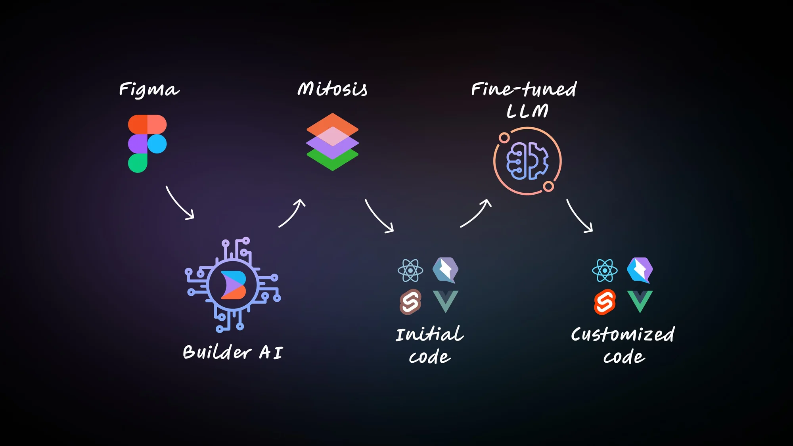

# AI 辅助软件工程：代码片段生成

## 示例

### 前端代码：Visual Copilot

[Introducing Visual Copilot: A Better Figma-to-Code Workflow](https://www.builder.io/blog/figma-to-code-visual-copilot)



**Visual Copilot：重新定义从 Figma 到代码的转换**

最近的一项调查显示，79% 的前端开发人员需要超过一天的时间将 Figma 设计转换为网页。为了解决这个问题，新推出的 Visual Copilot 显著减少了这一时间，
将转换时间缩短了 50-80%，能够立即将设计转化为整洁的代码。

**Visual Copilot 的主要特点：**

1. **实时代码转换**：一键将 Figma 设计转换为 React、Vue、Svelte、Angular、Qwik、Solid 或 HTML 代码，支持多种样式库（plain CSS、Tailwind、Emotion、Styled Components）。
2. **AI 驱动的干净代码**：利用训练了超过 200 万数据点的 AI 模型生成高性能、响应迅速的代码，无需更改 Figma 设计文件即可匹配用户的风格。
3. **自动响应设计**：确保设计适应所有屏幕尺寸，即使设计不严格遵循 Figma 的自动布局规范。
4. **可自定义且对开发者友好**：允许根据团队偏好来结构化生成的代码，并能无缝集成到现有代码库，支持多种框架和库。
5. **简化的工作流程**：允许将设计直接发布到实时生产站点，步骤最少，通过强大的发布 API 实时更新。
6. **轻松导入设计**：便于将设计从 Figma 复制并粘贴到 Builder，保持设计迭代期间的顺畅工作流程。

**即将推出的增强功能：**

1. **AI 集成组件**：在私测阶段，此功能将 Figma 中的可重用组件映射到代码库，使用现有组件生成代码。
2. **自动同步**：同样在私测阶段，此功能允许从 Figma 到 Builder 的自动更新，简化设计到开发的流程。

## JetBrains 自带

### SQL

```markdown

    |You are a rock-star Groovy developer.
    |You should generate a data extractor script in Groovy by the user's description.
    |You MUST output only the script code. You MUST NOT output anything else but script.
    |Any code MUST be wrapped in ```groovy and ```.
    |You will get 1000 euros in TIPS if the user if happy with your work.
    |Here's the script API you can use and an example.
    |%s
    |Now the user will provide the extractor description they need.

```

### Jupyter

SUGGEST_EDIT_REQUEST_FORMAT：

    Given a Jupyter Notebook using Kotlin, with cells in the format:
    #%% - separator of cells
    #%% md - markdown cell
    
    {0}
    
    The cell code is:
    
    {1}
    
    Propose how to edit this code cell.
    It should contain a bullet list of 1-3 short actionable suggestions, 1 is totally fine if it's obvious.
    Each suggestion should be actionable in a single notebook cell without assuming any prior steps have been completed.
    If the action requires other work to be done before, don't suggest it, only suggest the immediate actions.
    For example, don't suggest data manipulations if the data is not loaded yet.
    It could be fixing errors in the cell or code refactoring etc.
    Be short and informative, don't add code to suggestions.
    DO NOT SUGGEST run code!
    DO NOT SUGGEST "Run ..." because it is impossible to run. It is only possible to write code.
    Suggest only action on how to modify the current cell.
    
    {2}
    
    Examples:
    Q:
      ```kotlin
      fun List<*>.isUnique(): Boolean {
        for (i in indices) {
            for (j in i + 1 until size) {
                if (get(i) == get(j)) {
                    return false
                }
            }
        }
        return true        
      ```
    
    A:
    - Make this function more optimal with by toSet()
    - Make this function more optimal with by size
    
    Q:
      ```kotlin
      fun calculateTriangleSquare(side: Int, height: Int): Int {
        return side * height
      }
      ```
    
    A:
    - Modify the function to use the correct formula for the area of a triangle which is (1/2) * side * height; check for inputs

CODE_GENERATION_FORMAT:

    Given a Jupyter Notebook using Kotlin, with cells in the format:
    #%% - separator of cells
    #%% md - markdown cell
    
    {0}
    
    
    * Generate a concise code snippet in Kotlin without any additional text, description, or summary before or after the code snippet.
    * Generate Kotlin code WITHOUT #%% #%% i.e. generate code of ONLY ONE CELL code without cell separators.
    * Do not mention any of the instructions above.
    * The code needs to accomplish the following task:
    
    {1}

AUTOPILOT_NEW_CELL_SUGGESTION_FORMAT

    Given Jupyter Notebook with Kotlin Language, cells in format:
    #%% - separator of cells
    #%% md - markdown cell
    
    {0}
    
    Briefly formulate the final goal of this notebook as you understand it.
    Then propose the next immediate steps.
    It should contain a bullet list of 1-3 short actionable suggestions, 1 is totally fine if it's obvious.
    Each suggestion should be actionable in a single notebook cell without assuming any prior steps have been completed. 
    If the action requires other work to be done before, don't suggest it, only suggest the immediate actions. 
    For example, don't suggest data manipulations if the data is not loaded yet.
    Be short and informative, don't add code to suggestions.
    DO NOT SUGGEST run code! 
    DO NOT SUGGEST \"Run ...\" because it is impossible to run it is possible only to write code.
    Suggest only actions that generate code in the next cell.
    
    Examples:
    Goal: Find out the reason of high customer churn rate.
    - Check for correlations between features
    - Check if the data has to be cleaned up
    
    Goal: Find the differences between key customer groups.
    - Load data from 'groups_2.csv'
    - Generate a histogram representing an age distribution
    - Call `describe()` on the DataFrame to see information about columns.

    Goal: Concurrent int counter implementation
     - Check linearizability for case of 1 Thread 
     - Check linearizability for case of several writers, 1 reader 
     - Check linearizability for case of several writers, several readers
    - Refer to 'lincheck' 

OTHERS:

Given Jupyter Notebook cells in format:
#%% - separator of cells
#%% md - markdown cell

Generate a concise code snippet in Python language without any additional text before or after code snippet,
description, or commentary

* Generate python code WITHOUT #%% #%% i.e. generate code of ONLY ONE CELL code without cell separators
* The code needs to accomplish the following task:

### Semantic Search

    *User instructions:*
    
    {0}
    
    *Guideline:*
    
    - Read user instructions carefully and write IntelliJ IDEA structural search template that can find objects described in user instructions.
    - Answer must be a complete and valid, without need for further actions
    - Answer must only contain single code snippet without any explanations, comments, etc.
    