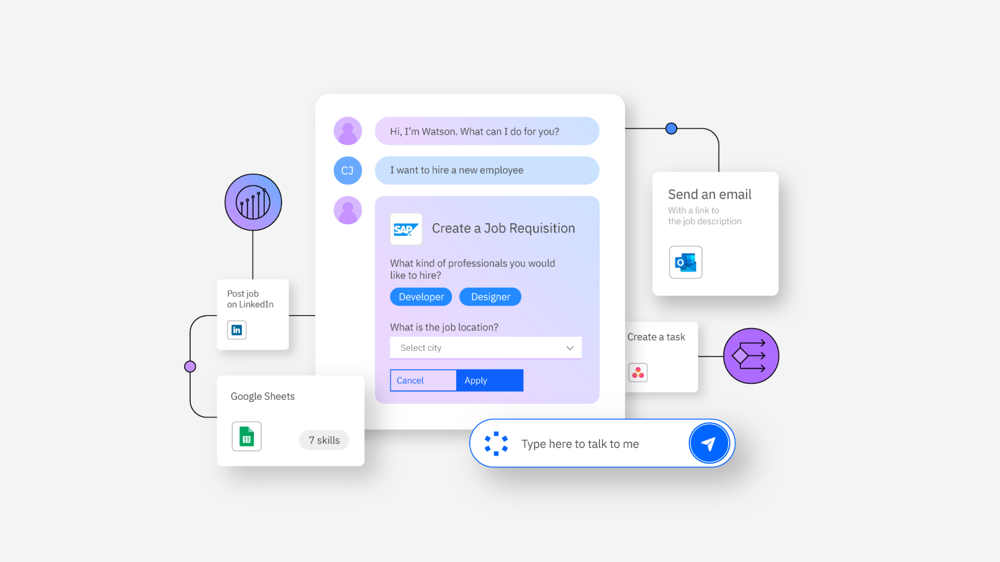

# 低代码生成

## 示例

### IBM Assistant Builder

Watsonx Orchestrate 中的 AI 助手构建器是新一代构建工作室，它利用生成式 AI 和数字技能的强大功能，帮助组织和领域专家通过强大的低代码体验快速轻松地创建新的、引人注目的
AI 助手。通过定制的 AI 助手，客户和员工可以在高度互动的自然语言体验下，无缝地完成任务和复杂流程。

Watsonx Orchestrate 中的 AI 助手构建器体验为构建者提供了一个低代码生成式 AI
和自动化工作室，可以快速建立基于大型语言模型（LLM）驱动的助手，这些助手扎根于业务背景、数据和自动化。AI
助手构建器使您能够通过高度对话化的界面扩展您的自动化投资，并通过注入您信赖的 AI 来扩大应用范围。生成式 AI 功能由 IBM
值得信赖且透明的大型语言模型本地提供，并针对特定业务功能进行了微调。构建者可以灵活控制何时以及如何使用大型语言模型，包括选择基础语言模型、内容支撑、AI
引导的操作和对话技能。IBM Watsonx Orchestrate 为您的客户和员工提供自然、优化的体验，引导他们完成多步骤流程，同时让生成式 AI
处理繁重的任务。

- 对话式搜索利用生成式 AI。AutomaConversational Search
  通过运用大型语言模型（LLM）进行检索增强生成（RAG），旨在生成准确、符合您公司内容的对话式回答，并具备答案追踪功能，确保信息准确且可验证。
- 对话技能。Watsonx Orchestrate AI 助手构建器中定制的AI助手能够在对话中直接执行自动化任务，或称为技能。生成式 AI
  在运行时无缝收集执行任务所需的输入，为用户提供更流畅的体验。
- AI引导的操作。通过为您的助手提供特定短语，精确控制何时利用 LLM 的强大功能。这些短语将自动触发针对特定用例的AI驱动响应，例如提供产品和服务建议、解释关键概念等。
- 基础 LLM。使用 IBM 的 Granite 模型系列，或从精选的其他 LLM 列表中选择，为您的助手提供生成式AI能力。通过添加特定的提示指令，生成最佳的生成式回答，或在无代码界面中优化
  LLM 输出，以增加灵活性。
