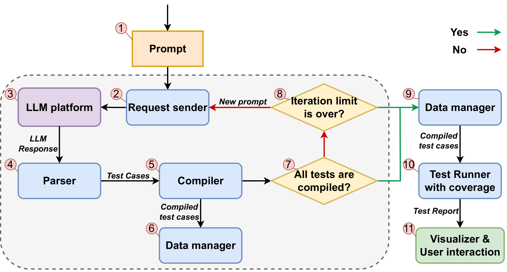

# AI 辅助软件工程：AI 辅助软件质量

如 CodeScene 的[文章]([Use Guardrails for AI-Assisted Coding](https://codescene.com/blog/use-guardrails-for-ai-assisted-coding))所总结：

在未来几十年里，人机协作编写代码的模式将逐渐成为主流。在这种趋势下，人们很容易错误地将代码编写的速度等同于生产力。为了在尽可能降低风险的同时，充分发挥 AI 辅助编码的积极作用，需要做到以下几点：

1. **设定现实的期望**：AI 辅助编程能高效完成特定任务，但因其一致性和正确性尚有不足，无法完全替代人类程序员。我们应承认这些限制，并专注于如何增强而非替代人类程序员的工作。同时，确保所有 AI 生成的代码都经过严格的测试覆盖。
2. **将代码质量设为关键绩效指标（KPI）**：对人类和机器均应执行最低质量标准。在交付流程中，实施自动化质量检查，确保代码质量。使用可靠且经过验证的指标，以最大限度地提高信号的准确性并减少误报。
3. **进行持续的代码检查**：AI 生成的代码需要被团队充分理解和审查。绝不能接受团队无法掌握或未经审查的代码。通过可视化手段，监控整个团队的代码熟悉度，以便及时发现并解决潜在的知识孤岛。
4. **认识到理解代码的重要性日益提升，而不仅仅是编写代码**：理解AI生成的代码将成为一项关键技能。因此，确保流程、实践和培训能够适应这一变化，以提升团队能力。

正如大家所见，在 AI 辅助编码领域，存在一个共同的主题。要想取得成功，必须让具备专业技能的人类参与其中，并且引入专门的工具与流程，以确保代码库的持续健康。
探索这一新兴领域，意味着必须重新关注代码质量和持续学习。这一点至关重要。

## 借助传统工具，改善 AI 代码质量

[Use Guardrails for AI-Assisted Coding](https://codescene.com/blog/use-guardrails-for-ai-assisted-coding)

在采用AI辅助编码工具时应用防护措施

这些防护措施需要在三个方面发挥作用：代码质量、代码熟悉度和强大的测试覆盖率，以确保正确性：

- 防护措施：代码质量。高质量的代码一直是企业的竞争优势，能够缩短开发周期并减少生产缺陷。这样的代码更容易理解，因此在需要修改时更安全、更具成本效益。对AI生成的代码保持同样的标准可以减轻多种风险。
- 防护措施：代码熟悉度。第二个防护措施涉及确保代码熟悉度的流程和实践。[研究表明](https://arxiv.org/abs/2304.11636)
  ，当开发人员处理之前没有看过的代码时，解决大型任务所需的时间可能增加93%——这是入职的成本。在拥抱AI时，我们开发人员不断面对新的和不熟悉的代码。因此，我们必须确保每个开发人员也能对生成的代码建立强烈的熟悉感。
-

防护措施：测试覆盖率。如上所述，AI助手经常生成不正确的代码。我们常说大语言模型并不是真正有创意的，但在进行我们的AI研究后，我不得不同意：AI破坏我们代码的方式是没有限制的。有些是微妙的，比如否定一个逻辑表达式，另一些则非常糟糕（比如删除JavaScript代码中的`this`
关键字，根本上改变了函数的意义）。强大的自动化测试在这里提供了急需的保护。而且——测试不应该从代码中由AI生成。这样做就错过了测试的双重记账功能。（例如，谁来测试测试？）。

## 示例

### 案例：TestSpark

[TestSpark](https://github.com/JetBrains-Research/TestSpark) 是一个用于生成单元测试的插件。TestSpark 能够在 IDE 中原生集成多种基于
AI 的测试生成工具和技术。

Paper: [TestSpark: IntelliJ IDEA’s Ultimate Test Generation Companion](https://arxiv.org/html/2401.06580v1)

TestSpark 目前支持两种测试生成策略：

1. 基于大语言模型（LLM）的测试生成（使用 OpenAI 和 JetBrains 内部的 AI Assistant 平台）
2. 基于局部搜索的测试生成（使用 EvoSuite）

### 基于大语言模型的测试生成

对于这种测试生成方式，TestSpark 向不同的大语言模型发送请求。此外，它会在向用户展示测试之前自动检查测试是否有效。

此功能需要从 OpenAI 平台或 AI Assistant 平台获取一个 token。

- 支持任何版本的 Java。
- 生成用于捕获故障的单元测试。
- 为 Java 类、方法和单行代码生成测试。

### 基于本地搜索（search-based）的测试生成

对于此类测试生成方法，TestSpark 采用了 EvoSuite，这是目前最强大的基于搜索的本地测试生成工具。

- 它只支持 Java 11 **及以下**版本。
- 根据多样的测试标准生成测试用例，包括行覆盖率、分支覆盖率、I/O 多样性、异常覆盖率和变异得分。
- 能够生成用于检测故障的单元测试。
- 为 Java 中的类、方法以及单行代码提供测试生成服务。

### 案例：UnitTestBot

[UnitTestBot](https://github.com/UnitTestBot)

Java 版本：[UnitTestBot](https://github.com/UnitTestBot/UTBotJava)

我们是一支分布式的研究人员和工程师团队🙋‍。

我们所有人都对数学和编程充满热情。我们热衷于参加软件测试[比赛](https://ieeexplore.ieee.org/document/9810769)
并在[研究文章](https://www.utbot.org/research)中描述我们的成就。

我们的主要项目是我们的旗舰产品——[UnitTestBot](https://www.utbot.org/)，它支持Java/Kotlin、C/C++、Python、JavaScript和Go语言。

为了保持与前沿科学的联系，我们与顶尖大学合作。作为校际团队的一部分，我们开发了根本技术，以增强UnitTestBot以及其他一系列软件产品。以下是其中一些：

#### 🤓 SAT求解技术

SAT求解器是一种计算机程序，用于确定给定布尔公式的变量是否可以一致地替换为_True_或_False_，从而使公式的结果为_True_
。SAT求解器经常被用作程序验证应用程序的“引擎”。

- [KoSAT](https://github.com/UnitTestBot/kosat)是一个基于MiniSat核心的纯Kotlin CDCL
  SAT求解器。它解决以DIMACS格式给定的布尔可满足性问题，并支持增量求解。
- 我们还研究了与SAT求解相关的[更广泛的理论问题](https://www.utbot.org/research)，例如评估给定SAT问题的计算难度。

#### 🧐 SMT求解技术

可满足性模理论（SMT）研究领域涉及确定逻辑公式是否可满足。

[KSMT](https://github.com/UnitTestBot/ksmt)是各种SMT求解器的Java/Kotlin门面。目前，它支持Z3和Bitwuzla SAT求解器。

#### 😎 符号执行

利用SAT和SMT求解器，我们开发了符号执行技术，以为我们的精确代码分析和自动化测试生成工具提供有效的引擎。在这个研究领域，我们有三个主要解决方案。

- [UnitTestBot Java](https://github.com/UnitTestBot/UTBotJava)
  有自己的动态符号执行引擎，已在[SBST比赛](https://ieeexplore.ieee.org/document/9810769)中表现出色。
- 我们为KLEE定制的补丁是[UnitTestBot C/C++](https://github.com/UnitTestBot/UTBotCpp)
  的核心。KLEE是一个基于LLVM编译器基础架构的符号虚拟机。我们通过实现补丁来[贡献给KLEE](https://github.com/UnitTestBot/klee)
  ，提高引擎的代码覆盖率和速度。我们提出了_懒初始化改进_，并向主KLEE分支提交了_未定义行为检测补丁_以及_内联汇编支持补丁_。
  我们将KLEE转换为_双向属性导向符号执行_引擎。此外，补丁后的KLEE引擎能够自动推导方法摘要。
- 我们还计划通过[V#](https://github.com/VSharp-team/VSharp)支持.NET基础架构——这是一个完全自动化测试生成的符号执行引擎。

符号执行是我们的主要关注点，因此我们进行了[一系列研究](https://www.utbot.org/research)，涉及该领域的应用和基础问题。

#### 🤪 模糊测试

在开发UnitTestBot产品系列的过程中，我们开发了适用于所有支持语言（Java/Kotlin、C/C++、Python、JavaScript和Go）的[模糊测试和动态程序分析技术](https://github.com/UnitTestBot/UTBotJava/tree/pelevin/UnitTestBot_Family_Fuzzer_Platform/utbot-fuzzers)。

#### 🙂 程序分析

UnitTestBot及其符号执行引擎和模糊测试技术是[现成的](https://github.com/UnitTestBot/UTBotJava/wiki/Static-code-analysis-with-UTBotJava-action)
用于[代码分析](https://github.com/UnitTestBot/UTBotCpp/wiki/CodeAnalyzer)的工具。除了这一端到端解决方案外，我们还实现了一个开发自定义静态代码分析器的基本框架。

[Java编译数据库（JacoDB）](https://github.com/UnitTestBot/jacodb)受到了[Soot](https://github.com/soot-oss/soot)
框架的启发，用于分析和转换Java代码。

JacoDB是一个纯Java数据库，存储关于编译后的Java字节码的信息——类、层次结构、注释、方法、字段及其用法。使用JacoDB，可以分析JVM进程外的字节码。这使得UnitTestBot能够支持最新的JDK，并在重启之间重用数据。

#### 🙃 程序合成

我们研究合成代码以解决实际问题的方法。
例如，UnitTestBot能够基于公共API而不是反射[生成人类可读的测试方法体](https://github.com/UnitTestBot/UTBotJava/pull/1030)。

我们还开发了**genui**
项目——一个自动化UI生成工具。在我们的研究中，我们[探讨](https://icfp22.sigplan.org/details/minikanren-2022-papers/3/On-a-Declarative-Guideline-Directed-UI-Layout-Synthesis)
了根据指定的设计指南自动排列用户界面元素的方法。下一步是合成能够实现此布局的代码。
