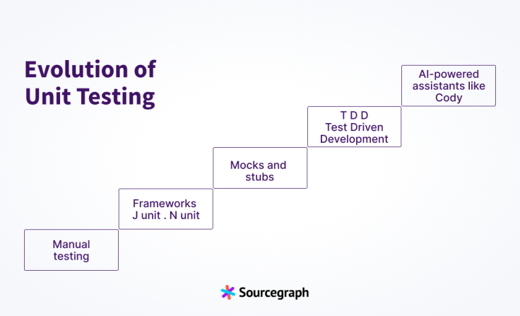

# AI 辅助软件工程：单元测试生成


## 示例

### SourceGraph

[How to write unit tests](https://sourcegraph.com/blog/how-to-write-unit-tests)



随着软件开发的发展，单元测试的实践也在不断进步。从手动测试到复杂的模拟框架和全面的代码覆盖率工具，单元测试正在不断改进，以应对复杂的软件架构和敏捷开发的需求。

单元测试的演变过程如下：

1. 起初，手动测试是常态。测试人员需要手动审查和测试软件，模拟真实用户的行为，并在不使用自动化工具的情况下识别错误。
2. 框架的崛起：专门的测试工具和框架应运而生，如JUnit和NUnit，它们提供了结构和自动化，从而提高了效率和可重复性。
3. 关注模拟和存根：模拟框架变得流行，开发者可以模拟对模拟对象（如数据库、外部服务）的依赖，并隔离单元，以进行更有效的测试。
4. 测试驱动开发（TDD）：这种方法通过让开发者在编写代码之前先写测试，从而优化了典型的开发流程。
5. 现代时代：人工智能助手如Cody的出现，提供了自动化的单元测试，识别边缘情况，并简化了开发工作流程。

### Shire 示例

    ---
    name: "Auto Test"
    description: "AutoTest"
    interaction: RunPanel
    actionLocation: ContextMenu
    when: $fileName.contains(".java") && $filePath.contains("src/main/java")
    fileName-rules:
      /.*Controller.java/: "When testing controller, you MUST use MockMvc and test API only."
    variables:
      "extContext": /build\.gradle\.kts/ { cat | grep("org.springframework.boot:spring-boot-starter-jdbc") | print("This project use Spring Framework")}
      "testTemplate": /\(.*\).java/ {
        case "$1" {
          "Controller" { cat(".shire/templates/ControllerTest.java") }
          "Service" { cat(".shire/templates/ServiceTest.java") }
          default  { cat(".shire/templates/DefaultTest.java") }
        }
      }
    onStreamingEnd: { parseCode | saveFile }
    ---
    Write unit test for following ${context.language} code.
    
    ${context.frameworkContext}
    
    #if($context.relatedClasses.length() > 0 )
    Here is the relate code maybe you can use
    ${context.relatedClasses}
    #end
    
    #if($context.currentClassName.length() > 0 )
    This is the class where the source code resides:
    ${context.currentClassCode}
    #end
    
    ${context.extContext}
    
    Here is the imports to help you understand:
    
    ${context.imports}
    
    Here is the source code to be tested:
    
    ```${context.language}
    ${context.selection}
    ```
    
    #if($context.isNewFile)
    Start method test code with Markdown code block here:
    #else
    Start ${context.targetTestFileName} test code with Markdown code block here:
    #end
    
    
## 示例

### JetBrains
             
### C Sharp

```shire
Generate test cases for the class $sourceFileClrName . Use the file $argetTestFileName as the starting point.
Each generated test method MUST CONTAIN MAXIMUM number of test cases and corner cases for EACH method; use the corresponding attribute from test framework for it.
You MUST generate corner cases. Test cases MUST be generated for EACH method from class and base classes. Do not remove existing functions.
Reply ONLY with code snippet block with the FULL new content for the file without any additional text before or after, description, or commentary.

$filesWithContent
```

### Java

```vm
#if ($USER_DESCRIPTION)
Read test description below and write new tests. Put new test methods inside the class `$TEST_CLASS`.

*Test description:*
$USER_DESCRIPTION
#else
Write tests for the `$METHOD_NAME` method in the `$CLASS_NAME` class. Put new test methods inside the class `$TEST_CLASS`.
#end

#if ($CREATE_NEW_FILE)
*Guideline:*
- Test file should be complete and compilable, without need for further actions.
- Write a description of the class and the method being tested.
- Ensure that each test focuses on a single use case to maintain clarity and readability.
- Instead of using `@BeforeEach` methods for setup, include all necessary code initialization within each individual test method, do not write parametrized tests.
#if ($LIBRARIES != "")
- Use libraries available in the project: $LIBRARIES .
#end
#if ($SUGGESTED_FRAMEWORK == "Spring-test")
- Use appropriate Spring test annotations such as `@MockBean`, `@Autowired`, `@WebMvcTest`, `@DataJpaTest`, `@AutoConfigureTestDatabase`, `@AutoConfigureMockMvc`, `@SpringBootTest` etc.
- Assume that the database is empty before each test and create valid entities with consideration for data constraints (jakarta.validation.constraints).
#end
#end
$CUSTOM_INSTRUCTIONS

*Sources:*
$SOURCES
```

