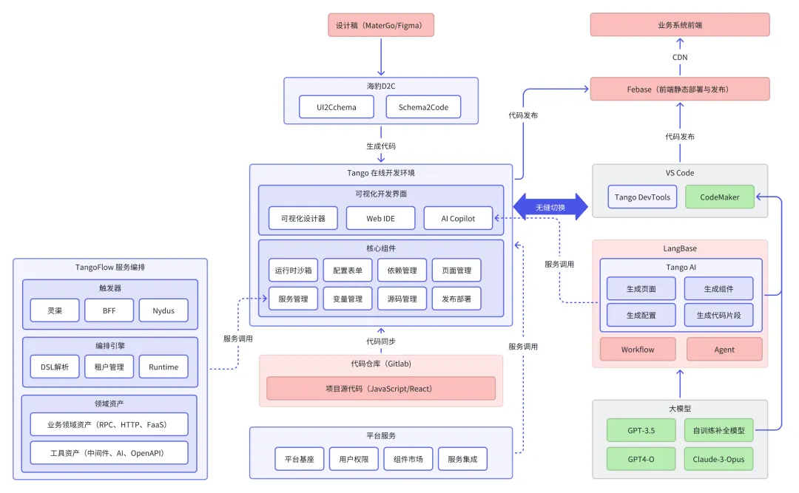
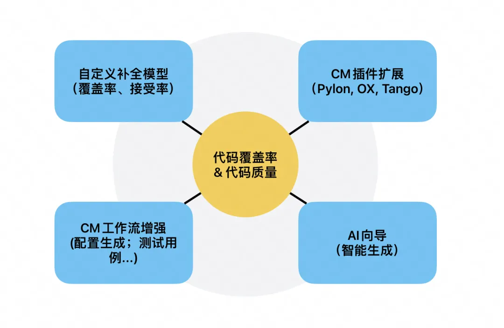
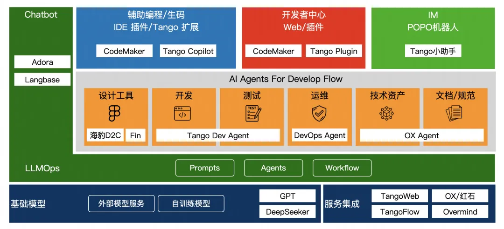

# AI 辅助 UI 设计

## 示例

### Tango + AI Agent Workflow

[AI 辅助的团队开发工作流思考](https://mp.weixin.qq.com/s/FmTFYfMVPTKH-pqmwG1Avg)

在网易云音乐内部，结合我们对业务需求特点的梳理，和开发者的实际诉求，我们构建了渐进式的低代码能力，专注于降低技能门槛，减少编写重复代码。我们从2023年4月开始探索
AI Code 能力与开发者个人工作流的结合，包括引入 Github Copilot 提升源码开发体验，通过 Tango 与 GPT 系列大模型的连接来提供
AI 驱动的 Low Code 能力。

在2024年，我们进一步的开始探索借助 AI 来升级现有的团队开发工作流，从大前端场景覆盖到服务端源码开发场景，在内部协同 LangBase
来提供 DevAgent（生成页面，生成组件，生成代码片段）、DesignAgent（抠图，生图，设计稿转代码） 等能力，与 CodeMaker 共建的方式来逐步取代
Github Copilot，为团队定制专属代码补全模型，并持续探索 AI Code 能力与团队开发工作流的深度集成和定制。

如上图所示，在大前端的开发工作流场景中，海豹D2C[3] 提供了基于设计稿直接生成项目源码的能力，目前支持 React, ReactNative, Vue
等多种框架，支持内部核心的C端场景覆盖，借助 DesignAgent 能力，我们增强了对设计稿的识别精度，提升了出码还原度。在 Tango
这一层，我们并没有一味追求可视化开发的思路，而是通过衔接既有的源码开发工作流，并借助 LangBase 提供的 DevAgent
来增强代码生成能力，在本地开发流程中通过完善源码开发环节的 DevTools 和 CodeMaker 能力来改善开发者体验。

当前我们正尝试从四个方面将 AI Code
能力融入到团队开发工作流中，具体包括训练自定义补全模型（针对不同的开发者画像提升补全覆盖率和接受率）、CM插件扩展（集成核心的工具设施到IDE，实现对话式信息获取和配置生成）、CM工作流扩展与自定义（复用和下发既有的Agent能力）、AI向导（提供特定领域内容的自动化生成能力）等四个方面。

