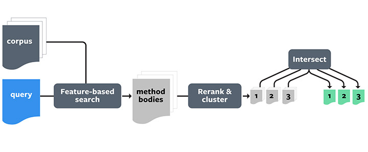

# 代码质量检查

对开发人员的提效，好的情况会提速50%，差的可能还拖慢进度（如针对初级开发者）。这取决于编程方式、开发任务的类型、使用的编程语言，
以及在使用聊天接口时如何制定恰当的提示指令。警惕AI生成代码可能带来的代码质量下滑([GitClear研究](https://www.gitclear.com/coding_on_copilot_data_shows_ais_downward_pressure_on_code_quality))
，监控代码质量变化并做好保障措施。

## 示例：Aroma

诸如SAST (Static Application Security Testing) 和 DAST (Dynamic Application Security Testing)
：这两种测试方法结合了不同的工具和技术，分别用于静态和动态地评估应用程序的安全性。

- Facebook's [Aroma](https://ai.meta.com/blog/aroma-ml-for-code-recommendation/)：一个代码推荐系统，可以从大型代码库中提取代码模式，并为开发者提供优化建议。

与传统的代码搜索工具相比，Aroma的代码推荐功能具有几个优势：

- Aroma 在语法树上执行搜索。与其寻找字符串级或标记级匹配，Aroma可以找到与查询代码语法上相似的实例，并通过修剪无关的语法结构来突出显示匹配代码。
- Aroma 自动将相似的搜索结果聚集在一起生成代码推荐。这些推荐代表了惯用的编码模式，比未聚集的搜索匹配更易于理解。
- Aroma 快到可以实时使用。实际上，即使对于非常大的代码库，它也能在几秒钟内创建推荐，而不需要提前进行模式挖掘。
- Aroma 的核心算法与语言无关。我们已经在内部代码库中的Hack、JavaScript、Python和Java代码库中部署了Aroma。

Aroma在创建代码推荐的过程中分为三个主要阶段：

1. **基于特征的搜索**：
    - Aroma 解析代码库中的每个方法并创建其解析树。
    - 从解析树中提取结构特征，创建稀疏向量，并将这些向量组成索引矩阵。
    - 当工程师编写新代码片段时，Aroma 创建相应的稀疏向量，并与索引矩阵进行点积计算，快速检索出相似性最高的前 1000 个方法体作为候选集。
2. **重新排序和聚类**：
    - Aroma对候选方法进行重新排序，根据查询代码片段的实际相似性进行排列。
    - 通过修剪方法语法树，删除与查询代码片段不相关的部分，保留最佳匹配的部分。
    - 运行迭代聚类算法，找到彼此相似且包含用于创建代码推荐的额外语句的代码片段聚类。
3. **交集：创建代码推荐**：
    - 以第一个代码片段为基准，逐步与聚类中的其他方法进行修剪，保留所有方法共有的代码。
    - 经过修剪过程后的代码作为代码推荐返回，确保推荐内容在不同聚类之间有显著差异，让工程师可以学习多种编码模式。
