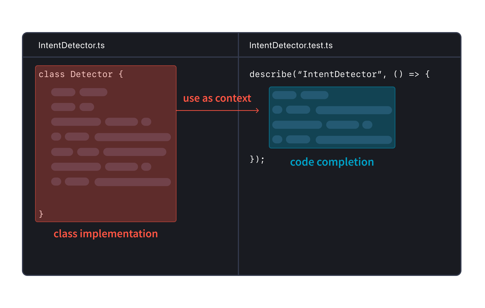

# 代码补全

## Codey  示例

[The lifecycle of a code AI completion](https://sourcegraph.com/blog/the-lifecycle-of-a-code-ai-completion)

每个Cody补全都经过以下四个步骤：

- 规划 - 分析代码上下文以确定生成补全的最佳方法，例如使用单行补全还是多行补全。
- 检索 - 从代码库中查找相关代码示例，为LLM提供最合适的上下文。
- 生成 - 使用LLM根据提供的提示和上下文生成代码补全。
- 后处理 - 对AI生成的原始补全进行细化和过滤，以提供最相关的建议。

Cody的目标是提供与开发者工作流程无缝集成的高质量补全。

详细步骤如下：

1. **规划阶段:**
    - **上下文准备:** 根据上下文确定生成自动补全建议的最佳方法。这涉及使用启发式和规则将请求分类为单行或多行补全。
    - **语法触发器:** 使用诸如Tree-sitter之类的工具分析代码结构，确定精确的语法线索，影响补全行为。
    - **建议小部件（Suggestion widget）交互:** 利用与建议小部件的交互（例如在VS Code等IDE中）来增强补全建议的相关性和可用性。
2. **检索阶段:**
    - **上下文检索:** 从编辑器上下文中收集相关的代码示例，例如最近查看的文件或打开的选项卡。
    - **优化:** 使用滑动窗口 Jaccard 相似性搜索等技术，根据与当前光标位置相关的相关性检索和排名代码片段。
    - **上下文嵌入:** 尝试使用嵌入索引等技术来提高上下文理解和补全建议的相关性。
3. **生成阶段:**
    - **模型利用:** 使用Claude Instant等大型语言模型（LLM）根据提供的提示生成代码补全。
    - **改进:** 解决“填充中间”支持、减少延迟和质量调整等挑战，通过优化提示结构和理解模型响应动态。
    - **降低延迟:** 实施令牌限制、停用词、流式响应和高效的TCP连接处理等策略，以减少端到端的延迟。
4. **后处理阶段:**
    - **质量保证:** 应用后处理技术来优化生成的补全。
    - **内容改进:** 避免重复内容，适当截断多行补全，并使用语法分析和概率评分评估补全的相关性。
    - **过滤:** 实施过滤器来移除明显低质量的补全建议，同时确保在显示足够相关建议和不过度展示之间取得平衡。

每个阶段在提升 Cody 代码补全功能的整体质量、速度和用户体验方面都发挥着关键作用，旨在利用先进的人工智能能力，同时优化代码编辑环境中的实际使用场景。

