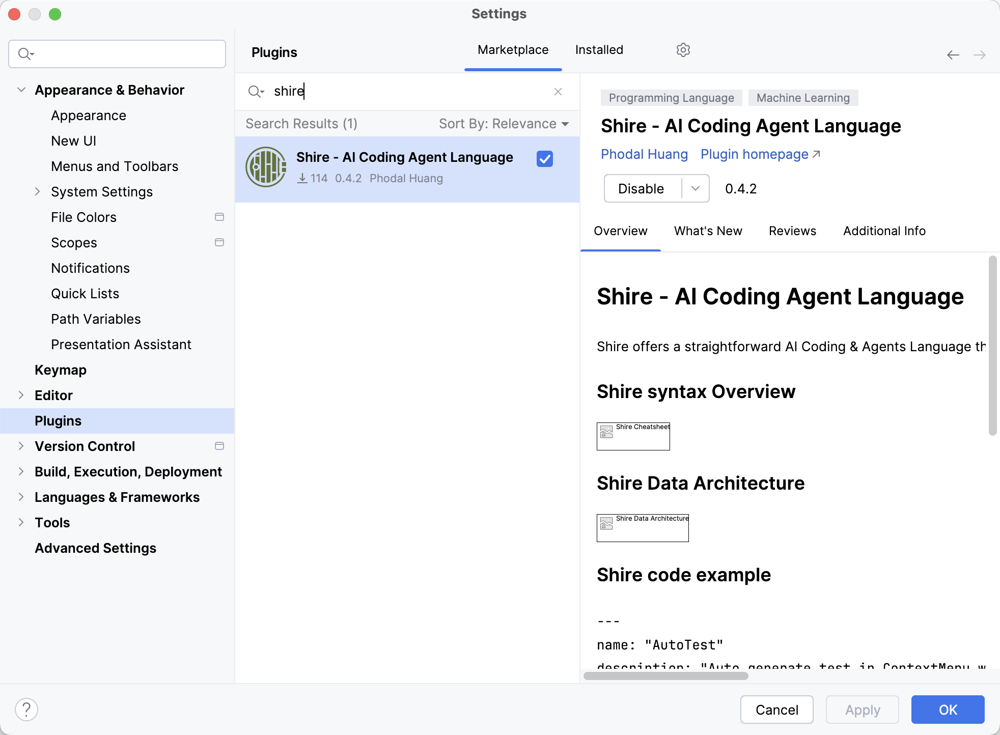
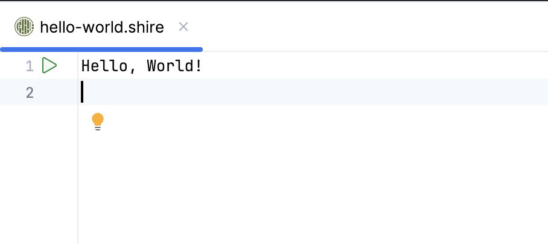
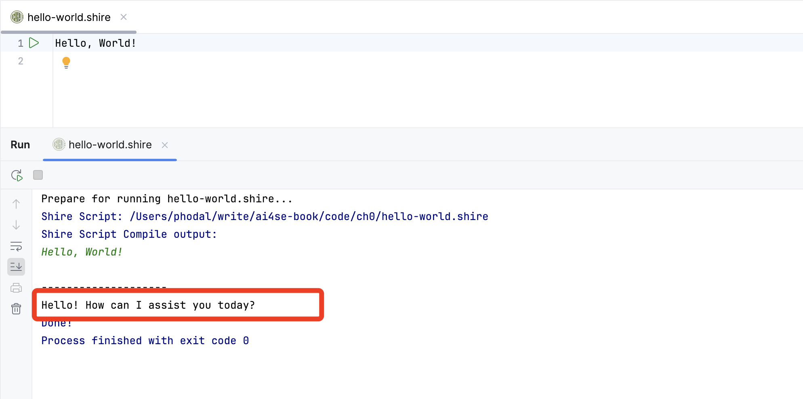

# 准备

在开始编程之前，我们需要安装一些工具。这些工具将帮助我们编写代码、运行代码、调试代码等等。在这一章节中，我们将安装这些工具。

## 安装 Shire

Shire 是一种专门为 AI 设计的语言，用于促进大型语言模型（LLM）与集成开发环境（IDE）之间的通信，从而实现自动化编程。当前，Shire
语言只支持 JetBrian's IDE (诸如 IntelliJ IDEA，PyCharm，WebStorm 等 ）。

因此，我们需要安装相关的 IDE，你可以选择其中一个来安装。在这里，我们选择 IntelliJ IDEA。随后，我们将安装 Shire 插件。

安装方式有三种：

1. 在线安装。访问如下的链接，[Shire - AI Coding Agent Language](https://plugins.jetbrains.com/plugin/24549-shire--ai-coding-and-agents-language)
2. 插件市场安装。在 IntelliJ IDEA 等 IDE 的插件市场中搜索 Shire 插件并安装。
3. GitHub 下载。从 [Release 页面](https://github.com/phodal/shire/releases) 下载插件的 zip 包，然后在 IDE 中选择安装插件。

插件市场安装示例：



## 配置 Shire

Shire 当前的配置项比较简单，只需要配置 OpenAI API 兼容的模型即可：


## 运行 Shire

在安装好 Shire 插件后，我们可以在 IDE 中右键新建一个 `.shire` 文件，诸如 `hello.shire`，然后输入如下代码：

```shire
Hello, World!
```

接着，我们可以点击文件第一行的运行按钮，或者使用快捷键 `Ctrl + Shift + R` 来运行代码。



根据你的配置，Shire 将会调用模型对话，来生成内容。 如下图所示，红框区域是 OpenAI 地返回的结果：`Hello! How can I assist you today?`。



当完成这些步骤后，我们就可以开始使用 Shire 构建我们的 AI IDE 了。

