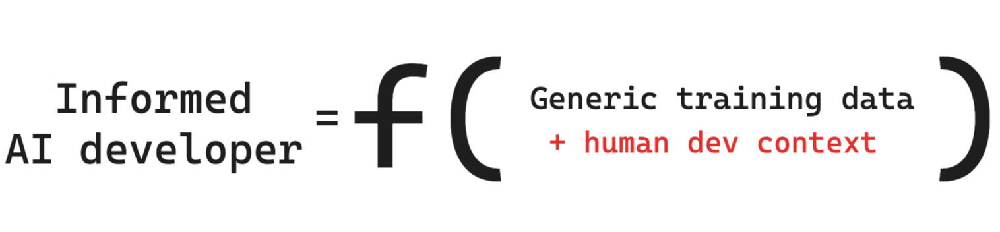

# AI4SE 设计原则 (TBD)

TBD

## 上下文感知

SourceGraph
的文章《[Why context awareness is challenging for code AI](https://sourcegraph.com/blog/how-cody-provides-remote-repository-context)》
对此进行了一个非常好的总结，如下图所示：

**1. 人类和 AI 的不同上下文:**

- 人类开发者依赖于其经验和知识积累的丰富、个性化的上下文。
- AI 依赖于其训练数据中的上下文，这种上下文更通用，特异性较低。

**2. 增强 AI 的上下文:**

- 为了提高 AI 的有效性，必须通过与任务相关的具体上下文来增强 AI 的能力，类似于人类开发者的上下文知识。

**3. 理论上的简单性与实践中的复杂性:**

- 理论上，开发者可以通过复制并粘贴代码到 AI 的输入中来提供上下文，但这需要大量劳动，并且违背了使用 AI 助手的初衷。
- 目标是让 AI 能够自动检索和利用相关上下文，从而提供准确和有用的输出。

**4. 所需的上下文类型:**

- **本地文件上下文:** 对于小任务通常足够，仅涉及同一文件中的周围代码。
- **仓库上下文:** 当任务需要理解分布在同一仓库中的多个文件的代码时是必要的。
- **远程仓库上下文:** 对于涉及共享库或存在于单独远程仓库中的代码的任务是必不可少的。

**5. 当前 AI 编码助手的能力:**

- 许多 AI 工具可以处理本地文件上下文（第1点）。
- 较少的 AI 工具能够检索和使用整个打开仓库的上下文（第2点）。

**6. 远程仓库上下文的挑战:**

- **IDE 限制:** AI 工具通常作为 IDE 扩展运行，将未在 IDE 中打开的仓库的上下文带入 IDE 是困难的。
- **规模差异:** 不同组织的仓库数量差异很大，使得上下文检索变得复杂。小团队可能只有几个仓库，而大企业可能有超过 100,000 个仓库。
- **陈旧上下文问题:** 确保 AI 使用最新信息需要不断更新上下文索引，这一任务具有很大挑战性。

这些要点突显了在 AI 编码助手中实现真正上下文感知的复杂性，强调了需要先进的解决方案来自动化各级代码库的上下文检索。
