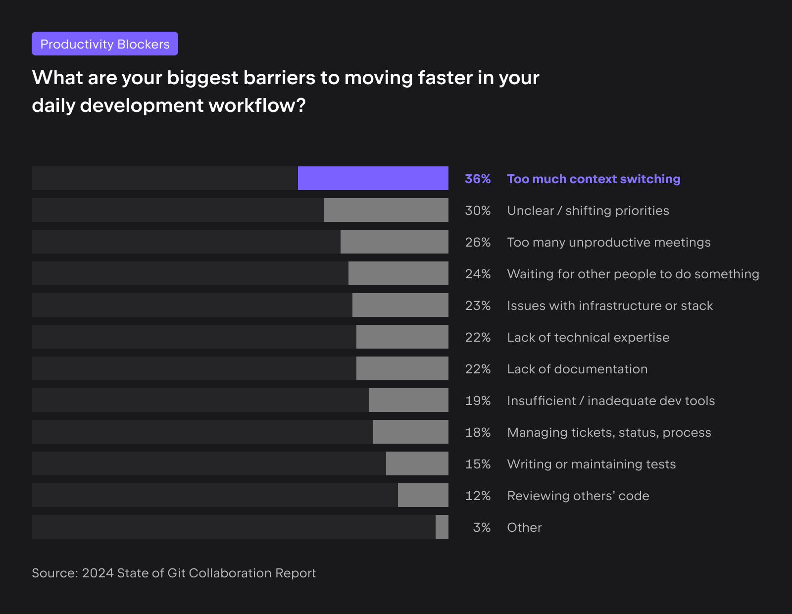

# AI 辅助软件工程：AI4SE 体系设计

设计适合自己公司的 AI4SE（Artificial Intelligence for Software
Engineering，人工智能用于软件工程）体系是一个复杂且多层次的过程，需要结合公司具体情况、业务需求和现有资源。

- Google
- Microsoft
- GitHub Copilot ?

工具示例：

| 环节      | 头部                  | 工具                                           | 特点                                                                                | 典型工具                                                          |
|---------|---------------------|----------------------------------------------|-----------------------------------------------------------------------------------|---------------------------------------------------------------|
| 需求/项目管理 | Atlassian           | Jira AI Assistant, Atlassian Intelligence    | 构建交互式 AI 需求编辑器，提升需求编写效率。扩大生成式 AI 使用触点，提供 AI 跨工具链能力。                               | Jira AI Assistant, Atlassian Intelligence                     |
| 开发与代码协作 | GitHub              | GitHub Copilot, Copilot X, Copilot Workspace | 围绕代码开发、协作、构建为核心，以开发者体验作为度量体系；                                                     | GitHub Copilot, Copilot X, Copilot Workspace, Dynatrace Davis |
| CI/CD   |                     | GitHub Action, GitLab                        |                                                                                   |                                                               |
| 测试      | ?                   | Checksum, Testim Copilot                     | 生成式 AI 测试工具，提供测试用例生成、自动化测试、测试报告等功能。                                               | Testim                                                        |
| 文档与协作   | Atlassian           | Atlassian Rovo                               | 通过生成式 AI 解锁企业知识的工具，内建和自定义知识管理智能体。                                                 | Atlassian Rovo                                                |
| 基础设施    | AWS/Sysdig          | Amazon Q, Sysdig Sag                         | 在云平台上，关注在 AI 重新定义"安全左迁"。结合生成式 AI 与传统 AI 工具，进行云基础设施排错、问答、网络诊断等。结合云平台，提供对应 AI 辅助能力。 | Amazon Q, Sysdig Sag                                          |
| 可观测性    | New Relic/Dynatrace | NewRelic Grok, Dynatrace Davis               | 结合传统判别式 AI 工具，无缝辅助问题定位和修复，与问题回顾。围绕新兴 AI 技术栈构建 AI 应用可观测性。                          | NewRelic Grok                                                 |
| 开发者工具   | JetBrains           | AI Assistant, Grazie                         | 围绕开发人员日常活动，构建全面的 AI 辅助；在 IDE 构建精确的上下文，以获得高质量生成内容。                                 | AI Assistant, Grazie                                          |

诸如 GPT 给出的建议：

1. **明确设计目标**：确定通过AI实现的具体业务目标，如提高开发效率和提升代码质量。
2. **识别痛点和需求**：评估当前软件工程流程中的痛点和瓶颈。
3. **选择合适的AI技术**：根据业务需求选择合适的AI技术，如机器学习、深度学习、自然语言处理等。
4. **构建跨学科团队**：组建包含数据科学家、AI工程师、软件工程师和业务专家的团队，并提供AI相关培训。
5. **开发原型与集成**：开发和测试AI模型的原型，并将有效模型集成到现有工具链中。
6. **逐步实施与评估**：采用小规模试点逐步扩大的策略，并定期评估体系绩效，使用关键绩效指标进行衡量。
7. **持续改进与技术更新**：收集用户反馈，持续优化AI模型和工具，并跟踪引入最新AI技术和方法，确保数据质量和安全。

## 明确设计目标

尽管 AI 技术在软件工程领域的应用已经取得了一些进展，但在实际应用中，AI 技术的效果并不总是如人们所期望的那样。

## 识别痛点和需求

### 数据分析：2024 State of Git Collaboration

- 较小的团队通常在敏捷性和满意度方面表现优于较大的团队。
- 团队成功的关键似乎在于团队成员数量与任务管理之间的平衡。



加剧这一问题的是无效会议的普遍存在，这些会议会占用宝贵时间却没有带来有意义的成果。再加上不明确的优先事项，使开发人员不确定哪些任务需要立即关注，这些陷阱可能会创造一个充满挑战的工作环境。

为了解决这些问题，团队应实施清晰的沟通渠道，以减少上下文切换的需求，并简化会议议程，以确保每次会议都有明确的目的和清晰的结果。

"上下文切换、不明确的优先事项和那些永无止境的会议。它们感觉像是烦恼，而GitKraken的这份报告有数据证实它们确实是烦恼。作为开发人员和开发团队，
是时候寻找匹配我们需求的工具和工作流程，消除让我们不开心的噪音。进入状态，构建出色的软件！"

## 选择合适的AI技术

诸如于人们喜欢优先考虑 Python 作为开发语言，而在软件开发时，可能更倾向于使用 Java、C++ 或其他语言。

在原型开发阶段，可以尝试不同的AI技术，如机器学习、深度学习、自然语言处理等，以确定最适合公司需求的技术。

而在实际应用中，需要考虑 AI 模型与基础设施的集成、数据安全性、模型解释性等因素。

## 构建跨学科团队

- AI 工程师与数据工程师不擅长软件工程
- 软件工程师不擅长 AI 与数据处理

## 开发原型与集成

基于反馈和数据驱动的方法，持续改进体系设计。

### 原型开发套件

诸如我们设计的：[ChocoBuilder](https://github.com/unit-mesh/choco-builder) 可以帮助开发人员快速构建原型，以验证 AI 模型的有效性。

```kotlin
@file:DependsOn("cc.unitmesh:rag-script:0.4.6")

import cc.unitmesh.rag.*

rag {
    indexing {
        val chunks = document("README.md").split()
        store.indexing(chunks)
    }

    querying {
        store.findRelevant("workflow dsl design ")
            .lowInMiddle()
            .also {
                println(it)
            }
    }
}
```

## 逐步实施与评估

设计度量体系

## 持续改进与技术更新


