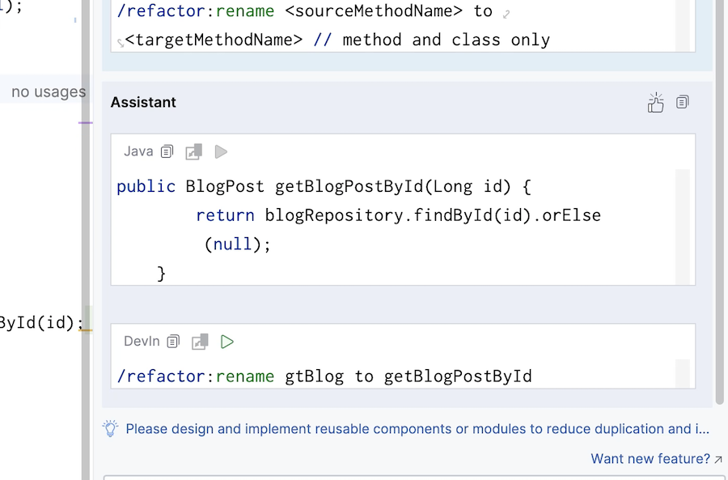

# AI 辅助软件工程：重构代码示例

在软件开发过程中，重构是一种常见的实践，旨在改善代码的质量、可维护性和可读性。AI 辅助重构工具可以帮助开发人员自动识别和执行重构操作，从而提高开发效率和代码质量。

> AI 重构是指利用人工智能技术来识别和执行代码重构操作的过程。AI 重构工具通常基于大型语言模型（LLM）和机器学习算法，能够分析代码库中的模式和结构，并生成重构建议。

在现有情况下，适合的 AI 重构场景应该具备以下特点：

- 可读性重构，即重构的目标是提高代码的可读性和可维护性。
- 意图驱动的重构，即用户应该提供明确的重构目标和意图，以便 AI 工具能够生成准确的重构建议。
- 代码坏味道修复，借助传统工具或者 AI 工具识别代码中的坏味道，并提供相应的重构建议。
- 模式识别和重构，借助三方工具识别到设计问题，并提供相应的重构建议。

在复杂上下文下，如大量继承关系、复杂的代码结构等，AI 重构工具的效果可能会受到限制。因此，开发人员需要在使用 AI 重构工具时，提供足够的上下文信息，以确保生成的重构建议准确和可靠。

## AI 重构

> AI 重构是指利用人工智能技术来识别和执行代码重构操作的过程。AI 重构工具通常基于大型语言模型（LLM）和机器学习算法，能够分析代码库中的模式和结构，并生成重构建议。

### AI 重构的优势

AI
代码重构的优势如下：（[Tabnine 总结](https://www.tabnine.com/blog/ai-code-refactoring-7-ways-tabnine-transforms-refactoring/)）

1. **提高效率**：AI驱动的重构工具能够快速处理和分析大型代码库，比人类开发者更快地识别出需要改进的区域。
2. **提升代码质量**：通过一致地应用最佳实践和编码标准，AI重构工具有助于整体提升代码质量。它们可以发现并修复代码异味、冗余代码和其他在手动重构过程中可能被忽略的问题。
3. **改进可维护性**：AI重构可以持续进行，确保代码库保持干净和有序。这提高了代码的可读性，降低了新团队成员的学习曲线，并有助于项目的长期可持续性。
4. **减少错误**：自动化重构可以最大限度地减少手动重构过程中可能发生的人为错误。AI工具可以确保重构不会引入新的错误，从而维护代码的功能完整性。
5. **代码库的一致性**：AI驱动的重构工具可以在大型项目的不同部分或组织内的多个项目中强制执行一致的编码风格和实践。
6. **节约成本**：通过减少代码维护所需的时间和精力，AI重构工具可以带来显著的成本节约。这使公司能够更有效地分配开发资源，将资源从维护转向创新。

但是往往在实际使用中，我们发现 AI 重构工具的效果并不如人工重构那么好。这是因为 AI
重构工具缺乏足够的上下文信息，无法理解代码的意图和结构，导致生成的重构建议不够准确和可靠。

### AI 重构的瓶颈：依赖于有效上下文

如果你探索过使用 AI 来构建代码时，你会发现：AI 懂的重构手法你都懂，但是看别人使用 AI 重构似乎非常顺手。这是为什么呢？
重构通常依赖于好的上下文， 即需要开发人员拥有大量的先验经验。

#### 意图驱动的重构

简单来说，当你缺少一个代码改进的方向时，无法给 AI 一个明确的意图，剩下的就要靠 AI 随机了 —— 因此，大部分情况下，AI
只是进行简单的重命名、方法提取之类基本的重构手法。而：

- 如果你告诉 AI，你要重构多个 if 到策略模式，那么它就会给你生成策略模式的代码。
- 如果你给了 AI 对应的继承关系，那么它就会考虑到继承关系。
- 如果你给了 AI 一些坏味道，那么它就会考虑到坏味道。

理解这一点，在工具上实现辅助重构就变得非常简单了。

#### 基于聊天的重构上下文

如下是 Tabnine 通过聊天提供的上下文：

- 你之前的问题或 prompt
- 当前文件中选定的代码块（或光标位置）
- 当前打开的文件及其他打开的文件
- 当前对话的聊天记录，包括所有之前的问题和答案
- 当前用户工作区中的相关文件或代码块
- 运行时错误
- 导入的库
- 编译/语法错误
- 非代码来源的信息
- 当前选定的代码
- 已连接的存储库
- 对话历史
- Git 历史
- 项目元数据和其他项目文件

对于其它 AI 编码工具来说，其也是非常相似的。部分工具，诸如于 Tabnine，还提供了更高级的方式去获取上下文

- Tabnine 的企业版还会从已连接的存储库中获取全局上下文。
- 你可以微调你的私人 Tabnine 模型，以获得更加个性化的 AI 重构工具。

总之，就是尽可能提供关键有效的上下文信息，以便 AI 能够更好地理解你的意图。

## AI 重构功能设计

对于习惯使用重构来改善既有代码可读性的开发人员来说，经常使用的重构手法有：

- **提取方法**：将重复的代码片段提取到单独的方法中，提高代码的可重用性和可读性。
- **重命名**：为变量、方法、类等提供更有意义的名称，使代码更易于理解。
- **内联方法**：将方法调用替换为方法体，减少不必要的方法调用。
- **移动方法**：将方法从一个类移动到另一个类，以更好地组织代码。
- **提取变量**：将复杂的表达式提取为一个变量，提高代码的可读性。

这些重构手法是开发人员在日常工作中经常使用的，它们有助于改善代码的质量、可维护性和可读性。

### 重命名建议

如下是 AutoDev 中重命名建议的示例：


它可以把当前代码作为上下文，发给 AI 模型，然后返回重命名的建议。

### 重新组织示例

当你使用 AI 重构时，会发现因为 AI 做了重命名等操作，没有修改 ref 导致代码无法运行。因此，你无法直接应用 AI 的重构建议。 基于此，
AutoDev 通过提供 DevIns AI Agent 语言，使得你可以直接执行重构代码：

```shire
/refactor:rename crtBlog to CreateBlog
```

如下图所示：



它使得你可以直接执行重构代码，而不需要手动修改代码。

## AI 重构功能实现： Shire 示例

在这里我们依旧使用 Shire 作为我们的 AI IDE 重构工具。Shire 语言提供了一种简便 AI
编码智能体语言，能够让大型语言模型（LLM）与控制集成开发环境（IDE）之间自由对话，以实现自动化编程。

### 步骤 1. 一个简单的示例

如下是一个基础示例，展示了如何使用 Shire 插件来构建一个简单的 AI 辅助开发人员的指令。只需要在 IDE 中新建一个 Shire
文件，然后将以下内容复制到文件中：

    请你这段代码建议适当的重构。提高代码的可读性、质量，使代码更加有组织和易懂。
    
    ```java
    public class Main {
        public static void main(String[] args) {
            int a = 5;
            int b = 10;
            int c = a + b;
            System.out.println("Sum: " + c);
            int d = a - b;
            System.out.println("Difference: " + d);
            int e = a * b;
            System.out.println("Product: " + e);
            int f = b / a;
            System.out.println("Quotient: " + f);
        }
    }
    ```

就可以直接在 IDE 中运行 Shire 插件，获取到 AI 重构的结果。如下是零一万物 API 返回的结果

```java
public class Main {
    public static void main(String[] args) {
        int a = 5;
        int b = 10;
        
        int sum = add(a, b);
        System.out.println("Sum: " + sum);
        
        int difference = subtract(a, b);
        System.out.println("Difference: " + difference);
        
        int product = multiply(a, b);
        System.out.println("Product: " + product);
        
        int quotient = divide(b, a);
        System.out.println("Quotient: " + quotient);
    }
    
    public static int add(int a, int b) {
        return a + b;
    }
    
    public static int subtract(int a, int b) {
        return a - b;
    }
    
    public static int multiply(int a, int b) {
        return a * b;
    }
    
    public static int divide(int a, int b) {
        return a / b;
    }
}
```

在上述示例中，AI 重构工具 Shire 对原始 Java 代码进行了以下改进：

- **提取方法**：将重复的计算逻辑提取到单独的方法中，提高了代码的可重用性和可读性。
- **命名改进**：为变量和方法提供了更有意义的名称，如 `sum`、`difference`、`product`、`quotient`
  ，以及 `add`、`subtract`、`multiply`、`divide`，使得代码意图更加清晰。
- **代码组织**：通过将计算逻辑放入单独的方法，使得 `main` 方法更加简洁，易于理解。

通过这些重构，代码变得更加模块化，易于维护，并且对于其他开发者来说也更加易于理解。这种重构不仅提高了代码的质量，也使得未来的修改和扩展变得更加容易。

### 步骤 2.将代码转变为变量方式

步骤 1 的代码是我们写死的，为了更加通用，我们可以将代码转变为变量方式：

```shire
请你这段代码建议适当的重构。提高代码的可读性、质量，使代码更加有组织和易懂。
    
$selection
```

随后，可以配置到右键菜单中，如下：

```shire
---
name: "重构代码"
actionLocation: ContextMenu
---

请你这段代码建议适当的重构。提高代码的可读性、质量，使代码更加有组织和易懂。
    
$selection
```

如此一来，我们就可以在 IDE 中右键选择代码，然后直接进行重构。

PS：当前的 Shire 插件为了确保性能，需要用户重新启动 IDE，才可在右键菜单中看到新的菜单项。

### 步骤 3. 丰富我们的 prompt

如果你不熟悉如何针对代码进行重构，可以参考一些主流工具的重构提示词。如下是我们结合了 JetBrains AI Assistant 的提示词所构建的
prompt：

```shire
---
name: "Refactoring"
actionLocation: ContextMenu
interaction: ReplaceSelection
---

请你这段代码建议适当的重构。提高代码的可读性、质量，使代码更加有组织和易懂。你的回答应包含重构描述和一个代码片段，展示重构后的结果。
使用一些众所周知的重构技巧，比如以下列表中的一个：

- 重命名
- 修改签名、声明
- 提取或引入变量、函数、常量、参数、类型参数
- 提取类、接口、超类
- 内联类、函数、变量等
- 移动字段、函数、语句等
- 上移构造函数、字段、方法
- 下移字段、方法

请勿生成多个代码片段，尝试将所有更改都整合到一个代码片段中。
请勿生成包含虚构周围类、方法的代码。不要模拟缺失的依赖项。
提供的代码已经整合到正确且可编译的代码中，不要在其周围添加额外的类。

重构以下代码：

$selection
```

而在某些情况下，我们实际上可以从 IDE 及其插件中拿到更多的上下文，诸如于代码坏味道、代码依赖关系、代码结构等

### 步骤 4. 添加代码坏味道

在 Shire 中可以通过 `$codeSmell` 变量来获取相关代码的坏味道信息，如下：

```shire
这里有一些相关的 Code Smell

$codeSmell
```

当代码中有一些坏味道时，我们可以通过这种方式来提示 AI 重构工具。

```markdown
这里有一些相关的 Code Smell

// - Method 'updatePost(java.lang.Long, com.phodal.shire.demo.entity.BlogPost)' is never used
// - String can be replaced with text block
```

有了上述的信息之后，AI 就能给我们更好地重构建议。

Shire 的相关代码实现，依赖于 IDE 的接口。因此，你也可以安装一些插件来做 lint，以提供更多的上下文信息。

## 其它

### JetBrains 重构的提示词示例

    You should suggest appropriate refactorings for the code. Improve code readability, code quality, make the code more organized and understandable. 
    Answer should contain refactoring description and ONE code snippet with resulting refactoring.  
    Use well-known refactorings, such as one from this list:
    - Renaming
    - Change signature, declaration
    - Extract or Introduce variable, function, constant, parameter, type parameter
    - Extract class, interface, superclass
    - Inline class, function, variable, etc
    - Move field, function, statements, etc
    - Pull up constructor, field, method
    - Push down field, method.
    Do not generate more than one code snippet, try to incorporate all changes in one code snippet. 
    Do not generate mock surrounding classes, methods. Do not mock missing dependencies. 
    Provided code is incorporated into correct and compilable code, don't surround it with additional classes. 
    Refactor the following code:

PS：AutoDev 基于 JetBrains 的 AI Assistant 这个提示词来编写重构功能。   
