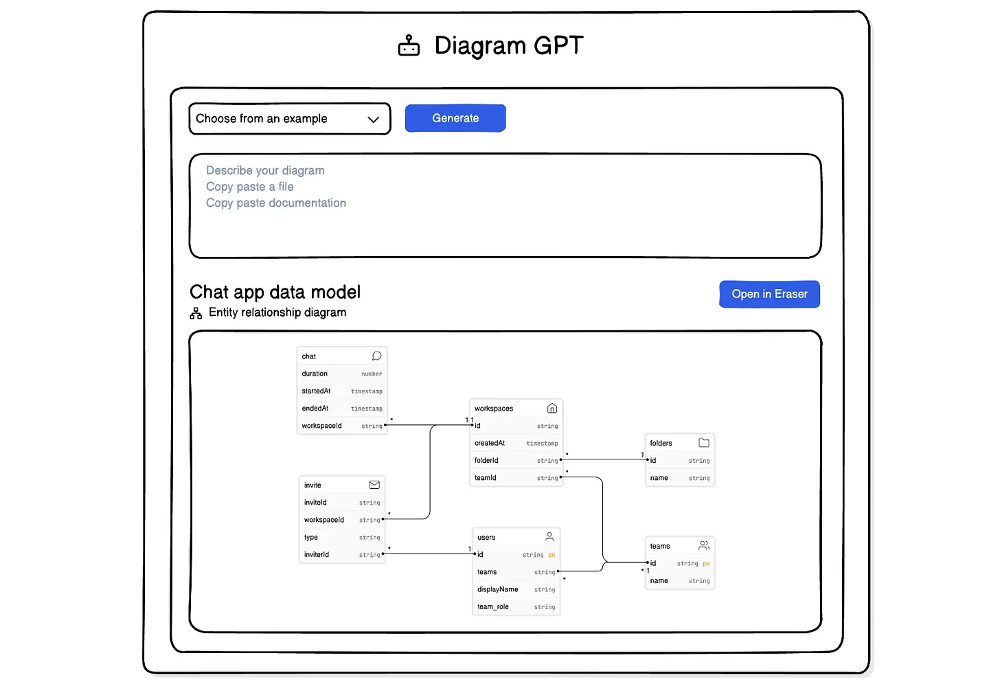

# AI 辅助软件工程：架构设计生成

## 示例

### DiagramGPT

[How an AI sidecar product drove 30% of sign-ups: Eraser’s founder on building and growing DiagramGPT](https://openviewpartners.com/blog/how-an-ai-sidecar-product-drove-30-percent-of-sign-ups-eraser/)

### ArchGuard Co-mate

ArchGuard Co-mate is an AI-powered architecture copilot, design and governance tools.

GitHub: https://github.com/unit-mesh/co-mate

设计原则如下：

1. 将领域特定语言（DSL）作为通用语言：采用领域特定语言（DSL），以实现人与机器之间的高效沟通。
2. 原子化语言模型（LLM）编排：利用语言模型（LLM）的原子化特性，在DSL中构建复杂的行为。
3. 分层动态上下文：将上下文划分为多个层次，通过语言模型（LLM）有效地处理复杂性。
