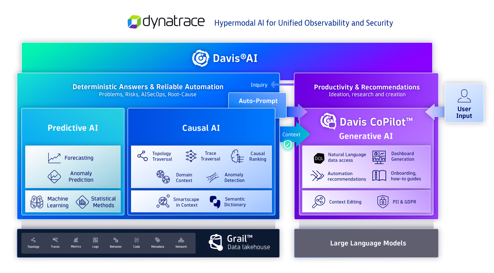
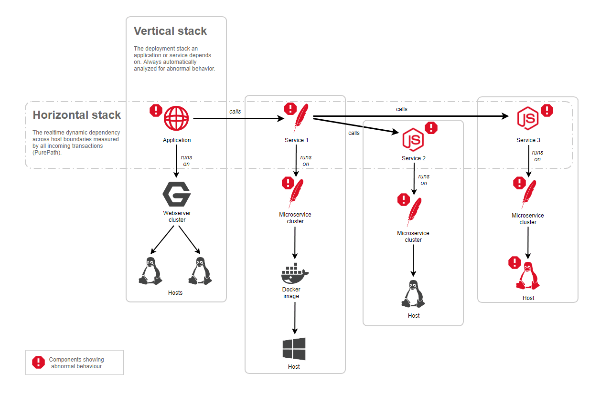
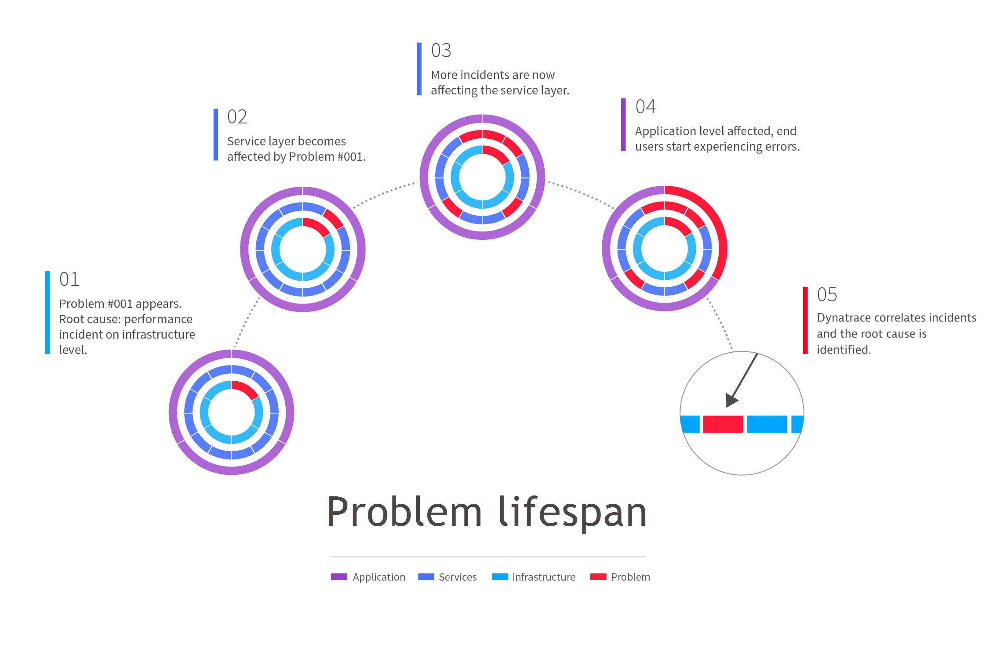
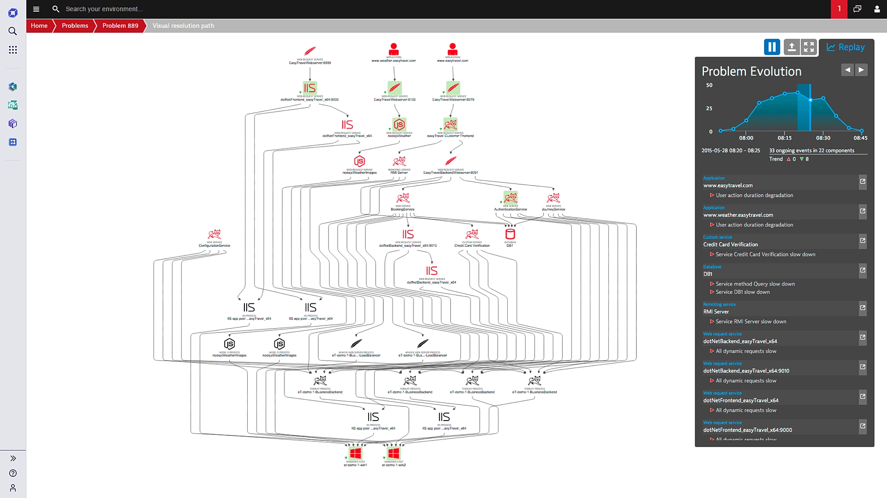
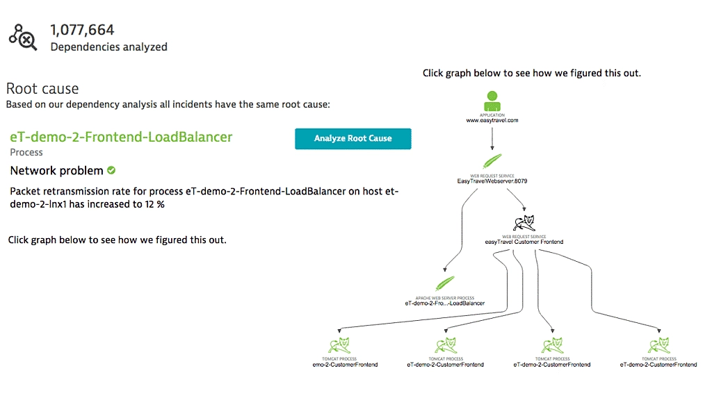

# AI 辅助软件工程：AI 辅助根因分析生成

核心技术：

- 智能调度核心：体系链路完善的调度核心、多模式一键配置
- 代码整库分析：仓库级代码理解、项目文件级代码编写生成
- 文档分析增强：文档知识库结合知识图谱的检索、推理增强
- 垂类专属知识：DevOps 专属知识库、垂类知识库自助一键构建
- 垂类模型兼容：DevOp s领域小模型、DevOps 周边平台兼容

## 示例

### New Relic AI: observability assistant

[Meet New Relic AI, your observability assistant](https://docs.newrelic.com/docs/new-relic-solutions/new-relic-one/core-concepts/new-relic-ai/#synthetic)

New Relic AI 旨在通过将大型语言模型 (LLMs) 与 New Relic 的数据平台相结合，帮助用户理解和管理他们的系统。这个 AI
助手可以用简单的语言回答问题，提供见解，并协助完成诸如故障排除、创建 NRQL 查询、分析错误日志、管理警报和配置合成监控等任务。

**主要功能：**

1. **聊天界面：** 在 New Relic 平台的多数页面中，通过聊天功能与 New Relic AI 进行互动。提出问题，获取关于系统性能和故障排除的见解。
2. **NRQL 查询：** 使用AI助手创建 NRQL（ New Relic Query Language ）查询，以分析系统数据，无需手动编写查询语句。
3. **错误分析：** 从日志和堆栈跟踪中获取错误的摘要和详细信息。
4. **警报管理：** 识别警报覆盖的空白，确保所有实体和服务得到监控。
5. **合成监控：** 设置合成监控，以检查 URL 的可用性和性能。
6. **支持工单：** 汇总并检查支持工单的状态，以便快速解决。
7. **仪表板分析：** 从仪表板中获取摘要和见解，以了解和调查遥测数据。

#### [AI Monitoring](https://newrelic.com/platform/ai-monitoring)

#### 应用数据 NRQL 查询示例

你可以使用 NRQL 查询从应用程序监控、浏览器监控和移动端监控中收集到的数据。通过这些数据，你可以回答各种问题。以下是一些基本的示例。

**唯一用户**。上周你有多少独立用户会话？

```sql
SELECT uniqueCount(session) FROM PageView SINCE 1 week ago
```

**唯一用户趋势**。与前一周相比，上周的独立用户会话数量是增加了还是减少了？

```sql
SELECT uniqueCount(session) FROM PageView SINCE 1 week ago COMPARE WITH 1 week ago
```

**页面浏览趋势**。如何绘制昨天与前天相比的独立用户数量图表？

```sql
SELECT count(*) FROM PageView SINCE 1 day ago COMPARE WITH 1 day ago TIMESERIES AUTO
```

**操作系统版本**。有多少移动端用户使用的是最新的操作系统版本？

```sql
SELECT uniqueCount(uuid) FROM MobileSession FACET osVersion SINCE 7 days ago
```

**关键账户的 Apdex**。某个重要客户的 Apdex 得分是多少？如果你定义了一些自定义属性，你可以查询以监控该客户在应用中体验的性能情况：

```sql
SELECT apdex(duration, t: 0.4) FROM Transaction WHERE customerName='ReallyImportantCustomer' SINCE 1 day ago
```

### Dynatrace



####  Automatic root-cause analysis

根本原因分析利用所有可用的上下文信息——如拓扑结构、事务和代码级别信息——来识别具有相同根本原因和影响的事件。

仅凭时间相关性不足以确定问题的根本原因。Dynatrace
采取了一种上下文感知的方法，检测跨越时间、进程、主机、服务、应用程序以及垂直和水平拓扑监控视角的相互依赖事件。这种方法将多个独立异常整合为单一一致的问题，
大幅降低了警报负载。

下图展示了 Davis
如何分析问题的所有水平和垂直依赖关系。在此示例中，应用程序表现出异常行为，而底层的垂直堆栈运行正常。分析跟踪应用程序的事务，
检测到对某个服务（服务1）的依赖，该服务也表现出异常行为。反过来，该服务的所有依赖项也表现出异常，并且都是同一问题的组成部分。



#### Problem Lifecyle

当 Dynatrace 接收到首个事件指标，表明出现异常行为时，如服务减慢、节点饱和或工作负载崩溃并重启，它会立即开启一个问题。
问题会自动遵循一个生命周期，并在仍有受影响的实体处于不健康或异常状态时保持活动状态，这通常由一个活跃事件来表示。

在以下场景中，基础设施层的一个性能事件是问题的根本原因：



问题生命周期：

1. Dynatrace 检测到基础设施层的性能事件，并创建一个新的问题以进行跟踪。同时，也会发送通知。
2. 几分钟后，基础设施问题导致应用程序的某个服务出现性能下降问题。
3. 开始出现更多服务层的性能下降问题。最初仅限于基础设施的问题，现在已经发展成一系列服务层问题，每个问题都源于基础设施层的原始事件。
4. 最终，服务层问题开始影响通过桌面或移动浏览器与应用程序互动的客户体验。在问题生命周期的这个阶段，您面临的是一个应用程序问题，其根本原因在于基础设施层，同时服务层也有额外的原因。
5. 由于 Dynatrace 了解您环境中的所有依赖关系，它能够将客户体验的性能下降问题与基础设施层的原始性能问题关联起来，从而促进快速解决问题。

##### Cut down your mean time to repair by 90% or more

性能问题很少是孤立的一次性事件，它们通常是更大问题的症状。Dynatrace 的人工智能分析了数十亿次事件，帮助您解决问题的根本原因，而非仅仅应对症状。

- 人工智能能够理解整个 IT 环境中的因果关系。
- 只有 Dynatrace 能够可靠地发现性能问题的根本原因。
- 通过深入分析源代码和数据库语句，您可以先行一步进行故障修复。



Dynatrace 的根本原因分析提供了即时回放功能，它能直观地展示问题是如何逐步发展的。通过这种方式，用户可以迅速定位并解决问题。

##### 可视化方式

在处理高度复杂的问题时，他巧妙地运用了视觉化的手段。在当今日益复杂且高度动态的环境中，应用程序的依赖关系远超个人能够通过传统监控工具有效分析的范围。

- Dynatrace 的人工智能能够自动且持续地在弹性应用环境中检测因果关系。
- 利用应用程序问题的即时回放功能，详细观察您的环境中的各个组件随时间如何受到影响。
- 查看一个互动式信息图表，它会告诉您问题出在哪里以及您可以采取哪些措施。



#### DQL

Total number of open vulnerabilities

```SQL
fetch events
| filter dt.system.bucket=="default_security_events"
     AND event.provider=="Dynatrace"
     AND event.type=="VULNERABILITY_STATE_REPORT_EVENT"
     AND event.level=="ENTITY"
// filter for the latest snapshot per entity
| dedup {vulnerability.display_id, affected_entity.id}, sort:{timestamp desc}
// filter for open non-muted vulnerabilities
| filter vulnerability.resolution.status=="OPEN"
     AND vulnerability.parent.mute.status!="MUTED"
     AND vulnerability.mute.status!="MUTED"
// count unique vulnerabilities
| summarize {`Open vulnerabilities`=countDistinctExact(vulnerability.display_id)}
```


## **IV. 市场格局：GenAI 辅助 RCA 的工具与平台**

随着生成式 AI 技术的飞速发展，AIOps 市场正在经历一场深刻的变革。众多供应商纷纷将其 AIOps 平台与生成式 AI 功能相融合，以期提供更智能、更高效的根因分析（RCA）解决方案。这一趋势的核心在于利用大型语言模型（LLMs）的自然语言交互能力，结合对海量、多样化遥测数据的深度分析，实现自动化诊断、智能告警以及更富洞察力的事件摘要。

A. **集成生成式 AI 的 AIOps 平台概述**

AIOps 平台集成生成式 AI 的主要目标是克服传统 RCA 方法在处理现代 IT 系统复杂性、数据量和动态性方面的局限性。AI 驱动的 RCA 系统能够自动化重复性任务，并能快速、更准确地识别根本原因 38。这些系统利用机器学习、模式识别和预测分析，不仅加速事件诊断，还能预测潜在问题 38。

生成式 AI 将 RCA 提升到了一个新的水平，它能够基于相似的过往事件建议潜在的根本原因和纠正措施 39。这些技术能够分析大量的实时和历史数据，以比人类更快的速度和更高的准确性检测模式、识别异常并提出可能的根本原因，从而提高 RCA 的精确度和速度，并实现更主动的维护策略 8。现代 RCA 工具的特性通常包括统一访问情境化数据、AI 辅助的文档交互以及协作式分析环境 8。

B. **领先商业解决方案深度剖析**

当前市场上，多家主流 AIOps 供应商已经推出了集成生成式 AI 功能的 RCA 解决方案。以下是对部分领先商业解决方案的概要分析：

1. **Datadog**  
   * **GenAI RCA 特性**: Datadog 的 Watchdog AI 引擎早在 2022 年就引入了根本原因分析（RCA）和日志异常检测功能 40。Watchdog RCA 能够自动识别跨应用和基础设施的症状之间的因果关系，并查明根本原因 42。它利用 APM 数据、基础设施指标和日志模式进行分析 43。近期，Datadog 推出了 Bits AI，这是一个基于生成式 AI 的对话式助手，允许用户通过自然语言查询可观测性数据，协助事件调查、跨团队协作，并能提供 AI 建议的代码修复方案 44。Datadog 在 Forrester Wave™: AIOps Platforms, Q2 2025 报告中被评为领导者，其平台利用生成式 AI 和机器学习，在数分钟内帮助用户从告警定位到根本原因并进行修复 46。其 AI 辅助的指标监控功能，如 Watchdog Explains 和 Metric Correlations，也有助于快速发现潜在根本原因 47。  
   * **技术与数据处理**: Watchdog RCA 主要分析 APM 错误率、延迟、命中率指标，APM 部署跟踪，APM 追踪，基于代理的基础设施指标（CPU、内存、磁盘使用情况），AWS 实例状态检查指标以及日志模式异常 43。Bits AI 则通过自然语言处理实现与各类可观测性数据的交互 44。  
   * **核心优势**: 强大的数据整合能力，结合机器学习和生成式 AI 实现自动化根本原因识别和影响分析，并通过 Bits AI 提供自然语言交互和代码级修复建议。  
2. **Dynatrace**  
   * **GenAI RCA 特性**: Dynatrace 的核心 AI 引擎 Davis® AI，结合其 Davis CoPilot™，利用生成式 AI 提供对根本原因的深入洞察 48。Davis CoPilot 能够分析多个问题，得出它们之间的关系，识别共同的根本原因，并提出纠正步骤 48。它通过整合全球技术社区的知识来增强技术性根本原因的分析 48。Dynatrace 也支持对生成式 AI 应用本身进行端到端追踪和监控 50。AIJourn 的一篇文章中也以 Dynatrace 为例，说明了 GenAI 如何分析内存泄漏等复杂问题 15。  
   * **技术与数据处理**: Davis AI 分析包括指标、日志、追踪、事件和拓扑信息在内的广泛数据 51。生成式 AI 的应用增强了对这些数据的理解和解释能力。  
   * **核心优势**: 强大的因果 AI (Davis AI) 与生成式 AI (Davis CoPilot) 相结合，提供精准的自动化根本原因分析和可操作的建议，并强调与业务成果的关联。  
3. **Splunk**  
   * **GenAI RCA 特性**: Splunk 推出了 AI Assistant in Splunk Observability Cloud，这是一个由生成式 AI 驱动的新体验，帮助工程团队通过自然语言提问来简化可观测性任务 18。该助手可以分析 Splunk APM、基础设施监控和日志观察器中的数据，在数秒内快速找到根本原因，并为分诊和调试提供建议 18。它还能生成 SignalFlow 代码，帮助用户快速构建自定义图表和检测器 18。Splunk 的 AI/ML 能力路线图也已包含利用 GenAI 进行自动化 RCA 53。  
   * **技术与数据处理**: AI 助手利用自然语言处理和生成式 AI 分析来自 Splunk Observability Cloud 的多源遥测数据。  
   * **核心优势**: 通过自然语言界面降低了可观测性工具的使用门槛，加速了调查和根本原因分析过程，并能辅助构建监控规则。  
4. **ServiceNow**  
   * **GenAI RCA 特性**: ServiceNow 的 Now Assist for ITOM 利用其自研的 Now LLM（大型语言模型）来赋能 IT 运营 54。Now Assist for ITOM 可以将隐晦的告警描述替换为简化的自然语言摘要，帮助运维人员快速理解告警含义 54。它还提供智能告警分析，借鉴 ServiceNow ITOM 客户群体的集体知识，识别可能导致告警的问题并建议后续步骤 54。其目标是提供可能的根本原因分析和补救步骤，以加快解决时间 56。  
   * **技术与数据处理**: Now LLM 是一个专门构建的 LLM，经过 ServiceNow 客户群体的匿名化 IT 运营数据（包括知识文章和其他运营信息）训练，从而对告警具有深入的理解 54。它处理的数据包括告警、CMDB 信息、日志和指标等 ITOM 数据。  
   * **核心优势**: 利用其平台内积累的丰富运营数据训练的专用 Now LLM，提供高度情境化的告警解释和 RCA 指导，并与 ServiceNow 强大的工作流引擎紧密集成。  
5. **IBM**  
   * **GenAI RCA 特性**: IBM 的 Watson AIOps (现为 IBM Cloud Pak for AIOps 的一部分) 利用 AI/ML 进行根本原因分析 57。通过与 IBM 的 watsonx 平台集成，Watson AIOps 获得了生成式 AI 的能力 58。watsonx.ai 是一个集成的 AI 开发工作室，支持使用预训练的基础模型（如 IBM Granite 系列）或第三方模型，并可利用企业自身数据进行微调，以执行文本摘要、分类、问答、代码解释等任务 59。watsonx.data 平台则专注于处理包括日志在内的非结构化数据，为 GenAI 应用提供支持 61。一篇 ICSE 2025 的论文提及 IBM 研究人员将基于知识的 GenAI 代理与“五个为什么”技术相结合，应用于银行遗留系统的 RCA 22。  
   * **技术与数据处理**: Watson AIOps 结合 watsonx 的基础模型和工具，处理来自 IT 环境的各类数据，包括日志、事件、拓扑信息等，以进行异常检测、事件关联和根本原因推断。  
   * **核心优势**: 依托强大的 watsonx AI 和数据平台，提供可定制和可信的生成式 AI 能力，支持处理复杂的企业级 IT 环境，并有针对特定行业（如金融）的 RCA 应用研究。  
6. **Moogsoft (已被 Dell Technologies 收购)**  
   * **GenAI RCA 特性**: Moogsoft AIOps 平台以其机器学习和高级关联技术著称，用于事件检测、降噪和根本原因识别 64。它通过关联时间序列指标和事件与发现的服务详情来确定根本原因和受影响的客户 64。一份 2023 年的 Moogsoft 数据表提到了基于 AI/ML 的自然语言处理（NLP）用于关联分析 67。虽然一些行业概览性文章（如 101）在提及 AIOps 工具列表时，将 Moogsoft 与使用生成式 AI 进行简明语言摘要的功能并列，但 Moogsoft 自身的官方材料（截至所提供的信息）主要强调其在机器学习、事件关联和概率性根本原因方面的能力，并未明确详细阐述其核心 RCA 功能中对“生成式 AI”或“LLM”的具体运用 64。  
   * **技术与数据处理**: 主要依赖机器学习算法进行异常检测、告警关联和事件聚类。  
   * **核心优势**: 强大的告警降噪和事件关联能力，能够从海量告警中识别出有意义的“情境”（Situations）。  
7. **ScienceLogic**  
   * **GenAI RCA 特性**: ScienceLogic 的 Skylar Automated RCA 利用机器学习进行日志分析，识别日志事件模式和异常 17。更进一步，它使用生成式 AI 将根本原因指标与积累的知识库进行比较，以识别罕见根本原因指标、其症状以及与独特运营环境之间的关联 17。该系统还能提供根本原因的简明语言分析 17。  
   * **技术与数据处理**: 结合机器学习进行日志模式识别和异常检测，并利用生成式 AI 进行知识库比对和自然语言解释。  
   * **核心优势**: 将机器学习的模式发现能力与生成式 AI 的知识推理和自然语言解释能力相结合，用于自动化 RCA。  
8. **ProSolvr**  
   * **GenAI RCA 特性**: ProSolvr 提供了一个定制的 GPT for RCA 专家系统，该系统使用流行的鱼骨图方法协助进行根本原因分析 35。它利用生成式 AI 从公共知识和私有事件信息中获取洞察，为 RCA 提供起点，并为先前解决的问题提供自动化建议 35。  
   * **技术与数据处理**: 利用 GPT 技术和生成式 AI，结合鱼骨图等传统 RCA 方法论。  
   * **核心优势**: 将生成式 AI 的能力与成熟的 RCA 框架（如鱼骨图）相结合，提供结构化的、AI 辅助的问题调查方法。

从这些商业解决方案可以看出，AIOps 市场正从基于传统 AI/ML 的异常检测，迅速向集成更复杂的生成式 AI（尤其是 LLMs）以实现更深层次语义理解和交互式问题解决的 RCA 演进。各供应商的一个共同策略是利用生成式 AI 来处理和理解 AIOps 平台已收集的大量可观测性数据（日志、指标、追踪信息），在其上叠加一个“智能层”。同时，采用自研的专用 LLM（如 ServiceNow 的 Now LLM）还是利用通用或开源模型（可能经过微调），是供应商在提供 GenAI for RCA 服务时的一个关键差异化和战略选择，这影响着数据隐私、模型控制、领域特异性和成本等多个方面。

C. **新兴开源工具与社区驱动项目**

除了商业解决方案外，开源社区也在积极探索和贡献生成式 AI 在 RCA 领域的应用。这些开源工具和项目使得更广泛的组织和研究人员能够接触和利用 GenAI 技术进行 RCA，从而推动了该领域的创新和发展。

根据 AIBase 等平台的收录信息 74，一些值得关注的开源 AIOps 项目或与 GenAI RCA 相关的项目包括：

* **Keep.aiops**: 一个开源的 AIOps 和告警管理平台，为构建智能运维能力提供了基础。  
* **EasyRAG**: 一个易于使用的 RAG（检索增强生成）框架，并且是 CCF AIOps 国际挑战赛 2024 的 Top3 解决方案。RAG 是将 LLMs 与外部知识库结合的关键技术，在 RCA 中可用于提供更准确、更具上下文的分析。  
* **OpsPilot**: 一个由 WeOps 团队开发的基于深度学习和 LLM 技术的开源智能运维助理。这类工具直接将 LLM 应用于运维场景，有望辅助 RCA。  
* **Codefuse-ChatBot**: 一个服务于整个软件开发生命周期的智能助手，由多智能体框架驱动，并与 DevOps 工具包、代码/文档库 RAG 等协同工作。其 RAG 能力和对 SDLC 的覆盖使其在代码相关的 RCA 中具有潜力。  
* **AIOps Modules (AWS)**: 为在 AWS 上进行机器学习、基础模型、大型语言模型和 GenAI 开发与运维提供可复用的基础设施即代码（IaC）模块集合。这有助于开发者快速搭建 GenAI 应用的基础环境。  
* **Openinference**: 为 AI 可观测性提供 OpenTelemetry 检测。虽然不直接是 RCA 工具，但为监控 GenAI 应用本身（包括用于 RCA 的 GenAI 应用）提供了基础。  
* **RCAEval**: 一个重要的开源根本原因分析基准测试项目 74。它提供了用于微服务系统中 RCA 的数据集（RE1, RE2, RE3）和评估框架，包含了多种基线方法（基于指标、基于追踪、基于多源数据）。虽然它本身不是 GenAI 工具，但它为评估包括 GenAI 在内的各种 RCA 方法的性能提供了标准化的平台，这对于推动 GenAI RCA 工具的成熟至关重要。

这些开源项目的存在表明，AIOps 领域正日益吸纳 LLM 和 RAG 等 GenAI 的核心能力，从而使中小型组织或研究团队也能够尝试和构建 GenAI 辅助的 RCA 方案，而不必完全依赖昂贵的商业平台。这无疑会加速整个领域的技术创新和应用普及。同时，像 RCAEval 这样的基准测试项目的出现，为衡量和比较不同 RCA 工具（无论是商业的还是开源的，无论是基于传统 AI 还是 GenAI）的性能提供了客观标准，有助于整个生态系统的健康发展。

## **V. 跨行业应用与用例**

生成式 AI 辅助的根因分析（RCA）技术，凭借其强大的数据处理、模式识别和智能推理能力，其应用场景已远远超出了传统的 IT 运营领域，并在多个行业展现出巨大的潜力。

A. **IT 运营与云事件管理**

这是生成式 AI 辅助 RCA 最主要和最成熟的应用领域。在日益复杂的 IT 基础设施（包括云、混合云和微服务环境）中，快速诊断服务中断、性能下降和各类错误至关重要。生成式 AI 在此扮演了核心角色：

* **快速诊断与解决**: AI 能够持续监控云系统，即时检测异常和偏离正常行为的情况，并通过自动查明中断的根本原因，大幅缩短解决事件所需的时间，从而改善平均解决时间（MTTR）2。例如，宝马公司利用亚马逊 Bedrock 代理，通过专门的架构工具、日志工具和指标工具，对其云服务事件进行自动化的根本原因分析，准确率达到 85% 13。  
* **处理复杂依赖关系**: 现代数字服务通常由多个相互关联的软件组件构成，这些组件可能由不同团队构建和运行 13。生成式 AI 能够分析这些组件间的复杂依赖关系（如通过架构图或追踪数据），从而更准确地定位故障源头。  
* **自动化文档与报告**: GenAI 模型可以生成事件的初步文档，包括受影响系统、潜在根本原因和故障排除步骤的详细信息，并能生成过去事件的摘要报告，帮助团队识别重复出现的问题和预防措施的机会 23。  
* **主动预防**: 通过预测分析，AI 系统可以分析历史事件并识别潜在故障的早期预警信号，使组织能够在问题升级为全面中断之前采取预防措施 2。

生成式 AI 在处理如多云和微服务这类高度复杂、动态和分布式环境中的 RCA 问题时，其变革性尤为突出。传统的手动或基于规则的 RCA 方法在应对这些环境的规模和相互依赖性时常常力不从心。而 GenAI 凭借其处理海量数据 2 和理解复杂交互 13 的能力，能够有效地应对这些现代 IT 挑战。

B. **制造业：提升质量控制与预测性维护**

在制造业中，确保产品质量和设备高效运行是核心目标。生成式 AI 辅助 RCA 在此领域大有可为：

* **产品缺陷分析与质量控制**: GenAI 模型可以分析生产线数据、传感器读数、标准操作程序（SOPs）、日志和批次记录，以识别质量缺陷的根本原因 27。  
* **预测性维护**: AI 可以分析机器性能数据和历史维护记录，预测设备何时以及如何发生故障 77。例如，通过分析机器的振动、温度和使用情况等实时数据，GenAI 可以生成模型来预测机器何时可能出现故障，并建议预防性措施，如更换零件或安排维护停机 77。Lakeside Software 的方案也利用历史数据和 AI 指导来解决复杂的设备问题 11。  
* **揭示非显性关联**: 在复杂的制造系统中，湿度、生产速度等多种变量可能以隐藏的方式相互作用。生成式 AI 能够通过多角度审视数据来发现这些关系，从而找出导致重复性设备故障的深层原因 20。例如，某化工厂通过 AI RCA 发现是阀门未对准导致的压力突涌过早磨损了密封件，而手动 RCA 则错误地归咎于密封件质量差 20。

在制造业中，GenAI-RCA 不仅解决了现有问题，还通过揭示操作参数与故障/缺陷之间的非显而易见的相关性 20，优化了流程和资源利用率。这种洞察力使得企业能够从根本上改进生产过程，从而实现更高的质量和效率。

C. **软件开发生命周期 (SDLC)：加速缺陷检测与改进质量保证**

在软件开发过程中，尽早发现并修复缺陷对于降低成本和提高软件质量至关重要。生成式 AI 正在改变这一领域的 RCA 实践：

* **加速缺陷根因定位**: GenAI 可以分析代码、测试结果和缺陷日志，以比传统方法更快地查明软件缺陷的根本原因 3。它能够通过无监督学习技术（如聚类和异常检测）来突出显示多维数据集中的统计显著相关性，从而将质量保证工程师从手动的帕累托图和鱼骨图绘制中解放出来 3。  
* **与 QA 工具集成**: GenAI 可以与现有的 QA 工具（如 SonarQube、Postman、Elastic Stack、GitHub Copilot、Dynatrace）集成，提供上下文感知的解释和修复建议 15。例如，若 SonarQube 识别出潜在的空指针异常，GenAI 模型可以分析代码上下文并建议替代代码片段或防御性编码策略 15。若 Dynatrace 识别出内存泄漏，GenAI 可以分析系统事件的时间线，将其与代码更改相关联，并提供关于泄漏原因的叙述，甚至建议具体的代码行修复 15。  
* **早期缺陷检测**: GenAI 能够在软件开发生命周期的早期阶段（如代码提交或设计阶段）就检测和诊断缺陷，从而减少缺陷进入生产环境的风险 22。

这种将 RCA 能力“左移”到 SDLC 前端的方式，使得问题能够在造成更大影响和修复成本更高之前被发现和解决，极大地提升了软件开发的效率和质量。

D. **医疗保健与医疗技术**

尽管医疗保健领域的 RCA 具有独特的伦理和监管约束 78，但生成式 AI 在分析复杂多模态数据方面的能力 79，对于辅助诊断和理解疾病或不良事件的病因因素具有高度相关性。

* **辅助诊断与预后预测**: GenAI 可以通过模拟复杂的生物过程（如疾病进展）进行预测建模，预测患者结局，帮助临床医生做出更准确的决策 78。在肌肉骨骼医疗保健中，由于治疗决策依赖于大量非结构化数据和视觉信息（如X光片），GenAI 的应用有望增强治疗决策 79。  
* **药物研发与个性化医疗**: GenAI 能够创建潜在的药物分子并模拟其效果，从而加速传统上漫长而昂贵的药物开发过程。它还可以基于个体患者数据制定量身定制的治疗计划，优化临床试验和治疗效果 78。  
* **医疗设备故障分析**: 虽然直接的自动化 RCA 可能面临严格审查，但 GenAI 的原理可用于分析医疗设备日志，辅助识别潜在故障模式，以提高患者安全和减少设备停机时间。

在医疗保健领域，GenAI 在 RCA 中的角色可能更侧重于增强人类专家的分析能力，帮助他们理解复杂的生物学或临床路径，而不是在没有严格监督的情况下完全自动化关键医疗场景中的根本原因确定。

E. **其他有前景的领域 (例如，客户行为分析)**

生成式 AI 辅助 RCA 的应用潜力并不仅限于技术故障排除。其分析复杂数据并探究因果关系的能力，使其在商业智能等领域也展现出价值。

一个突出的例子是**客户行为分析**。LLM 驱动的 RCA 能够通过分析多样化的数据源，包括客户评论、交易记录和市场趋势，来揭示客户行为变化的根本原因 16。例如，如果特定产品线的退货率异常增加，GenAI 可以帮助企业提出相关的 RCA 问题，并通过分析数据来验证假设，最终找到导致退货率上升的根本原因（可能是产品质量问题、描述不符、物流延迟等），从而为企业提供可操作的改进建议 16。Tredence 提出的框架包含异常检测模块、RCA 问题生成模块、RCA 问题测试模块和洞察生成模块（NLQ2SQL 模型），系统化地应用 LLM 进行客户行为的 RCA 16。

这表明，任何拥有复杂数据并需要理解观测结果背后原因的领域，都可以从生成式 AI 辅助的 RCA 技术中受益。其通用性为企业解决各类关键业务问题提供了新的视角和强大的工具。


## **VII. 评估 GenAI 辅助 RCA 的指标与基准**

为了客观衡量生成式 AI 在根因分析（RCA）中的有效性、准确性和效率，并推动该技术的健康发展，建立一套科学的评估指标和标准化的基准测试至关重要。

A. **衡量有效性、准确性和效率的关键绩效指标 (KPIs)**

评估 GenAI 辅助 RCA 的 KPIs 应涵盖从技术性能到业务影响的多个维度：

1. **准确性与可靠性相关指标**:  
   * **根本原因识别准确率 (Root Cause Identification Accuracy)**: AI 识别出的根本原因与经人类专家验证的真实根本原因一致的百分比。这是衡量 RCA 系统核心能力的关键指标。  
   * **精确率 (Precision) 与召回率 (Recall)**: 在假设生成场景中，精确率衡量 AI 提出的根本原因假设中有多少是正确的；召回率衡量所有真实的根本原因中，有多少被 AI 成功识别 82。  
   * **幻觉率 (Hallucination Rate)**: AI 生成的 RCA 报告或解释中，包含不真实、与事实不符或无依据内容的比例 80。低幻觉率是模型可靠性的重要保障。  
   * **错误率 (Error Rate)**: 模型在评估数据集或特定测试中犯错的百分比，例如错误地关联事件或错误地排除真正的根本原因 82。  
2. **效率与速度相关指标**:  
   * **平均解决时间 (MTTR) 缩减量**: 引入 GenAI 后，从故障发生到完全解决的平均时间相对于传统方法的缩减百分比或绝对值。这是衡量 RCA 对业务影响的核心指标之一 38。  
   * **诊断时间 (Time to Diagnose/Identify Root Cause)**: 从开始分析到 AI 提出（正确的）根本原因所需的时间。  
   * **响应时间 (Response Time)**: AI 系统处理输入（如告警、日志）并生成初步分析或假设所需的时间 82。  
   * **自动化程度**: RCA 流程中由 AI 自动完成的部分所占的比例，例如自动数据收集、分析、报告生成等。  
3. **运营与成本相关指标**:  
   * **告警降噪率 (Alert Noise Reduction Rate)**: AI 系统有效过滤掉无关告警、合并重复告警的能力，从而减少运维人员的告警疲劳。  
   * **事件升级率降低**: 由于 AI 能够更早、更准确地识别和辅助处理问题，导致需要人工升级处理的事件数量的减少。  
   * **运营成本节约**: 包括人力成本的降低（减少人工调查时间）、因停机时间缩短而避免的业务损失等 82。  
   * **Token 使用量与成本**: 对于基于 LLM 的系统，监控 Token 的消耗率和相关成本，以评估其运营经济性 90。  
4. **用户体验与采纳度相关指标**:  
   * **用户反馈/满意度**: 收集运维工程师对 AI 辅助 RCA 工具的可用性、准确性、解释清晰度等方面的反馈 82。  
   * **采纳率**: 目标用户群体实际使用 AI 辅助 RCA 功能的频率和广度。  
5. **模型健康与漂移相关指标**:  
   * **模型漂移 (Model Drift)**: 监控模型性能随时间推移是否下降，例如响应模式的变化、输出质量或相关性的变化等，这可能表明模型需要重新训练或调整 90。  
   * **数据质量指标**: 监控输入数据的质量，如完整性、一致性、时效性，因为数据质量直接影响模型输出 82。

B. **现有基准测试与未来评估框架的发展**

随着 AIOps 和 GenAI 在 RCA 中应用的深入，标准化的基准测试对于评估不同方法和工具的性能变得越来越重要。

* **现有基准**:  
  * **RCAEval**: 这是一个值得关注的开源基准测试项目，专门为微服务系统中的 RCA 设计。它提供了多个数据集（如 RE1, RE2, RE3，包含 735 个故障案例，涵盖 11 种故障类型）和评估框架，支持对基于指标、基于追踪和基于多源数据的 RCA 方法进行基准测试 74。RCAEval 旨在通过提供可复现的基线和全面的评估环境，推动 RCA 解决方案的进步。其评估指标包括如 Avg@5（排名前 5 的推荐原因中命中真实原因的平均数）等 75。  
  * 一些研究论文中也会使用特定的公共数据集或内部数据集进行评估，但可能缺乏 RCAEval 那样的通用性和标准化程度。  
* **未来评估框架的发展方向**:  
  * **真实世界适用性**: 评估指标必须能够反映 AI 系统在真实世界运营环境中的性能，而不仅仅是在静态、受控的数据集上 91。这意味着需要考虑实际部署中的数据异构性、动态变化以及与现有工具链的集成情况。  
  * **迭代优化与校准**: 评估指标和方法本身需要随着技术的发展和对 GenAI 理解的深入而不断迭代优化和校准 91。这包括选择和改进相关的测量目标。  
  * **多维度评估**: 未来的评估框架需要更全面地覆盖准确性、效率、可解释性、鲁棒性、公平性、安全性以及成本效益等多个方面。  
  * **针对 GenAI 特性的评估**: 需要专门针对 GenAI 的特性进行评估，例如评估其生成解释的质量、应对“幻觉”的能力、以及在交互式场景中的表现。  
  * **可解释性评估**: 开发能够量化和比较不同模型可解释性的指标和方法，这对于建立用户信任和理解模型行为至关重要。  
  * **鲁棒性与对抗性测试**: 评估 GenAI RCA 系统在面对数据质量问题、输入扰动或潜在对抗性攻击时的表现。  
  * **标准化与社区共享**: 推动建立更广泛接受的评估标准、数据集和工具，并鼓励社区共享，以促进领域内的公平比较和协同进步 94。例如，可以借鉴 AI 竞赛的经验，建立持续更新的、能够有效防止“作弊”（如数据泄露）的评估流程 94。  
  * **结合人工评估**: 尽管自动化评估指标很重要，但在评估诸如解释质量、建议合理性等方面，结构化的人工评估（如专家评审）仍然不可或缺。

正如一些研究指出的，当前对生成式 AI 的评估生态系统尚不完善，静态基准面临有效性挑战 91。因此，未来的发展方向应更侧重于建立能够反映真实世界性能、可迭代优化并得到广泛认可的评估框架和流程。

## **VIII. 未来趋势与展望：自主根因分析的兴起**

生成式 AI 在根因分析（RCA）领域的应用尚处于快速发展阶段，其未来充满了令人期待的可能性。核心趋势指向更高级别的自动化、智能化和自主化，目标是构建能够自我诊断、自我修复甚至自我优化的 IT 系统。

A. **迈向更高级别的自主化：从辅助到自主 RCA**

当前，生成式 AI 主要在 RCA 流程中扮演辅助角色，例如加速数据分析、提供假设、生成报告等。然而，随着模型能力的增强、数据质量的提升以及可解释性和可靠性的改善，未来将逐步从“AI 辅助 RCA”向“AI 主导 RCA”甚至“自主 RCA”过渡。

自主 RCA 系统将能够：

* **自动触发和执行完整的 RCA 流程**: 当检测到异常或事件时，系统能自动启动 RCA，无需人工干预，从数据收集、分析、根本原因识别到提出解决方案建议，形成闭环 6。  
* **自主决策与行动**: 在某些预定义的场景或置信度足够高的情况下，AI 系统不仅能识别根本原因，还能自主执行修复操作，如重启服务、回滚变更、调整配置等，实现真正的自愈能力 6。  
* **持续学习与自适应优化**: 自主 RCA 系统将能够从每一次事件处理中学习，不断优化其诊断模型、知识库和行动策略，从而适应不断变化的 IT 环境和新的故障模式 2。

这种转变将极大地解放 IT 运维团队，使其能够从繁琐的日常故障处理中摆脱出来，更专注于架构优化、服务创新等高价值工作 2。

B. **Agentic AIOps：智能代理在 RCA 中的角色**

Agentic AIOps 是实现自主 RCA 的关键技术路径之一。它指的是利用一个或多个智能 AI 代理（Agent）来执行复杂的 IT 运营任务，包括 RCA 7。这些代理基于生成式 AI（特别是 LLMs）构建，具备以下特点：

* **感知与交互能力**: 能够从多样化的数据源（日志、指标、追踪、CMDB、文档等）感知系统状态，并能通过 API、命令行等方式与 IT 环境进行交互（如执行诊断命令、获取额外数据）13。  
* **规划与推理能力**: 能够根据当前情境制定多步骤的诊断计划，并进行逻辑推理以逐步逼近根本原因 34。  
* **工具使用能力**: 能够调用外部工具或服务（如专门的分析模块、知识库查询接口、修复脚本等）来辅助其分析和行动 13。  
* **协作能力（多智能体系统）**: 在复杂的 RCA 场景中，可以部署多个具有不同专长的 AI 代理协同工作，例如数据收集代理、异常检测代理、假设生成代理、验证代理、报告代理等，形成一个多智能体系统 32。

例如，LogicMonitor 提出的 Agentic AIOps 概念强调其能够主动搜寻潜在故障、学习、适应并自主行动，无需等待人工干预 7。研究论文如 TAMO 25 和 Flow-of-Action 32 也提出了具体的工具辅助 LLM 代理或多智能体系统架构用于 RCA。这种基于智能代理的方法，使得 RCA 过程更加灵活、动态和高效。

C. **预测性与规范性 RCA 的增强**

未来的 GenAI 辅助 RCA 将不仅仅局限于事后分析（发生了什么？为什么发生？），而是会更加侧重于：

* **预测性 RCA (Predictive RCA)**: 在故障实际发生或产生显著影响之前，预测潜在的根本原因。通过分析细微的早期预警信号和系统行为模式，AI 可以提前识别可能导致问题的组件或配置，并发出预警 2。  
* **规范性 RCA (Prescriptive RCA)**: 在识别出（或预测出）根本原因后，AI 系统能够主动推荐最佳的纠正措施或预防策略 5。这可能包括具体的配置更改建议、代码修复方案、资源调整计划等。

这将使 IT 运营从“救火”模式转变为真正的“防火”模式，最大程度地减少服务中断和业务影响。

D. **多模态与知识增强的持续演进**

* **更深入的多模态数据融合**: 当前的多模态 RCA 主要集中在日志、指标和追踪数据。未来，GenAI 将能够融合更广泛的数据类型，如系统架构图、配置代码、用户界面截图、甚至视频记录（如用户操作录屏），从而形成对事件更完整、更立体的理解 25。  
* **知识图谱与 LLM 的更紧密集成**: 知识图谱将为 LLM 提供更动态、更准确的关于 IT 环境（拓扑、依赖、历史变更等）的结构化知识。LLM 则能更好地理解和利用这些知识进行推理。这种 KG-RAG 的混合架构将持续优化，以提高 RCA 的准确性和解释性 22。  
* **持续学习与知识库的动态更新**: AI 系统将能够从新的事件、新引入的技术栈、以及运维人员的反馈中持续学习，动态更新其内部的知识表示和诊断模型，确保其 RCA 能力与时俱进。

E. **可解释性、可信赖性与人机协作的深化**

尽管追求自主化，但完全取代人类专家在短期内既不现实也不可取，尤其是在处理高度复杂、未知或高风险的故障时。因此，未来 GenAI RCA 的发展将更加注重：

* **增强的可解释性 (XAI)**: 开发更有效的 XAI 技术，使 AI 的诊断过程和结论更易于人类理解和验证，从而建立信任 2。  
* **提升可信赖性**: 通过更严格的测试、验证和持续监控，确保 AI 输出的准确性和可靠性，减少幻觉和偏见 86。  
* **优化人机协作界面与流程**: 设计更好的人机交互方式，使运维工程师能够与 AI 系统高效协作，例如通过自然语言对话进行查询、指导 AI 的分析方向、验证 AI 的假设、以及从 AI 的分析中学习 96。

最终目标是实现一种高效的人机协同 RCA 模式，充分发挥 AI 在数据处理和模式发现方面的优势，同时结合人类专家的经验、直觉和最终决策权。

F. **面临的持续研究挑战**

尽管前景光明，但实现上述愿景仍面临诸多研究挑战 2：

* **处理“未知未知”故障**: 如何让 AI 有效应对从未见过、缺乏历史数据的新型复杂故障。  
* **动态环境中的因果推断**: 在快速变化的云原生环境中，准确、实时地进行因果推断仍然是一个难题。  
* **小样本学习与迁移学习**: 如何在数据稀疏或特定领域知识有限的情况下，快速训练或调整 RCA 模型。  
* **伦理与治理的成熟**: 随着 AI 自主性的提高，相关的伦理规范、问责机制和治理框架需要同步发展和完善。

克服这些挑战将是未来几年 GenAI 辅助 RCA 领域研究和开发的核心议题。

## **IX. 结论**

生成式人工智能（GenAI），特别是大型语言模型（LLMs），正在为根因分析（RCA）领域带来一场深刻的变革。通过自动化数据分析、智能假设生成、以及高效的报告汇总，GenAI 不仅显著提升了 RCA 的速度和准确性，还有效降低了人工干预的需求，使得 IT 团队能够更从容地应对日益复杂的系统和海量的运维数据。

核心价值与技术驱动：  
本报告的调研显示，GenAI 在 RCA 中的核心价值体现在其能够处理和理解大规模、异构的运维数据（包括日志、指标、追踪信息、甚至代码和文档），从中提取有意义的模式和异常，并基于这些洞察提出潜在的根本原因。LLMs 作为关键的使能技术，其自然语言处理能力使得与系统的交互（如通过自然语言查询日志）和结果的呈现（如生成人类可读的 RCA 报告）更为直观和高效。诸如 PromptWizard 这样的提示优化技术，以及将 LLMs 与知识图谱（KG-RAG）、多模态数据融合、Agentic AI 架构相结合的方法论，正在不断拓展 GenAI 在 RCA 中的应用深度和广度。  
市场现状与应用前景：  
市场上，主流 AIOps 供应商如 Datadog、Dynatrace、Splunk、ServiceNow 和 IBM 等，均已积极将生成式 AI 功能集成到其解决方案中，尽管集成的深度和侧重点各有不同，但总体趋势是利用 GenAI 提升自动化水平和洞察力。同时，开源社区的努力也为该技术的普及和创新提供了动力。GenAI 辅助 RCA 的应用已从核心的 IT 运营和云事件管理，扩展到制造业的质量控制与预测性维护、软件开发生命周期中的缺陷分析，乃至客户行为分析等多个领域，展现出其广泛的适用性。  
挑战与未来展望：  
尽管前景广阔，GenAI 在 RCA 中的应用仍面临数据质量与偏见、模型准确性（尤其是幻觉问题）、可解释性、系统集成复杂性、成本以及 LLM 自身的技术局限（如上下文窗口）等挑战。此外，相关的伦理问题、风险管理和治理框架也亟待完善。  
展望未来，生成式 AI 将驱动 RCA 向更高程度的自主化演进。Agentic AIOps 的兴起，结合预测性与规范性分析能力的增强，以及多模态数据融合和知识图谱技术的深化应用，预示着一个能够进行自主诊断、甚至自主修复的智能运维新时代的到来。然而，实现这一愿景需要持续的技术创新，特别是在提升模型的可信赖性、可解释性以及优化人机协作方面。

最终建议：  
对于寻求利用生成式 AI 提升 RCA能力的组织而言，建议采取务实的态度：

1. **关注数据基础**：确保高质量、全面且治理良好的数据是成功应用 GenAI 的前提。  
2. **从小处着手，逐步扩展**：可以从辅助性功能（如日志摘要、告警解释）开始，逐步探索更高级的应用（如假设生成、自动化诊断）。  
3. **重视人机协同**：将 GenAI 视为增强人类专家能力的工具，而非完全替代。建立有效的验证和监督机制。  
4. **持续评估与迭代**：密切关注技术发展和市场动态，选择合适的工具和平台，并根据实际效果持续评估和优化应用策略。

生成式 AI 无疑为根因分析带来了强大的新动能。通过审慎规划、持续投入和对技术边界的清醒认识，组织可以逐步释放其巨大潜力，构建更智能、更高效、更具韧性的运营体系。
