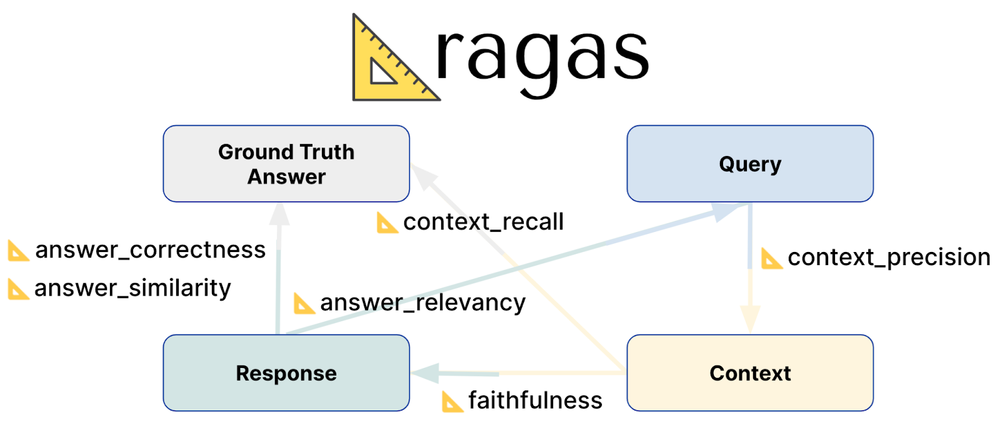

# AI4SE 度量评估

## RAG 评估：Ragas

[RAG Evaluation Using Ragas](https://zilliz.com/blog/rag-evaluation-using-ragas)

**评估 Ragas 所需的数据**

根据 Ragas 的文档，您的RAG管道评估将需要四个关键数据点。

- 问题：提出的问题。
- 上下文：从您的数据中与问题意义最匹配的文本块。
- 答案：您的RAG聊天机器人针对问题生成的答案。
- 真实答案：问题的预期答案。

**Ragas 评估指标**

您可以在文档中找到每个指标的说明，包括其背后的公式。例如，忠诚度。一些指标包括：

- 上下文精确度：使用问题和检索到的上下文来衡量信噪比。
- 上下文召回率：使用真实答案和检索到的上下文来检查是否检索到了答案的所有相关信息。
- 忠诚度：使用上下文和机器人答案来衡量答案中的陈述是否可以从上下文中推断出来。
- 答案相关性：使用问题和机器人答案来评估答案是否解决了问题（不考虑事实性，但会惩罚不完整或多余的答案）。
- 答案正确性：使用真实答案和机器人答案来评估机器人答案的正确性。
  关于这些指标如何计算的具体细节可以在他们的论文中找到。
