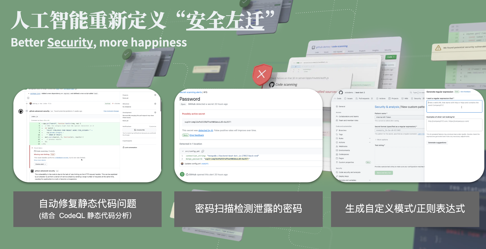

# 现代软件工程转型

## 示例：GitHub 

> 围绕代码的开发、协作、构建为核心，以开发者体验作为度量体系

[GitHub AI 驱动的开发者平台](https://github.blog/2023-11-08-universe-2023-copilot-transforms-github-into-the-ai-powered-developer-platform/)

### 工具、平台驱动

### [AI 增强的安全左移](https://github.blog/2023-11-08-ai-powered-appsec/)

- 自动修复（autofix）静态代码问题 (结合 CodeQL 静态代码分析）
- 密码扫描检测泄露的密码
- 生成自定义模式 - 正则表达式

相关文章：

- [CodeQL team uses AI to power vulnerability detection in code](https://github.blog/2023-09-12-codeql-team-uses-ai-to-power-vulnerability-detection-in-code/)
- [Multi-repository variant analysis: a powerful new way to perform security research across GitHub](https://github.blog/2023-03-09-multi-repository-variant-analysis-a-powerful-new-way-to-perform-security-research-across-github/)

### AI 辅助研发决策框架

[A developer’s second brain: Reducing complexity through partnership with AI](https://github.blog/2024-01-17-a-developers-second-brain-reducing-complexity-through-partnership-with-ai/)

- 发现 1：认知负担确实存在，开发人员通过两种方式体验它。（太乏味了和这伤害了我的大脑”）
- 发现 2：开发者渴望 AI 协助完成复杂任务，但我们必须把握好界限
- 发现 3：复杂任务由四个部分组成：理解（建构感知）、决策、行动计划、执行
- 发现 4：开发者对于在理解和制定行动计划方面，接受 AI 的协助。
- 发现 5：开发者对 AI 在决策或执行方面的自主性持谨慎态度。

[Social Integration of Artificial Intelligence: Functions, Automation Allocation Logic and Human-Autonomy Trust](https://link.springer.com/article/10.1007/s12559-018-9619-0)

形态框架：

1. **建构感知**。收集和综合形成任务背景的所有相关信息。
2. **制定行动**。定义执行任务的具体步骤和步骤的顺序。 
3. **制定决策**。提出应该针对这个任务采取的措施。 
4. **实现任务**。执行按照定义的顺序进行的步骤。

### 度量框架 [Space](https://queue.acm.org/detail.cfm?id=3454124)
|    | 满意度和幸福感                  | 效率             | 活动               | 沟通和协作             | 效率和流程       |
|----|--------------------------|----------------|------------------|-------------------|-------------|
| 个体 | - 开发者满意度                 | - 代码检视速度       | - 检视速度完成数量       | - 代码检视评分（质量或思考深度） | - 代码检视时长    |
|    | - 留存                     |                | - 编码时长           | - PR 合并次数         | - 生产力感知     |
|    | - 分配的代码检视满意度             |                | - # 代码提交次数       | - 会议质量            | - 不受打扰      |
|    | - 代码审查的                  |                | - 代码行数           | - 知识分享，可发现性（文档质量） |             |
| 团队 | - 开发者满意度                 | - 代码检视速度       | - # 完成的用户故事/需求点数 | - PR 合并次数         | - 代码检视时长    |
|    | - 留存                     | - 交付的用户故事/需求点数 |                  | - 会议质量            | - 交接时长      |
| 系统 | - 平台工程的满意度（如 CI、CD 流水线等） | - 代码检视速度       | - 部署频率           | - 知识分享，可发现性（文档质量） | - 代码检视时长    |
|    |                          | - 代码检视接受率      |                  |                   | - 系统中的速度/流动 |
|    |                          | - 平台用户满意度      |                  |                   |             |
|    |                          | - 可靠性（正常运行时间）  |                  |                   |             |

## 示例：Azure

[Azure UI](https://azure.microsoft.com/en-us/blog/product/azure-ai/)

## 示例：微软

文章：[Transforming modern engineering at Microsoft](https://www.microsoft.com/insidetrack/blog/transforming-modern-engineering-at-microsoft/)

### 核心观点总结

**微软现代工程转型**

微软的现代工程愿景旨在提供高质量、安全且功能丰富的服务，以推动公司的数字化转型。关键策略和措施包括：

1. **云迁移与灵活性提升**：
    - 通过云技术提高开发过程的敏捷性和价值交付速度。
    - 增加基础设施资源的按需使用，以快速响应业务需求。

2. **统一工程系统**：
    - 解决团队之间在编码标准、自动化测试、安全扫描、合规性和发布方法上的不一致性问题。
    - 投资于一个基于Azure DevOps的中央团队，推动一致的工程设计、编码、测试、构建和部署方法。

3. **现代工程实践**：
    - 采用以客户为中心、数据驱动、速度导向和质量聚焦的工程流程。
    - 强调可访问性、安全性和合规性的开发实践，并应对技术债务。

4. **客户反馈驱动开发**：
    - 通过反馈循环机制将客户体验置于工程过程的中心，利用客户反馈进行产品改进。
    - 采用“Send a Smile”工具收集并分析反馈，以获得可操作的洞察。

5. **统一遥测系统**：
    - 构建在Azure Monitor上的遥测平台，整合不同数据源，提供端到端视图和可操作的洞察。
    - 通过合成监控和机器学习进行事件检测和自动修复。

6. **服务健康与实时站点文化**：
    - 标准化事件管理流程，持续改进服务健康指标和关键绩效指标（KPI）。
    - 实施实时站点文化，进行事后分析和长期改进计划。

7. **工程生产力与工具集成**：
    - 提供统一的工程标准和实践，改善自动化和工程系统的一致性。
    - 集成代码分析和合规工具，推动向左转移的目标，优化Azure服务设计。

8. **代码重用与API经济**：
    - 推动数据和代码重用，采用服务导向架构，建立API目录和搜索体验，促进内部源码共享。

9. **劳动力策略**：
    - 减少对供应商的依赖，增加全职员工并确保供应商交付符合标准和法规要求。
    - 实施统一的招聘和入职培训，提升AI相关项目的工程能力。

10. **快速交付与安全性**：
    - 通过一致、简化和标准化的部署方法，加快向客户交付新功能。
    - 实现安全、合规和无障碍的开发流程，采用CI/CD模型，提高工程可靠性和效率。

11. **关键成果**：
    - 推动实时站点文化，利用数据提供服务和业务过程健康信号，快速迭代新想法和功能。
    - 采用Azure DevOps模型进行持续集成和部署，增强工程流程的可见性和服务质量，提高客户体验。

这些措施确保微软不断改进和适应其服务和流程，以支持当前和未来的数字化转型。

