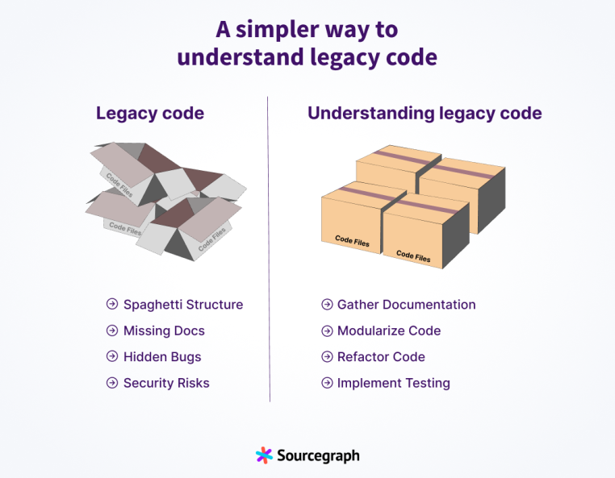

# AI 辅助软件工程：遗留系统重构

## 示例

### watsonx Code Assistant for Z

https://www.ibm.com/products/watsonx-code-assistant-z


### Bloop

[State of Mainframe Modernization](https://www.kyndryl.com/us/en/campaign/state-of-mainframe-modernization)

#### 转换 HumanEval 数据集

构建评估工具：[COBOLEval](https://github.com/BloopAI/cobolEval)

```cobol
       IDENTIFICATION DIVISION.
       PROGRAM-ID. HAS-CLOSE-ELEMENTS.

       ENVIRONMENT DIVISION.

       INPUT-OUTPUT SECTION.

       DATA DIVISION.

       LINKAGE SECTION.

       01 LINKED-ITEMS.
           05 L-NUMBERS OCCURS 100 TIMES INDEXED BY NI COMP-2.
           05 L-THRESHOLD COMP-2.
           05 RESULT PIC 9.

      * Check if in given list of numbers, are any two numbers closer to each other than
      * given threshold.
      * >>> has_close_elements([1.0, 2.0, 3.0], 0.5)
      * False
      * >>> has_close_elements([1.0, 2.8, 3.0, 4.0, 5.0, 2.0], 0.3)
      * True
      *

      * Complete the WORKING-STORAGE SECTION and the PROCEDURE DIVISION
      * Store the result in the RESULT variable and mark the end of your program with END PROGRAM

       WORKING-STORAGE SECTION.
```

- [Evaluating LLMs on COBOL](https://bloop.ai/blog/evaluating-llms-on-cobol)
- [GnuCOBOL](https://gnucobol.sourceforge.io/)

### SourceGraph Cody示例

资料来源：[A simpler way to understand legacy code](https://sourcegraph.com/blog/a-simpler-way-to-understand-legacy-code)



这篇文章介绍了构建遗留系统重构的过程和策略，并提供了一些实用工具来帮助开发人员理解和改进遗留代码。

**主要流程和策略如下：**

1. **评估代码库：**
    - 设置开发环境并运行代码以确保其按预期工作。
    - 使用代码静态检查工具（如ESLint或Pylint）来识别语法错误和潜在问题。
    - 使用依赖关系分析工具和架构可视化工具来了解项目的依赖关系和结构。

2. **文档和注释：**
    - 利用现有的文档和注释来获取代码的原始目的、设计决策和潜在问题的洞察。
    - 对缺乏文档的遗留系统进行文档补充和注释更新。

3. **代码分析工具：**
    - 使用静态分析工具（如SonarQube、PMD、CAST）来识别代码问题、代码异味和安全漏洞。
    - 这些工具还能揭示代码依赖关系和结构，帮助开发人员确定重构的优先级。

4. **版本控制历史：**
    - 利用版本控制系统（如Git）来理解代码库的历史，通过分析提交日志来追踪代码的变更。
    - 使用`git blame`和`git log`命令来了解每行代码的最后修改情况及其原因。

5. **重构和清理：**
    - 在不改变外部行为的前提下对代码进行重构，以提高代码的可维护性和可读性。
    - 采用小规模、可管理的更改，使用特性分支并持续测试代码，以验证重构未影响功能。

6. **测试和验证：**
    - 编写单元测试、集成测试和端到端测试来验证更改，防止回归问题。
    - 在没有测试的遗留代码上编写测试，以确保代码可靠性。

**使用Cody的辅助工具：**

Cody是一款AI编程助手，旨在帮助开发人员理解、编写、审查和重构代码，并加速代码生成和软件开发。它的主要功能包括：

- **自动完成**：利用大语言模型（LLM）提供代码预测和建议，支持多种编程语言。
- **聊天功能**：回答与代码相关的技术问题，并提供上下文答案。
- **命令功能**：运行预定义操作并创建自定义命令以加速日常编码任务。

通过这些功能，Cody可以帮助开发人员理解遗留代码结构，识别潜在问题，并提出改进建议。

**使用Cody的实际示例：**

1. **重构代码**：Cody可以识别代码异味并建议改进。
2. **编写单元测试**：Cody可以生成单元测试代码，帮助验证代码的预期行为。
3. **生成文档**：Cody可以自动生成代码文档，帮助未来的协作者理解代码。

**总结：**

通过评估代码库、利用文档、使用代码分析工具、理解版本控制历史、谨慎重构和全面测试，开发人员可以有效地理解和改进遗留代码。AI编程助手如Cody能够进一步简化这些过程，提供有价值的见解和自动化支持，使处理遗留系统变得更容易和高效。

